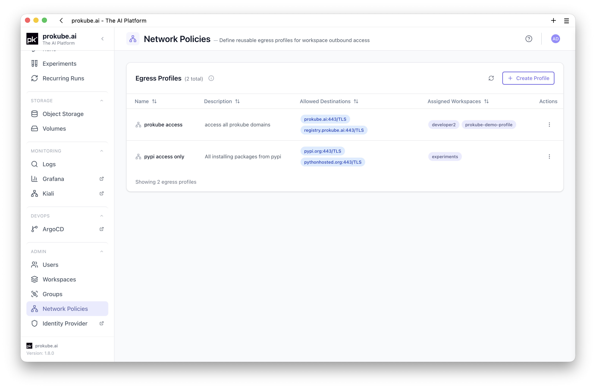
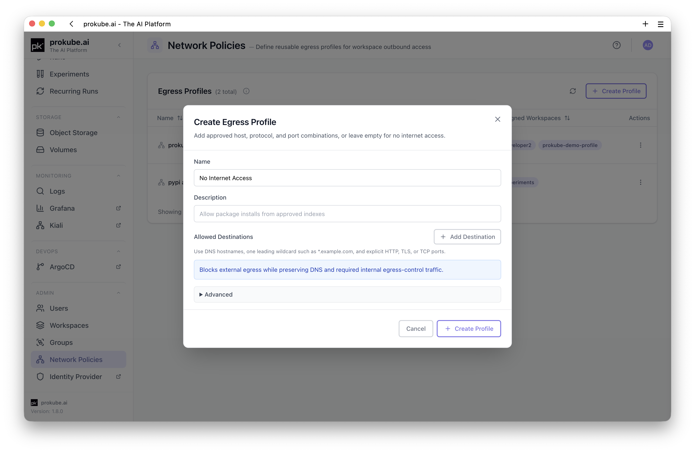
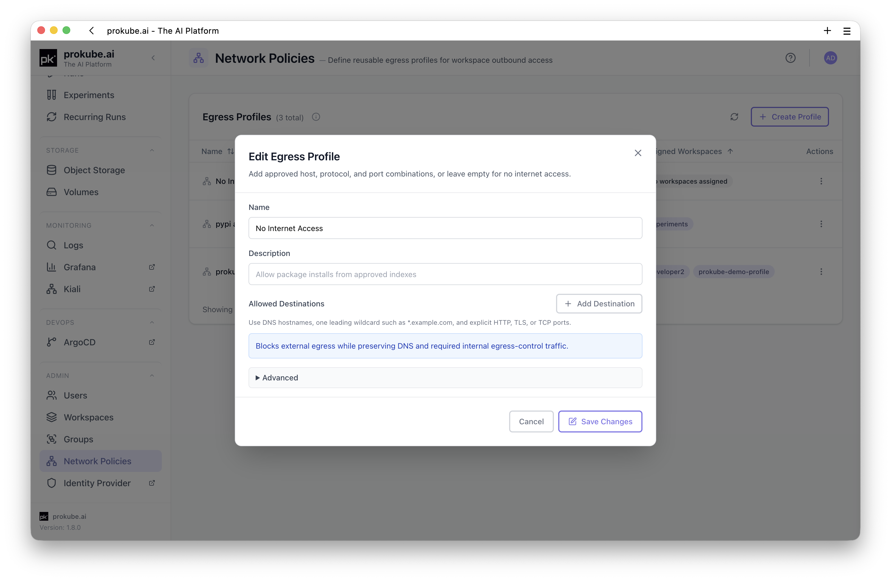
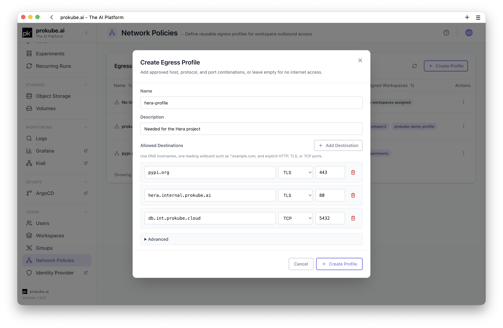
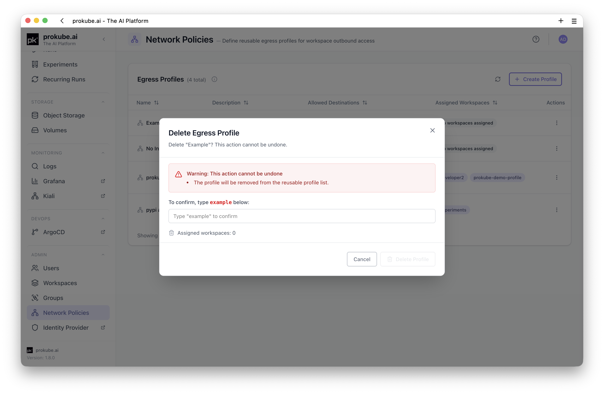

# Network Policies

Administrators can use **User Management** > **Network Policies** to define reusable egress profiles for workspace outbound access.

An egress profile is an allowlist of external destinations. Assign a profile to a workspace from **User Management** > **Workspaces** to control which external hosts workloads in that workspace may reach.

## How Egress Profiles Work

Each workspace can have at most one assigned egress profile.

An assigned profile applies to Istio-injected workloads in the workspace. prokube keeps DNS and required internal egress-control traffic allowed so approved hosts can resolve and route through the egress gateway.

::: warning Istio sidecar required
Egress profiles restrict only workloads that are part of the Istio mesh and routed through the platform egress controls. Workloads without Istio sidecar injection are not filtered by these profiles and can still use any network path allowed by the cluster and underlying network.
:::

The UI shows profile assignment state in the **Egress Profile** column on the Workspaces page:

- profile name and first allowed destination when a profile is assigned;
- **No internet access** when the assigned profile has no destinations;
- **Profile missing** when a workspace still references a deleted or unavailable profile;
- **None** when no profile is assigned.

## Create a Profile

Open **User Management** > **Network Policies** and click **Create Profile**.

Set:

- **Name**: display name for administrators. New profile IDs are generated from the name and become stable after creation.
- **Description**: optional explanation of intended use.
- **Allowed Destinations**: DNS host, protocol, and port combinations.

Leave **Allowed Destinations** empty to create a **No Internet Access** profile. This blocks external egress while preserving DNS and required internal egress-control traffic.

## Destination Rules

Allowed destinations use explicit host, protocol, and port rows.

Supported protocols:

| Protocol | Use for |
|---|---|
| `HTTP` | Plain HTTP traffic, commonly port `80`. |
| `TLS` | HTTPS or other TLS traffic, commonly port `443`. |
| `TCP` | Opaque TCP traffic such as databases or custom services. |

Host rules:

- use DNS hostnames only, for example `pypi.org` or `api.example.com`;
- do not include URL schemes, paths, query strings, or fragments;
- exact hosts and one leading wildcard label are supported, for example `*.example.com`;
- wildcard hosts are supported for `HTTP` and `TLS`, but not for `TCP`.

Port rules:

- ports must be integers from `1` to `65535`;
- duplicate host/port/protocol rows are deduplicated;
- `TCP` destinations must use exact hostnames;
- for opaque `TCP`, one port can target only one host per profile because same-port TCP routes cannot be distinguished by host.

## Assign a Profile to a Workspace

Open **User Management** > **Workspaces**, open the row actions for the workspace, and choose **Assign Egress Profile**.

In the dialog:

1. Select the egress profile.
2. Click **Save Assignment**.

To remove an assignment, open the same dialog and click **Clear Assignment**.

Clearing the assignment removes the derived egress-control resources for that workspace. It does not delete the reusable profile.

## Edit and Delete Profiles

Use **Edit** on the Network Policies page to change the profile name, description, or destinations. Assigned workspaces are reconciled after the update.

Profiles cannot be deleted while assigned to workspaces. Clear all workspace assignments first, then delete the profile.

## Operational Notes

- Egress profiles are administrator-managed and stored as platform configuration.
- Assignment creates workspace-scoped egress-control resources for the selected workspace.
- A profile with no allowed destinations intentionally means no external internet access, not an error.
- Egress control depends on sidecar injection and platform egress-gateway configuration. Workloads that are not covered by those controls may not be restricted by the profile.
- If a user reports that allowed access still fails, check the exact host, protocol, port, DNS resolution, sidecar injection, and whether the workload is in the expected workspace.

## Related Pages

- [User Management](user_management.md)
- [Workspaces](../platform/workspaces.md)
- [Kubernetes Resources](../platform/kubernetes.md)
