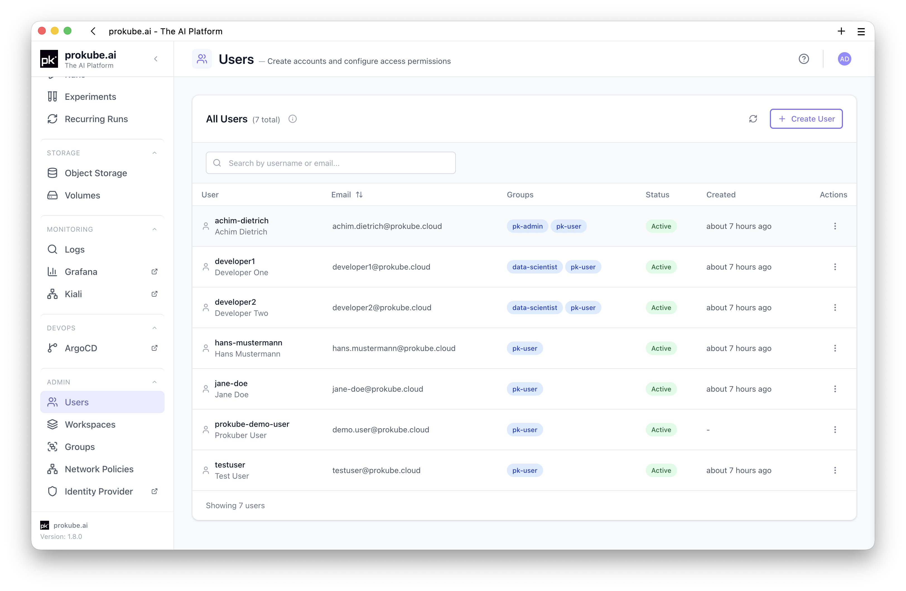
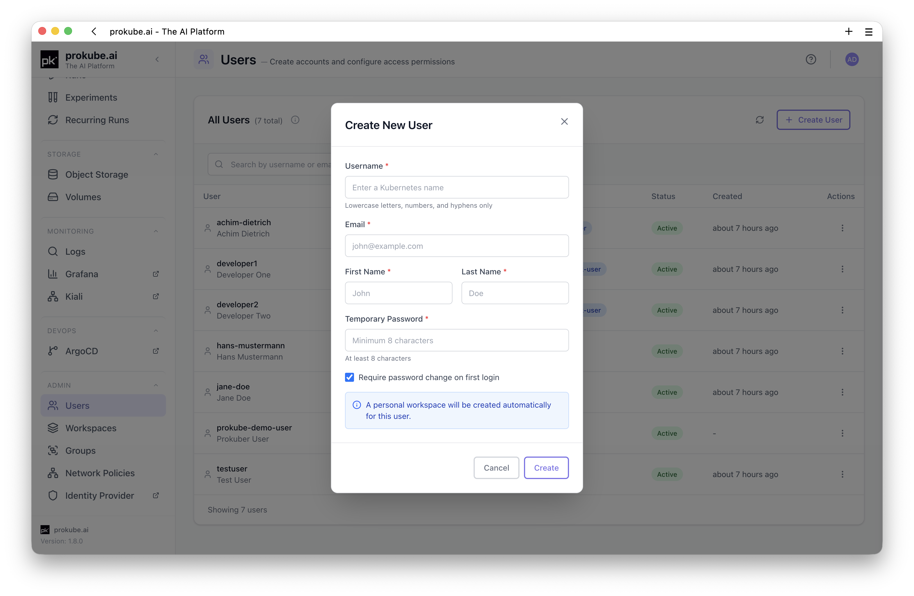
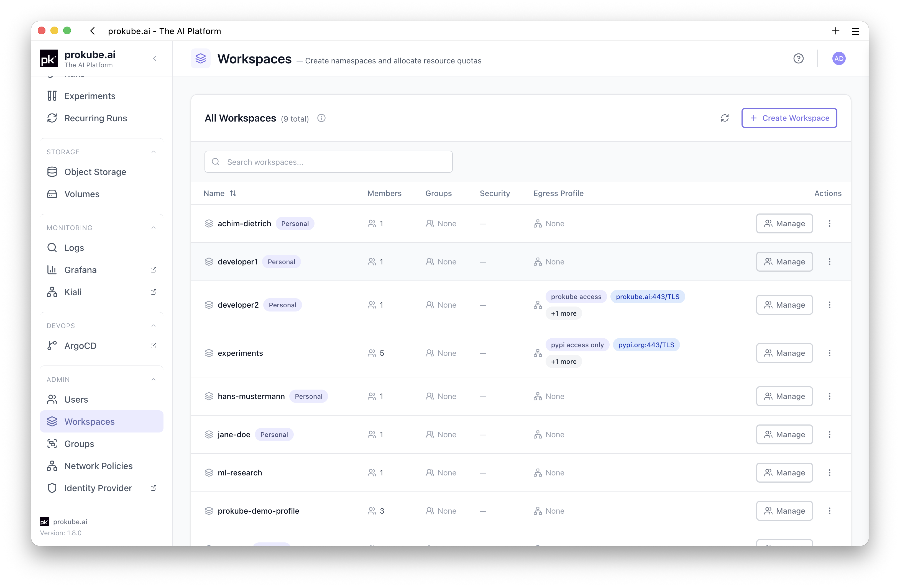
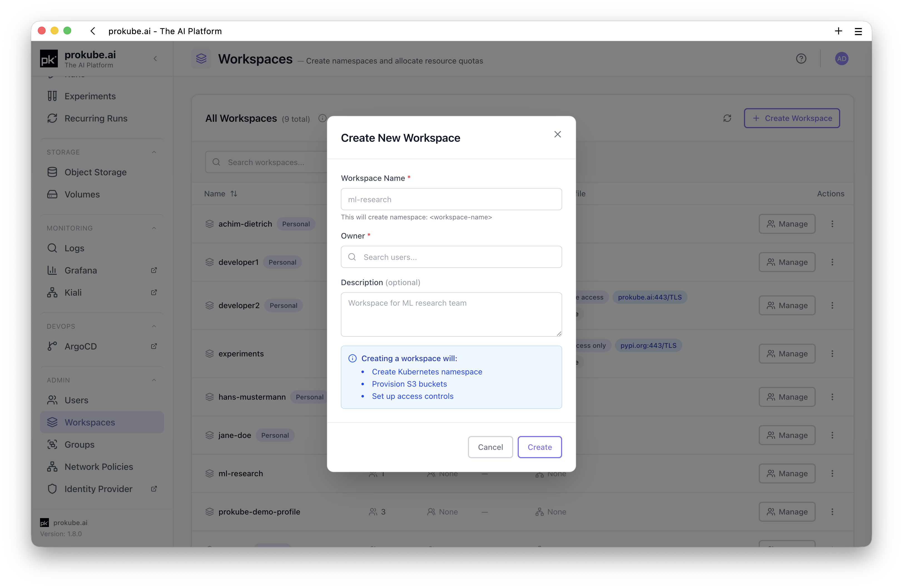
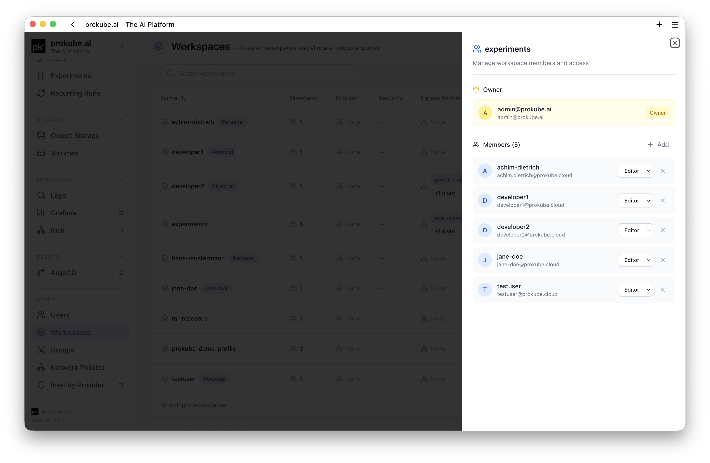
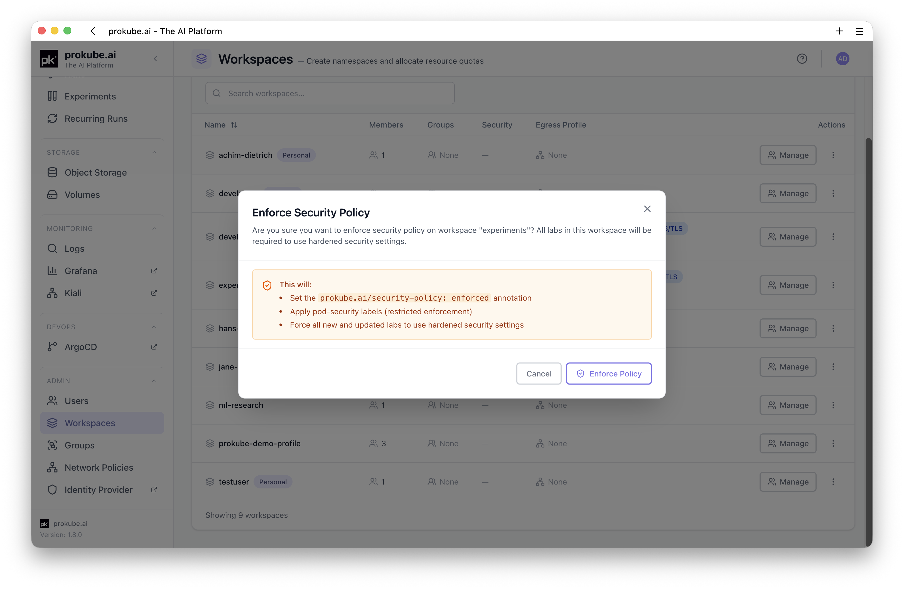
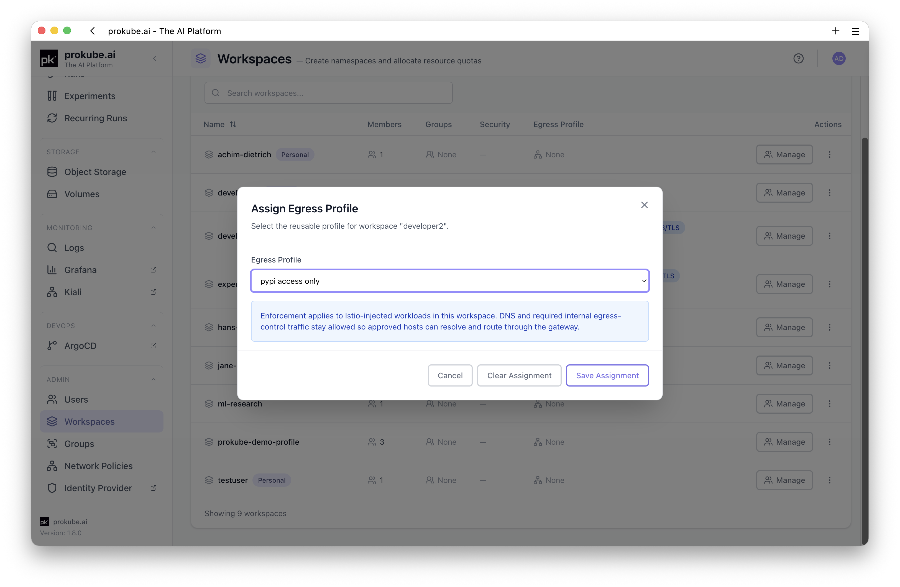
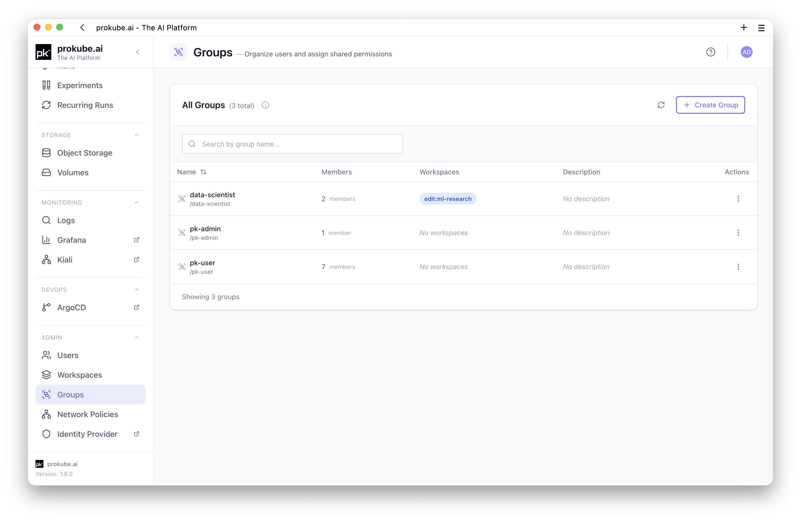
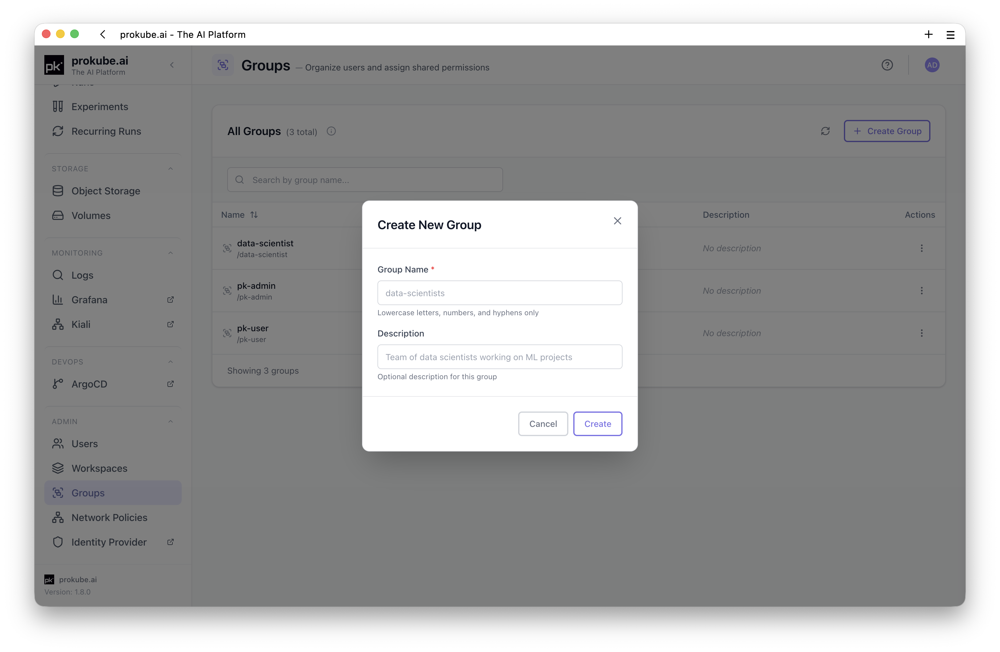
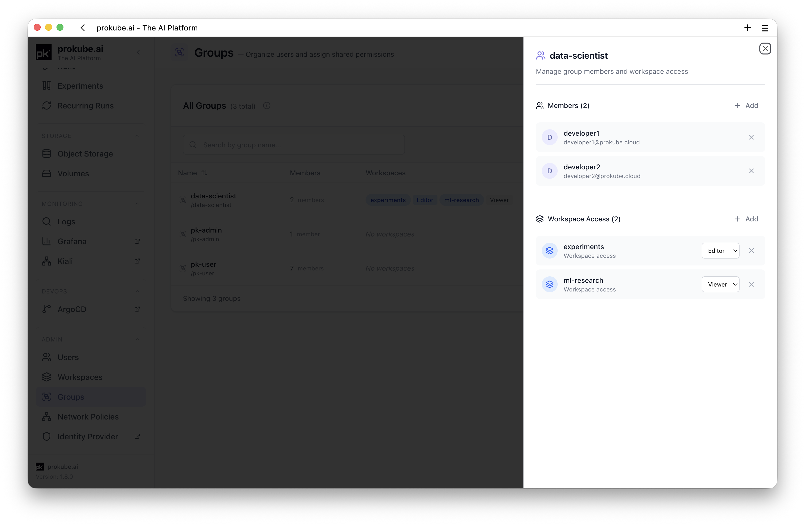

# User Management

Administrators can manage users, workspaces, groups, and workspace access from the prokube UI. Use the UI for day-to-day administration instead of editing identity-provider roles directly.

## User Management Area

Open **User Management** in the admin area. It provides pages for:

- **Users**: create, search, edit, disable, and delete users;
- **Workspaces**: create and delete workspaces, manage workspace members, enforce workspace security policy settings, and assign egress profiles;
- **Groups**: create and delete groups, manage group members, and grant or revoke group access to workspaces;
- **Network Policies**: define reusable egress profiles for workspace outbound access.

The underlying identity provider is [Keycloak](identity_providers.md). Use the Keycloak admin console only for advanced IAM tasks that are not exposed in the prokube UI.

Common platform roles are:

- `pk-user`: allows normal platform access for authenticated users;
- `pk-admin`: grants access to administrator views and platform administration workflows;
- `pk:<workspace-name>`: grants access to a specific workspace namespace.

Prefer assigning workspace access through the prokube UI. Direct role edits in Keycloak are easy to misapply and can affect Kubernetes, file-storage, and workload access.

## Users

Open **User Management** > **Users** to view platform users. The table shows username, email address, group memberships, account status, and creation time. Use search to find users by username or email.

To create a user:

1. Click **Create User**.
2. Enter username, email, first name, last name, and an initial password.
3. Keep **Require password change** enabled unless you have a specific reason not to.
4. Save the user.

To update a user, open the row action menu and choose **Edit**. The prokube UI can update the user's first name, last name, and enabled status. Usernames and email addresses are not changed from this dialog.

To delete a user, open the row action menu and choose **Delete**. Deleting a user removes the account and revokes platform access.

## Workspaces

Open **User Management** > **Workspaces** to manage workspace namespaces. The table shows each workspace name, workspace type, member count, group access, security policy state, egress profile assignment, and available actions.

To create a workspace:

1. Click **Create Workspace**.
2. Enter a Kubernetes-compatible workspace name.
3. Select an owner user.
4. Save the workspace.

Workspace names must be Kubernetes-compatible DNS labels: lowercase letters, numbers, and hyphens, starting and ending with a letter or number.

The platform creates the required cluster resources. The workspace owner is shown separately from regular members in the member management panel.

To manage workspace members, click **Manage** on a workspace row. Use the side panel to add users, search existing members, or remove members. Added members receive editor access to the workspace.

Personal workspaces are tied to user lifecycle and cannot be deleted from the Workspaces page while attached to a user.

### Workspace Security Policy

Use the shield action in the workspace row to enforce or remove the workspace security policy.

When enforced, prokube sets the `prokube.ai/security-policy: enforced` annotation, applies restricted pod security labels, and requires new and updated Labs in that workspace to use hardened security settings.

Review workloads in the workspace before enforcing the policy. Existing workloads or custom images may need changes if they rely on privileged behavior.

### Workspace Egress Profile

Use **Assign Egress Profile** from the workspace row actions to attach or clear an egress profile. The Workspaces table shows the current assignment and a short destination summary.

Each workspace can have one egress profile assignment. Egress profiles are created under **User Management** > **Network Policies** and define the external host, protocol, and port combinations workloads are allowed to reach.

See [Network Policies](network_policies.md) for profile creation, destination rules, and operational notes.

### Delete a Workspace

Deleting a workspace is destructive and cannot be undone. The UI requires typing the workspace name to confirm.

Workspace deletion removes the namespace and Kubernetes resources in it, including Labs, volumes, secrets, configurations, deployed models, services, pipelines, experiments, and pipeline runs. Object-storage data may be archived rather than deleted, depending on the platform configuration.

Before deleting a workspace, confirm that required data has been exported or archived according to your organization's retention policy.

## Groups

Open **User Management** > **Groups** to manage groups. Groups are useful when multiple users need the same workspace access.

The Groups page supports search and pagination. The management panel shows group members and workspace access for the selected group.

To create a group:

1. Click **Create Group**.
2. Enter the group name and optional description.
3. Save the group.

To manage a group, click **Manage** on the group row. The side panel lets you add or remove members and grant or revoke workspace access.

Granting workspace access adds the corresponding `pk:<workspace-name>` role to the group. All group members receive access to that workspace.

The Workspaces page also shows which groups have access to each workspace. Use groups for team access instead of adding many users individually.

To delete a group, use the row action menu. Deleting a group removes the group membership relationship, but it does not delete users or workspaces.

## Advanced IAM in Keycloak

Keycloak remains the identity provider behind prokube. Use the Keycloak admin console for advanced IAM operations that are not exposed in the prokube UI, such as:

- external identity provider setup;
- authentication flow changes;
- advanced role mapping;
- email configuration;
- credential reset emails;
- low-level realm or client configuration.

Identity administration is security-sensitive. Access admin consoles only over trusted TLS and with administrator accounts protected by your organization's required controls.

Prefer creating and deleting workspaces through the prokube UI. If you must manage workspace roles directly in Keycloak, workspace roles use the `pk:<workspace-name>` naming pattern. Direct role changes can affect workspace access and should be made carefully.

## Security Notes

- Grant users and groups the minimum workspace access they need.
- Prefer group-based access for teams instead of one-off user role assignments.
- Treat shared workspace secrets as visible to users with sufficient workspace permissions.
- Use service accounts or workload-specific credentials for shared automation instead of personal credentials.
- Review workspace contents before deleting users or workspaces; Kubernetes resources may be deleted permanently while file-storage data may follow a separate archive policy.

## Related Pages

- [Workspaces](../platform/workspaces.md)
- [Network Policies](network_policies.md)
- [Kubernetes Resources](../platform/kubernetes.md)
- [API Keys](../platform/api_keys.md)
- [Admin Documentation](index.md)
