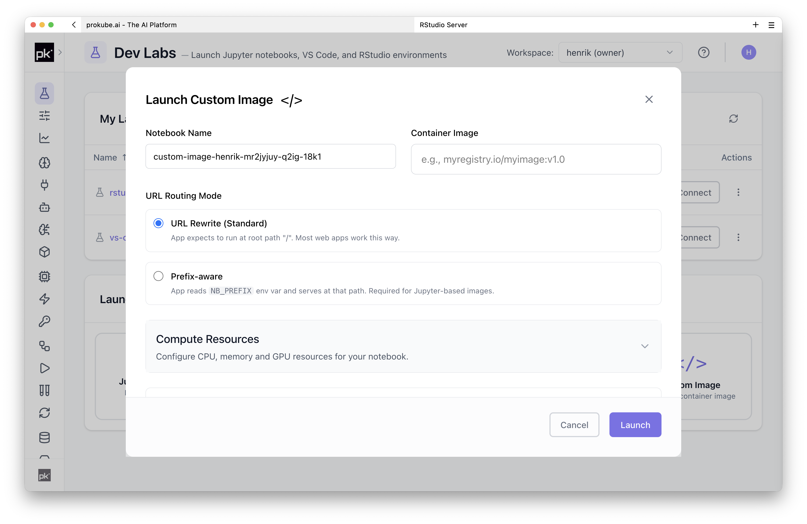
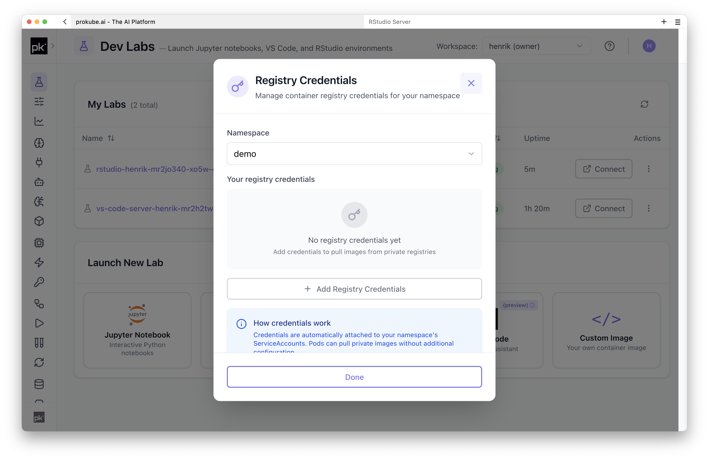

# Custom Notebooks

Custom Notebooks let you run specialized Lab environments when the standard JupyterLab, VS Code, RStudio, or OpenCode images are not enough.

Use a custom notebook image when you need a controlled package stack, additional system tools, GPU-specific libraries, or a web application that should run inside the same workspace boundary as the rest of your prokube.ai work.

## Common Uses

- Preinstall Python, R, CUDA, or system packages that should be available every time the Lab starts.
- Package team-specific tooling, CLIs, SDKs, or templates into a reusable image.
- Run a custom browser-based web server for rapid prototyping.
- Test specialized development environments before turning them into shared images.

## How It Works

Custom Notebooks use the same technical foundation as other Labs: a [Kubeflow Notebook](https://www.kubeflow.org/docs/components/notebooks/) pod with configurable compute resources, persistent workspace storage, optional data volumes, and workspace-level configuration.

At minimum, you need to:

1. Build a container image that is compatible with [Kubeflow custom notebook images](https://www.kubeflow.org/docs/components/notebooks/container-images/#custom-images).
2. Push the image to a container registry that the Kubernetes cluster can reach.
3. Add registry credentials if the image is private and no matching registry pull secret has already been configured by an administrator.
4. Select the image in the Custom Notebook launch dialog.

For custom web applications, the container should expose the expected notebook port and handle being served behind the platform's notebook proxy path.

Use [Using Labs](index.md) for the shared workspace, persistence, object-storage, and image-building behavior. Use custom images when user-space package installation is not enough or when a team needs the same environment repeatedly.

The [`prokube/examples` Streamlit example](https://github.com/prokube/examples/tree/main/images/streamlit-example) shows a custom image that can run as a Kubeflow Notebook and serve a Streamlit app behind the notebook proxy path.

## Registry Credentials

If your custom image is stored in a private registry, the workspace needs an image pull secret before Kubernetes can start the Lab pod. This may already be handled globally by an administrator, for example through a shared `regcred-*` secret. If not, add registry credentials for the workspace.

In the prokube.ai UI, click your user icon in the top-right corner and open the registry credentials action. Use it to configure the registry server, username, and token or password for the workspace.

Registry credentials are stored as Kubernetes `Secret`s in the workspace. Edit and view contributors of that workspace can read Kubernetes `Secret`s in the namespace, so use registry credentials intended for that workspace rather than personal or admin credentials.

For the legacy Kubernetes-level explanation of image pull secrets, see the existing [Kubernetes documentation](https://docs.prokube.ai/latest/user_docs/kubernetes/) while this section is being migrated.

## Custom Solutions

prokube.ai can support custom Lab solutions for teams that need specialized images, custom web applications, GPU stacks, or additional platform integration.

## Related Pages

- [Using Labs](index.md)
- [JupyterLab](jupyterlab.md)
- [RStudio](rstudio.md)
- [Streamlit custom image example](https://github.com/prokube/examples/tree/main/images/streamlit-example)
- [Kubeflow custom image documentation](https://www.kubeflow.org/docs/components/notebooks/container-images/#custom-images)
