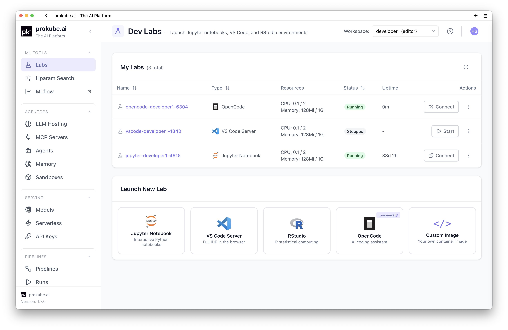
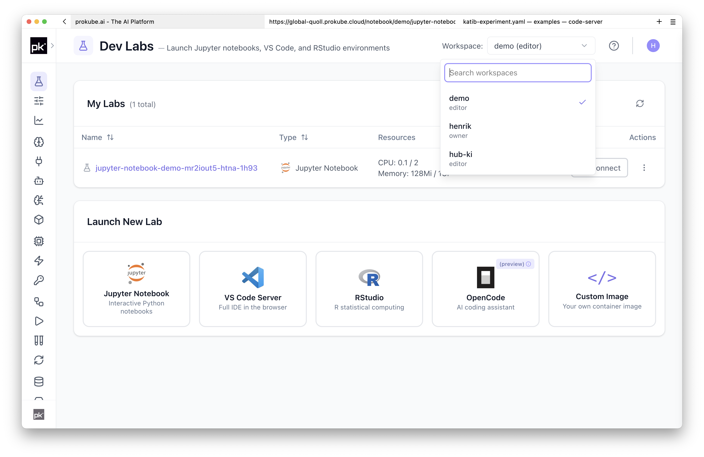

# Labs

Labs are browser-based development environments with access to the compute resources, storage, credentials, and platform tools available in your workspace.

You can use Labs to explore data, write code, start platform workflows, and prepare work for production runtimes without setting up a local development environment first. From within a Lab you can access other prokube tools programmatically through `kubectl`, SDKs, CLIs, and APIs, for example to launch pipelines, run hyperparameter tuning or distributed computing experiments, develop MCP servers, and test agent workflows.

Alongside classic preconfigured [JupyterLab](jupyterlab.md), [VS Code](vscode.md), and [RStudio](rstudio.md) images, prokube also supports agentic engineering environments: GitHub Copilot in VS Code and [OpenCode](opencode.md) as a dedicated agentic coding tool.



## When to Use Labs

- You want a browser IDE with workspace storage and platform credentials already available.
- You want coding agents to run in a controlled workspace that keeps working when your laptop is closed, disconnected, or not the right place to execute agent-driven code changes.
- You need to run experiments against the same cluster resources used by production workloads, including CPUs, GPUs, and persistent volumes.
- You want to develop code and then hand it off to pipelines, model serving, agents, MCP servers, or sandboxes.
- You want to test platform integrations from inside the workspace before packaging them for repeatable or production use.

## Available Environments

| Environment | Typical use |
| --- | --- |
| [JupyterLab](jupyterlab.md) | Python notebooks, data exploration, visualization, quick experiments |
| [VS Code](vscode.md) | Browser-based IDE workflows and local VS Code attachment to running notebook pods |
| [RStudio](rstudio.md) | R notebooks, statistics workflows, and R package based analysis |
| [OpenCode](opencode.md) | Agent-assisted coding sessions inside a lab workspace |
| [Custom Notebooks](custom_notebooks.md) | Custom images and web servers for specialized applications |

## How Labs Work

Labs are built on [Kubeflow Notebooks](https://www.kubeflow.org/docs/components/notebooks/) and run inside your prokube workspace, not on your laptop. Each Lab gets its own [Kubernetes Pod](https://kubernetes.io/docs/concepts/workloads/pods/), resource limits, and mounted storage.

prokube adds curated images, platform credentials, storage defaults, and workspace integrations on top of Kubeflow Notebooks.

## Workspaces

Labs run in the currently selected workspace. Most users have a personal workspace, and can also be granted access to shared workspaces for team projects.

The active workspace determines which namespace, storage, credentials, and access rules the Lab uses. When you have access to multiple workspaces, select the workspace before launching a Lab.



::: warning Secrets are workspace-visible
Each workspace has its own Kubernetes namespace. Edit and view contributors can read Kubernetes `Secret`s in that namespace, including secrets used by Labs, PodDefaults, pipelines, model-serving workloads, or manually created `kubectl create secret ...` resources.

Do not put personal access tokens, admin credentials, cloud root keys, or other broad credentials into a workspace that other people can access. For team work, use a shared workspace with credentials intended for that team and workload.
:::

See the existing [workspace and user management documentation](https://docs.prokube.ai/latest/user_docs/user_management/) for access levels and shared workspace behavior.

## Launch Options

When you launch a Lab, the same basic options apply across JupyterLab, VS Code, RStudio, OpenCode, and custom notebook images:

- **Name**: identifies the Lab in your workspace.
- **Image**: selects the IDE, language stack, preinstalled packages, and system tools.
- **Compute resources**: configures CPU, memory, and GPU resources for the Lab pod.
- **Storage**: attaches the workspace volume and optional data volumes.
- **Configurations**: applies administrator-provided options such as environment variables, secrets, labels, tolerations, or node affinity settings.
- **Security options**: enables the hardening options available in your platform installation.

Key concepts apply across all Lab types:

- **Workspace storage**: files under the Lab home directory are backed by a [persistent volume](https://kubernetes.io/docs/concepts/storage/persistent-volumes/) and survive restarts. In the default images this is the `jovyan` user's home directory, usually `/home/jovyan`. A persistent volume can be mounted by other Labs or other pods, but the default storage class is commonly `ReadWriteOnce`: in multi-node clusters, the same volume can usually only be mounted read-write by pods on one node at a time.
- **Data volumes**: additional volumes can be mounted when you need shared datasets or larger working directories. Use object storage or a storage class with the required access mode when multiple pods need concurrent access across nodes.
- **Compute resources**: CPU, memory, and GPU requests are configured when the Lab is created.
- **Platform access**: Labs can use workspace credentials, `kubectl`, SDKs, CLIs, and APIs to interact with other prokube tools.
- **Images**: the selected image defines the IDE, language stack, system tools, and preinstalled packages.
- **Ephemeral container state**: changes outside mounted volumes should be treated as temporary. If you need extra tools, install them into the persistent home directory with user-space package managers where available, or move them into a custom image.

## Managing Labs

Running Labs reserve CPU, memory, GPU, and volume attachments in the cluster. Stop Labs when you no longer need the running process.

Common lifecycle operations:

- **Stop**: stops the Lab pod and releases compute resources. Files on mounted persistent volumes remain.
- **Start**: creates the Lab pod again from the configured image, resources, and volumes.
- **Delete**: removes the Lab server object and pod. Mounted volumes are not necessarily deleted with it; delete unused volumes separately when you no longer need the data.
- **Recreate**: use this when you need to change image, compute resources, storage, or advanced configuration. Stop the old Lab, create a new one with the desired settings, and reuse the relevant persistent volume if you want to keep the home directory.

Existing Labs generally should not be treated as mutable infrastructure. If you need a repeatable environment for a team, build a [Custom Notebook](custom_notebooks.md) image instead of manually changing a running Lab.

### Advanced Configuration

The `Configurations` and `Security options` fields are administrator-provided options for the Lab pod. Depending on the installation, they may include environment variables, secret injection, labels, tolerations, node affinity, or hardening options.

For example, GPU-specific workloads may use an affinity configuration so that the Lab is scheduled on nodes with the required GPU type. If the required option is not visible in the launch dialog, ask your platform administrator.

## Persistence and Package Installation

Files in the Lab home directory are backed by the workspace volume and survive Lab restarts. In the default images this is the `jovyan` user's home directory, usually `/home/jovyan`. This is the right place for notebooks, source code, configuration files, and cloned repositories.

Container-local changes outside mounted volumes should be treated as temporary. Python packages installed into system locations, system packages installed inside the running container, and background processes may disappear when the Lab is recreated.

For additional packages, prefer installs that write into the persistent home directory or project directory:

- use pip's [user install mode](https://pip.pypa.io/en/stable/user_guide/#user-installs), for example `pip install --user`, for simple Python additions when user-site installs are visible in the selected environment;
- use [uv project environments](https://docs.astral.sh/uv/concepts/projects/config/#project-environment-path) under the persistent workspace, for example the default `.venv` next to your project;
- use [Poetry in-project virtual environments](https://python-poetry.org/docs/configuration/#virtualenvsin-project) when working with Poetry projects;
- use [conda environments with an explicit prefix](https://docs.conda.io/projects/conda/en/latest/user-guide/tasks/manage-environments.html#specifying-a-location-for-an-environment), for example under `/home/jovyan/envs` or your project directory;
- keep dependency files such as `requirements.txt`, `pyproject.toml`, `poetry.lock`, `environment.yml`, `package.json`, or `renv.lock` with your project;
- create a [Custom Notebook](custom_notebooks.md) image for team workflows or system-level dependencies.

For large datasets, shared artifacts, pipeline outputs, and model files, prefer object storage over the workspace volume. Workspace volumes are useful for interactive work, but object storage is the better integration point for pipelines, MLflow, and model serving.

Do not use the same workspace volume from multiple running Labs at the same time unless your administrator has explicitly designed the storage setup for that pattern. Use separate data volumes or object storage for shared datasets and artifacts.

## Installing Tools Without Root

Labs usually run without root access. Install additional command-line tools into the persistent home directory when the selected image does not already include them.

One option is [Homebrew on Linux](https://docs.brew.sh/Homebrew-on-Linux):

```bash
export HOMEBREW_PREFIX="$HOME/.linuxbrew"
mkdir -p "$HOMEBREW_PREFIX"
curl -L https://github.com/Homebrew/brew/tarball/master | tar xz --strip 1 -C "$HOMEBREW_PREFIX"

echo 'export HOMEBREW_PREFIX="$HOME/.linuxbrew"' >> ~/.bashrc
echo 'export PATH="$HOMEBREW_PREFIX/bin:$HOMEBREW_PREFIX/sbin:$PATH"' >> ~/.bashrc

export PATH="$HOMEBREW_PREFIX/bin:$HOMEBREW_PREFIX/sbin:$PATH"
brew update --force
```

After that, install tools into your home directory:

```bash
brew install jq
brew install htop
```

The installation lives under `/home/jovyan` in the default images and survives Lab restarts. For team-wide or production environments, move required tools into a [Custom Notebook](custom_notebooks.md) image instead.

## Object Storage from Labs

Labs can work with S3-compatible object storage through Python libraries, SDKs, UI extensions, and command-line tools, depending on the selected image and workspace configuration.

The prokube-maintained `pk-*` notebook images include `rclone` with a preconfigured `minio` remote when the workspace object-storage configuration is available. Use it from a Lab terminal:

```bash
rclone lsd minio:
rclone copy local-file minio:my-bucket/path/
rclone copy minio:my-bucket/path/file ./file
```

For Python examples with `s3fs`, pandas, DuckDB, and S3-compatible configuration, use the existing MinIO documentation at [docs.prokube.ai](https://docs.prokube.ai/latest/user_docs/minio/) while this section is being migrated.

## Building Container Images

The prokube-maintained `pk-*` notebook images generated from the upstream Kubeflow notebook server images include Docker CLI and Buildx support for building container images through a remote [BuildKit](https://github.com/moby/buildkit) service in the cluster. This covers the standard prokube JupyterLab, VS Code/code-server, and RStudio image families. Upstream or fully custom images only have this capability if they include the same tooling and startup configuration.

The Lab pod does not run a local Docker daemon. The image contains the Docker client and Buildx plugin; the actual build runs in the remote BuildKit service configured by `BUILDKIT_HOST` when available.

Builds should be pushed to a registry:

```bash
docker login <registry>
docker buildx build -t <registry>/<image>:<tag> --push .
```

In prokube-maintained images, `docker build` may be wrapped to use `docker buildx build`, so existing scripts and Makefiles can work with the remote builder. Use `--push`; there is no local Docker image store in the Lab pod.

This setup is only for building and pushing images. It is not a container runtime: images cannot be started with `docker run` inside the Lab. Run workloads through Kubernetes resources, pipelines, model serving, sandboxes, or other platform runtimes instead.

## Troubleshooting Labs

Start with the Lab details page and the pod events. Most startup failures show up as Kubernetes events before they show up in the application UI.

If you have Kubernetes access, inspect the pod directly:

```bash
kubectl describe pod <pod-name> -n <workspace>
kubectl logs <pod-name> -n <workspace> --all-containers
```

Common cases:

- **The Lab does not start**: check pod events for image pull errors, missing secrets, failed volume mounts, resource quota limits, or scheduling errors.
- **The browser shows an upstream connection error**: the Lab pod may not be ready yet, may have crashed, or may be unable to start the expected web server. Check pod status and logs.
- **A private custom image cannot be pulled**: verify the image reference and registry credentials. See [Registry Credentials](custom_notebooks.md#registry-credentials).
- **A volume cannot be attached**: another running pod may still be using a `ReadWriteOnce` volume on a different node, or the cluster may still have a stale volume attachment after a node restart. Stop other Labs using the volume and contact your administrator if the attachment does not clear.
- **The Lab cannot be resized**: create a new Lab with the desired resources and reuse the relevant persistent volume. If the volume itself is too small, create or request a larger volume and copy the data.
- **A deleted Lab leaves data behind**: this is expected for persistent volumes. Delete unused volumes separately when you no longer need them.
- **A Lab server object or pod appears stuck**: check events first. If a pod remains after deleting the Lab, ask an administrator or use `kubectl` only if you understand which pod belongs to the Lab.
