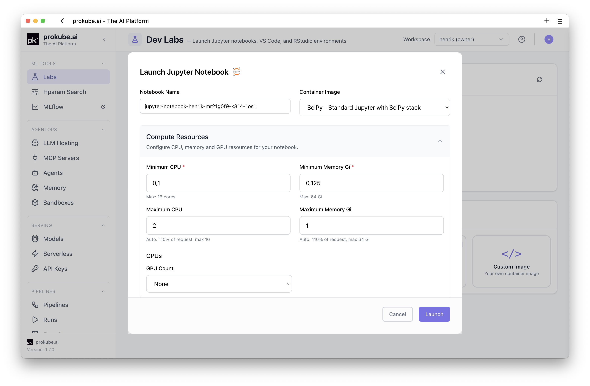
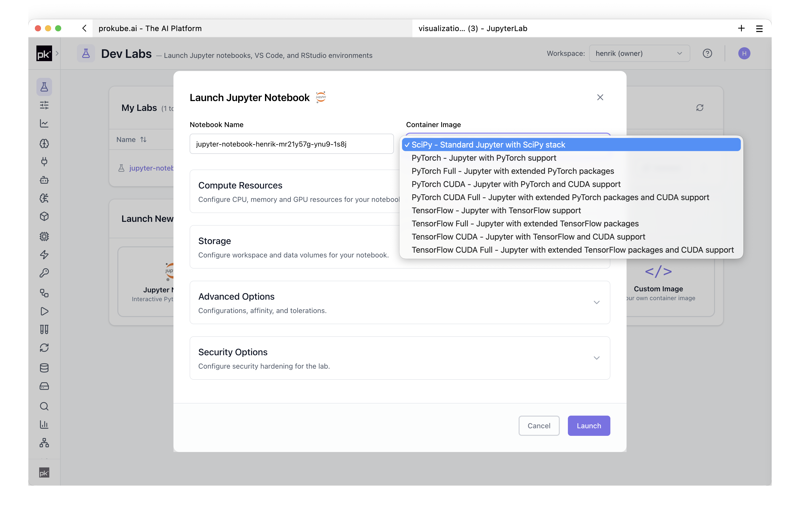
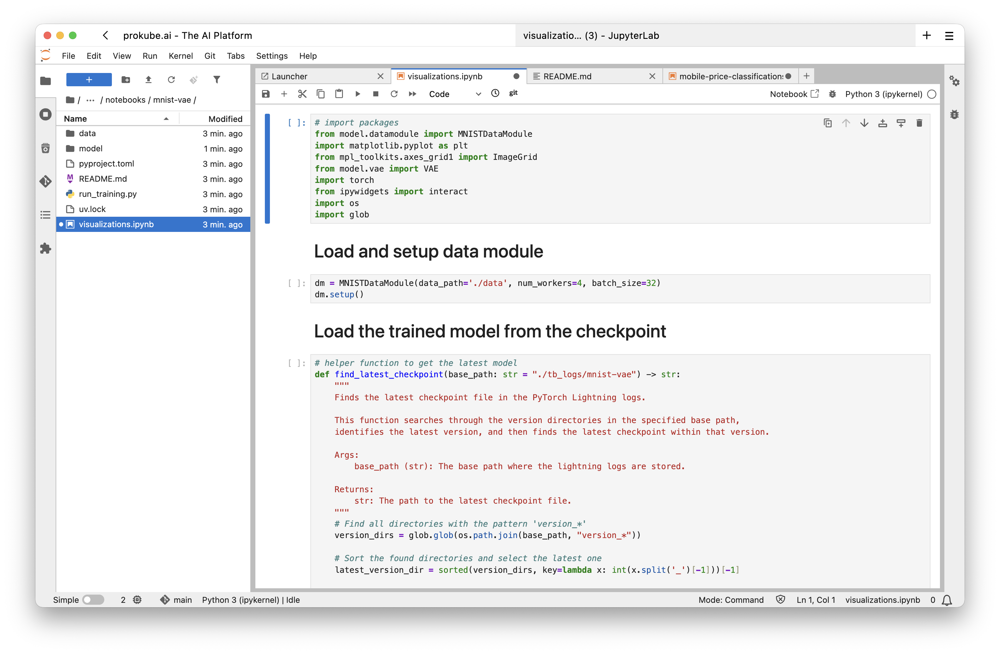
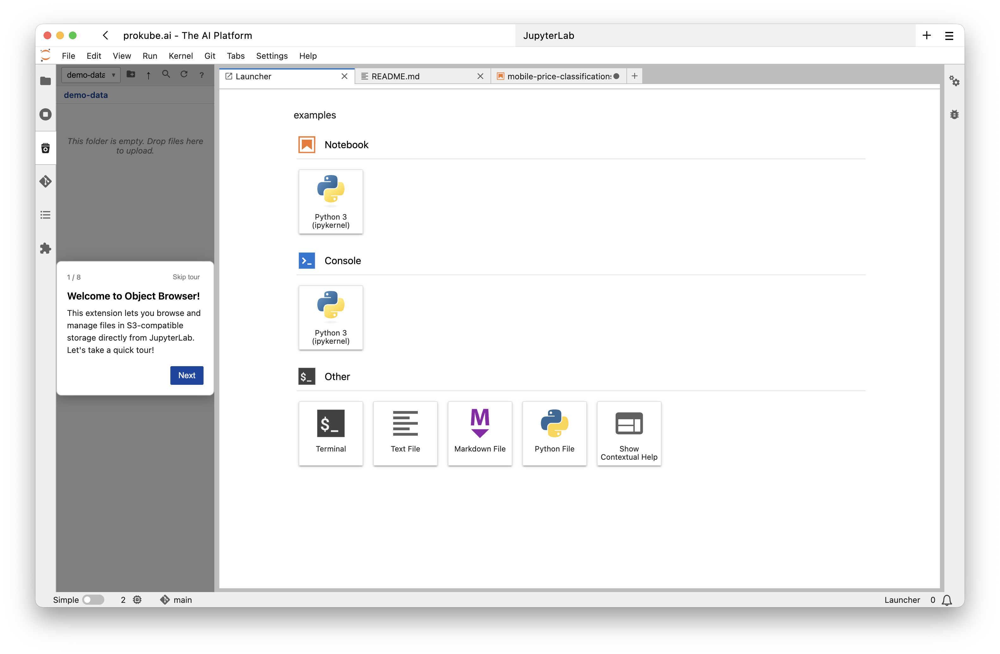

# JupyterLab

JupyterLab Labs provide a browser-based Python workspace inside prokube. They are intended for notebooks, data exploration, model development, and quick experiments that should run close to the same storage, compute, and platform services used by production workloads.

prokube maintains its own JupyterLab images with platform-oriented defaults: common CLI tools, Python packages, S3-compatible object storage integration, image building support, and the public [`prokube/examples`](https://github.com/prokube/examples) repository are preconfigured where applicable.

::: info JupyterLab documentation
For JupyterLab features that are not specific to prokube, use the upstream [JupyterLab documentation](https://jupyterlab.readthedocs.io/). Administrators who customize notebook images may also want the [Kubeflow Notebooks documentation](https://www.kubeflow.org/docs/components/notebooks/).
:::

## Getting Started

Create a JupyterLab Lab from the Labs page. The launch dialog uses the same basic options as other Labs: name, image, compute resources, storage, configurations, and security options.

For JupyterLab, the image choice mainly decides which Python and ML stack is available when the Lab starts. Choose an image that matches your workload rather than installing everything manually after startup.

Typical image families include:

| Image family | Use when |
| --- | --- |
| SciPy | You need a general-purpose Python data science environment. |
| PyTorch | You develop or inspect PyTorch workloads. |
| PyTorch CUDA | You need PyTorch with GPU support. |
| TensorFlow | You develop or inspect TensorFlow workloads. |
| TensorFlow CUDA | You need TensorFlow with GPU support. |

Use [Custom Notebooks](custom_notebooks.md) if you need a controlled package stack, extra system libraries, or a custom web application instead of one of the standard images.

## What the prokube Images Add

The default JupyterLab images include platform-oriented tooling requested in real user environments.

Included capabilities depend on the selected image, but the prokube-maintained images commonly include:

- command-line tools such as `kubectl`, `git`, `tmux`, `tree`, `ripgrep`, `fzf`, `htop`, `curl`, `make`, `gcc`, `nvim`, and `zsh`;
- Python tooling and SDKs used across the platform, including the Kubeflow Pipelines SDK, MLflow, `s3fs`, `pyarrow`, debugging helpers, and `uv`;
- S3-compatible object storage access through `rclone`, with a preconfigured `minio` remote where available;
- optional S3 browsing in the JupyterLab sidebar for object storage workflows;
- container image build support through Docker CLI and Buildx backed by a remote BuildKit service;
- automatic cloning of the public [`prokube/examples`](https://github.com/prokube/examples) repository into the Lab home directory on first start.

You can also use the JupyterLab terminal for CLI-based coding-agent tools when that fits your workflow, for example the OpenCode CLI, Claude Code, or similar tools. Install additional tools into the persistent home directory rather than the container filesystem; see [Installing Tools Without Root](index.md#installing-tools-without-root).

## Platform Access from Notebooks

A JupyterLab Lab runs inside your workspace as a [Kubernetes Pod](https://kubernetes.io/docs/concepts/workloads/pods/), so it can interact with the platform programmatically. Typical workflows include:

- starting Kubeflow Pipelines with the KFP SDK;
- running hyperparameter tuning or distributed computing experiments;
- reading and writing datasets or model artifacts in S3-compatible object storage;
- building container images for pipeline components or serving runtimes;
- using `kubectl` to inspect workspace resources when your role allows it;
- working through examples from the cloned `prokube/examples` repository.

::: info Examples repository
The public [`prokube/examples`](https://github.com/prokube/examples) repository contains examples for notebooks, pipelines, serving, MLflow, hyperparameter tuning, RStudio, and related workflows. In the default notebook images it is cloned into the Lab home directory during startup if it is not already present.
:::

JupyterLab uses the same persistence and package-installation model as other Labs. See [Using Labs](index.md#persistence-and-package-installation) for the shared storage rules and [Custom Notebooks](custom_notebooks.md) for repeatable image-based environments.

## Object Storage in JupyterLab

prokube JupyterLab images can include an S3 browser extension for working with S3-compatible object storage directly from the JupyterLab sidebar.

The extension lets you browse buckets, upload and download files, copy S3 paths, and generate snippets for loading data with common Python libraries. The required S3 endpoint and credentials are provided through the workspace configuration, so users normally do not need to configure access manually.

For terminal, Python, and external-client access to object storage, see [Object Storage](../platform/object_storage.md).

Some workflows need custom container images, for example pipeline components, KServe predictors, custom model servers, or agent runtimes. For the shared image-building workflow and limitations, see [Building Container Images](index.md#building-container-images).

## When to Move Beyond JupyterLab

JupyterLab is best for interactive development and inspection. Move the workload into a production-oriented runtime once the work becomes repeatable:

- use Kubeflow Pipelines for scheduled or reproducible workflows;
- use MLflow for experiment tracking and model registry workflows;
- use model serving for inference endpoints;
- use AgentOps components for MCP servers, agents, and sandboxed execution.

## Related Pages

- [Using Labs](index.md)
- [Custom Notebooks](custom_notebooks.md)
- [Existing documentation](https://docs.prokube.ai/latest/)
- [Pipelines](../mlops/pipelines.md)
