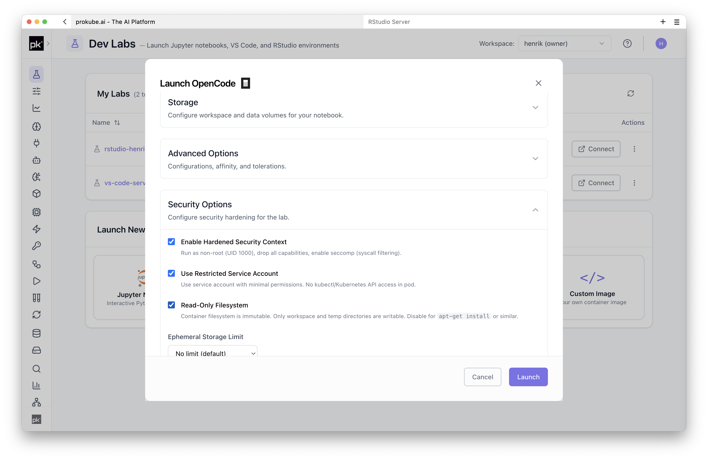
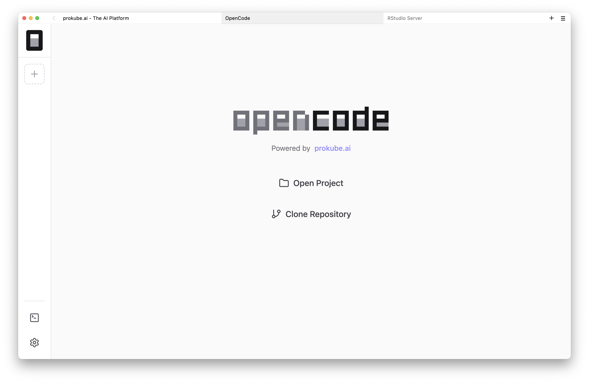
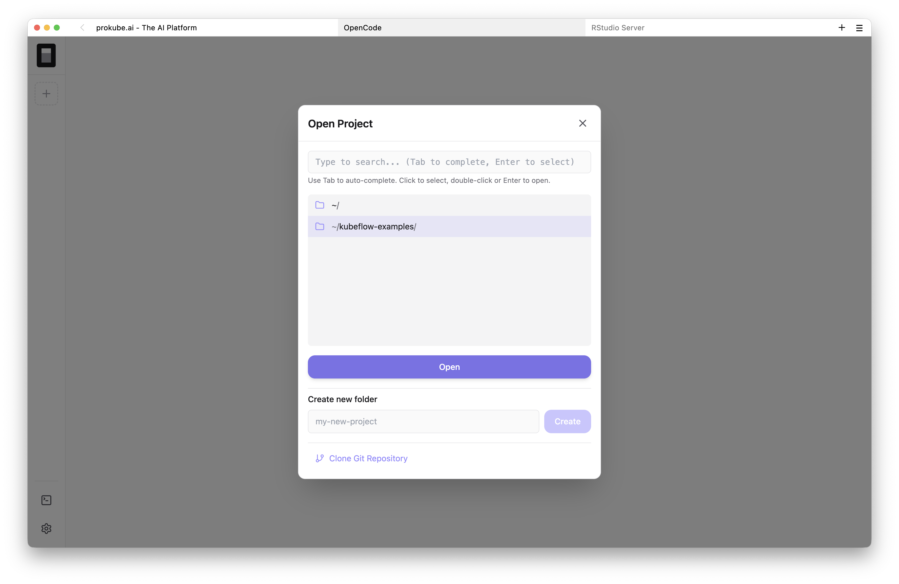
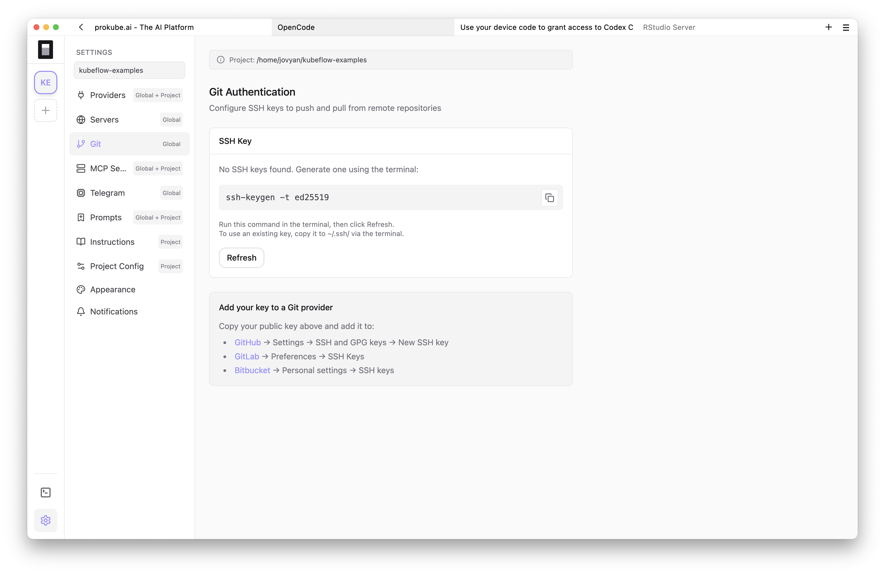
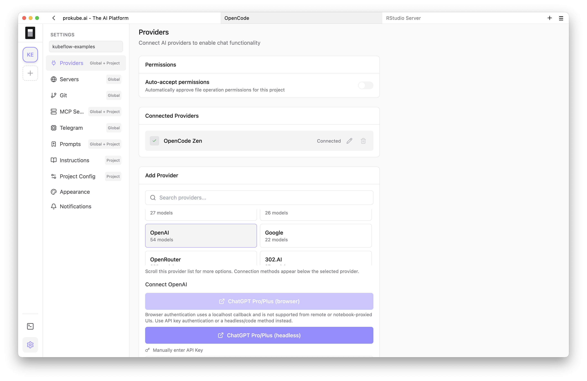
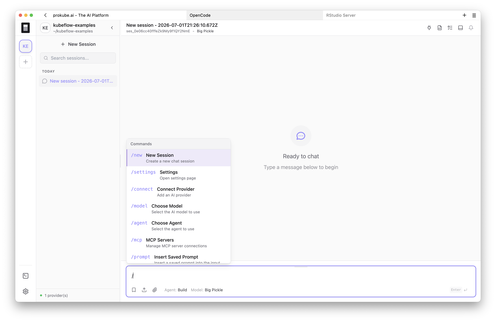
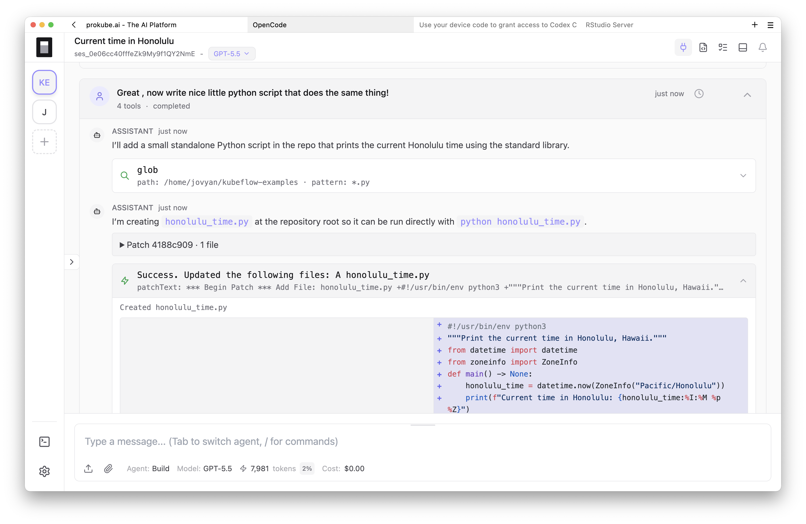
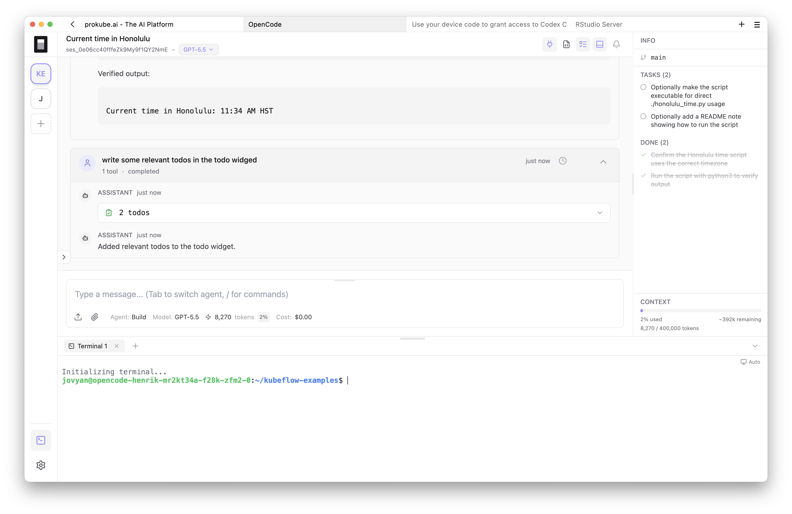
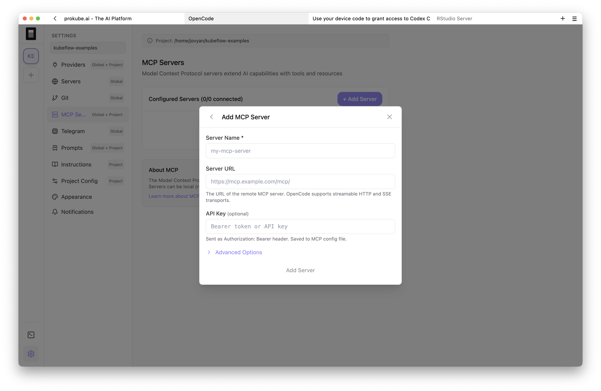
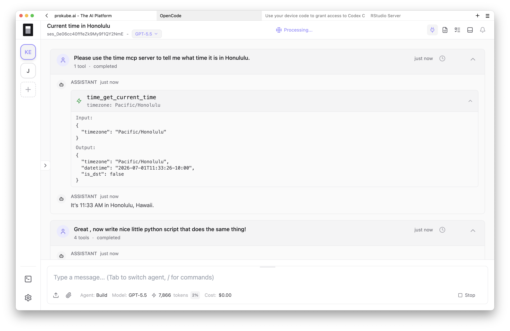

# OpenCode

OpenCode Labs run [OpenCode](https://github.com/anomalyco/opencode) inside a prokube.ai workspace, so you can manage long-running agentic coding sessions from the browser without giving the agent access to your local machine.

Because sessions run in the workspace, you can leave tasks running overnight, switch between multiple projects and sessions, and review changes before they reach Git or your local checkout.

prokube.ai uses the open-source [pk-opencode-webui project](https://github.com/prokube/pk-opencode-webui) to run OpenCode in Kubeflow Notebooks. prokube.ai open-sourced this prefix-aware Web UI and Notebook integration so OpenCode can be exposed correctly behind workspace URL prefixes such as Kubeflow Notebook routes. The integration adds the notebook image, URL-prefix handling, project picker, Git/SSH helpers, MCP management UI, Lab-specific defaults, and workspace integration needed for this deployment model.

::: info OpenCode documentation
For OpenCode features that are not specific to prokube.ai, use the upstream [OpenCode documentation](https://opencode.ai/docs/). For the prokube.ai wrapper and notebook integration, see [`pk-opencode-webui`](https://github.com/prokube/pk-opencode-webui).
:::

## When to Use OpenCode Labs

Use OpenCode Labs for fully agentic engineering workflows where code is mostly written, changed, and reviewed by AI agents. OpenCode is a good fit when agents should work iteratively: inspect the repository, propose changes, run commands or tests, react to feedback, and continue across longer sessions inside the workspace rather than on your laptop.

Common uses include:

- editing notebooks, pipeline code, model-serving code, MCP servers, agents, and platform examples;
- asking a coding agent to inspect a workspace-specific issue while it has access to the same mounted files and services;
- working across several project directories from one browser session;
- configuring or testing MCP servers while developing agent workflows;
- reviewing file changes and terminal output before committing to Git.

Use [VS Code](vscode.md) when you want a full IDE. Use [JupyterLab](jupyterlab.md) when notebooks and exploratory analysis are the main workflow. Use [Agent Sandboxes](../agentops/sandboxes.md) for API-controlled execution environments used by agents and applications.

You can also combine OpenCode with sandboxes through MCP. This is useful when you want OpenCode to plan, inspect, and orchestrate work from its Lab, but do not want it to execute untrusted code or shell commands directly in the OpenCode Lab pod. In that setup, OpenCode talks to an MCP server, and the MCP server runs the actual workload in an [Agent Sandbox](../agentops/sandboxes.md): OpenCode for interaction, sandboxes for isolated execution.

## Start an OpenCode Lab

Create an OpenCode Lab from the Labs page. The launch dialog uses the same core options as other Labs: name, compute resources, storage, configurations, and security options.



After the Lab starts, open it from the Labs table. The OpenCode UI is served from the Lab pod and connects to the OpenCode API server running in the same container.



The Lab starts:

- the upstream `opencode serve` backend on an internal loopback port;
- the prefix-aware web UI on the notebook port used by Kubeflow;
- process supervision for both services;
- persistent OpenCode configuration under `/home/jovyan`;
- startup handling for SSH key permissions on the mounted home volume.

OpenCode Labs use the same lifecycle and persistence model as other Labs. See [Managing Labs](index.md#managing-labs) and [Persistence and Package Installation](index.md#persistence-and-package-installation) for shared behavior.

## Open or Clone a Project

On first open, choose a project directory or clone a Git repository. The project picker can browse the Lab filesystem, create folders, clone repositories, and reopen recent projects.



Keep active work under the persistent home directory, usually `/home/jovyan`, or another mounted volume. Files written only to the container filesystem are lost when the Lab is recreated.

For private repositories, configure Git credentials first. The OpenCode image includes Git and an SSH helper in Settings. If no SSH key exists, the UI shows the `ssh-keygen -t ed25519` command. Open the integrated terminal with the terminal button in the bottom-left corner, run the command there, then return to Settings. The UI displays public keys found under `~/.ssh/*.pub` so you can add them to GitHub, GitLab, or another Git host.



## Connect a Model Provider

OpenCode needs a model provider before it can answer prompts or edit code. Use Settings to connect a provider such as OpenCode, Anthropic, GitHub Copilot, OpenAI, Google, or OpenRouter, depending on what your environment allows. You can also use models hosted on prokube.ai itself, or external models that an administrator exposes through the [Agent Gateway](../agentops/agent_gateway.md).



Provider credentials are stored in the Lab environment according to OpenCode's configuration behavior. Treat them as workspace-scoped credentials: use narrowly scoped keys, avoid personal or administrator credentials, and rotate or remove keys when they are no longer needed.

## Work with Projects and Sessions

In OpenCode, a project is the directory OpenCode works in. In practice this is usually a cloned Git repository or a folder under the persistent Lab home directory. The project defines the files, instructions, Git state, and working directory that OpenCode can inspect or modify.

A session is a single agent conversation attached to a project. You can keep multiple sessions for the same project, for example one for debugging, one for a refactor, and one for documentation. You can also switch between projects without restarting the Lab.

Within a session, you can switch model/provider settings, attach files, fork from earlier messages, and let OpenCode request permissions before file edits or shell commands.

The UI also exposes features from the prokube.ai wrapper around the OpenCode backend:

- project-aware sessions and recent projects;
- saved prompts available globally or per project;
- editable instruction files such as `AGENTS.md`;
- command palette and keyboard hint mode;
- file tree, file viewer, diffs, and image attachments;
- session timeline rendering for tool calls and agent activity.





## Control Permissions and Execution

OpenCode can make real changes to files and run commands in the Lab container. If you use it in a workspace with sensitive code, data, credentials, or platform access, prokube.ai recommends starting with narrow permissions and expanding them only when needed.

During Lab launch, set the OpenCode security settings explicitly instead of accepting broad access by habit. These settings are the first control surface for what the Lab can access and what OpenCode is allowed to do. If those launch-time controls are not enough for your workflow or risk model, tighten OpenCode itself through its config file.

In the prokube.ai OpenCode image, the global OpenCode config is stored at:

```text
/home/jovyan/.config/opencode/opencode.json
```

This path is under the persistent Lab home directory. The image provides a default config at that location, and startup scripts create the config directory without overwriting an existing config on the mounted home volume.

Useful upstream OpenCode references:

- [Configuration](https://opencode.ai/docs/config/)
- [Permissions](https://opencode.ai/docs/permissions/)
- [Tools](https://opencode.ai/docs/tools/)
- [MCP servers](https://opencode.ai/docs/mcp-servers/)

OpenCode permissions are configured in `opencode.json`. Defaults can be permissive depending on the tool and environment, so explicitly set sensitive tools to `ask` or `deny` when you want review before edits, shell commands, task delegation, or MCP tool calls. OpenCode also supports tool patterns and MCP-tool wildcards; use those to allow only the operations a project actually needs.

For coding-agent workflows, prokube.ai disables broad Kubernetes and object-storage access by default where possible, and recommends granting only the narrow permissions required for the task. Do not assume `kubectl` access or S3-compatible object storage credentials are available in an OpenCode Lab.

The OpenCode image is not intended for local container image builds and does not include the Docker/Buildx workflow used by some other Labs.

For stronger isolation, do not rely on a "read-only directory" convention as the main security boundary. Upstream OpenCode documents [references](https://opencode.ai/docs/references/) for adding external context, and read-only external directory behavior has been discussed upstream, for example in [anomalyco/opencode#18441](https://github.com/anomalyco/opencode/issues/18441). For real isolation, deny invasive OpenCode tools and avoid mounting sensitive directories or credentials into the OpenCode Lab in the first place.

If OpenCode should only inspect or orchestrate work, run edits, tests, and command execution through an MCP server backed by an [Agent Sandbox](../agentops/sandboxes.md). In that setup, the OpenCode Lab is the interactive interface and the sandbox is the execution boundary.

## Use the Integrated Terminal

OpenCode Labs include an integrated terminal backed by the OpenCode PTY API. Use it for normal development commands such as `git`, SSH setup, package managers, tests, and CLIs that are available in the selected image.



The terminal runs inside the same Lab pod as OpenCode. It is useful for explicit manual commands, but it is not a separate sandbox. If you need package installation patterns or object-storage access in a Lab where those permissions are intentionally enabled, use the shared Labs guidance:

- [Object Storage from Labs](index.md#object-storage-from-labs)
- [Persistence and Package Installation](index.md#persistence-and-package-installation)

## Add MCP Servers

OpenCode supports [Model Context Protocol](https://modelcontextprotocol.io/) servers. The prokube.ai UI provides a graphical MCP manager for adding remote servers, connecting and disconnecting them, starting OAuth flows where supported, and seeing server status.



Remote MCP entries can include a URL, optional Authorization header, custom HTTP headers, timeout, and OAuth settings. The UI writes MCP configuration through OpenCode's config APIs.



For hosting MCP servers on prokube.ai, platform-managed MCP endpoints, and public routing, see [MCP Servers](../agentops/mcp_servers.md). For memory-backed MCP endpoints, see [Memory Stores](../agentops/memory_stores.md).

## Relationship to Agent Sandboxes

OpenCode Labs are interactive development environments for humans working with a coding agent. They are long-lived enough for development, inspection, and review, but they are still Labs: storage and lifecycle follow the Lab model.

[Agent Sandboxes](../agentops/sandboxes.md) are API-managed execution environments for agents and applications. They can be created, claimed, paused, resumed, and controlled through APIs. Use OpenCode Labs to build and debug the code, then move operational agent execution into sandboxes or dedicated services when the workflow becomes repeatable.

## Operational Notes

OpenCode Labs run as workspace pods. They inherit the same workspace access model, storage behavior, and operational limits as other Labs.

Important points:

- Persist work under `/home/jovyan` or another mounted volume.
- Stop or delete unused Labs to release compute resources.
- Keep provider keys and Git credentials scoped to the workspace risk level.
- Browser-based agent activity may not behave like a Jupyter kernel for every idle-culling setup; confirm automatic shutdown behavior in your environment.
- If the UI opens but the agent does not respond, check provider configuration and OpenCode logs in the Lab home directory.

For general lifecycle issues, storage attachment problems, image pull errors, and pod-level debugging, see [Troubleshooting Labs](index.md#troubleshooting-labs).

## Related Pages

- [Using Labs](index.md)
- [VS Code](vscode.md)
- [JupyterLab](jupyterlab.md)
- [Agent Sandboxes](../agentops/sandboxes.md)
- [MCP Servers](../agentops/mcp_servers.md)
- [pk-opencode-webui on GitHub](https://github.com/prokube/pk-opencode-webui)
- [OpenCode upstream project](https://github.com/anomalyco/opencode)
