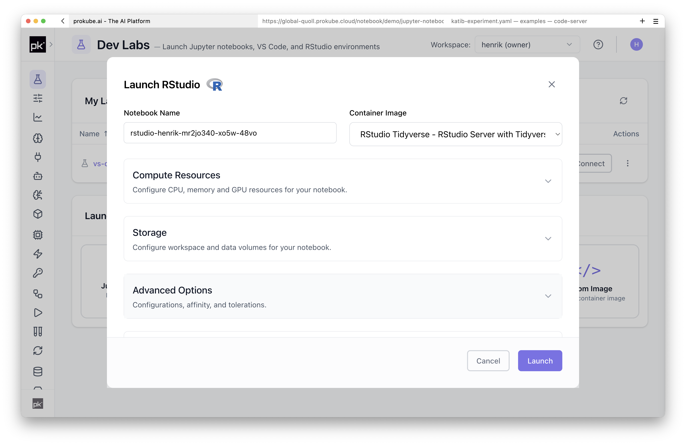
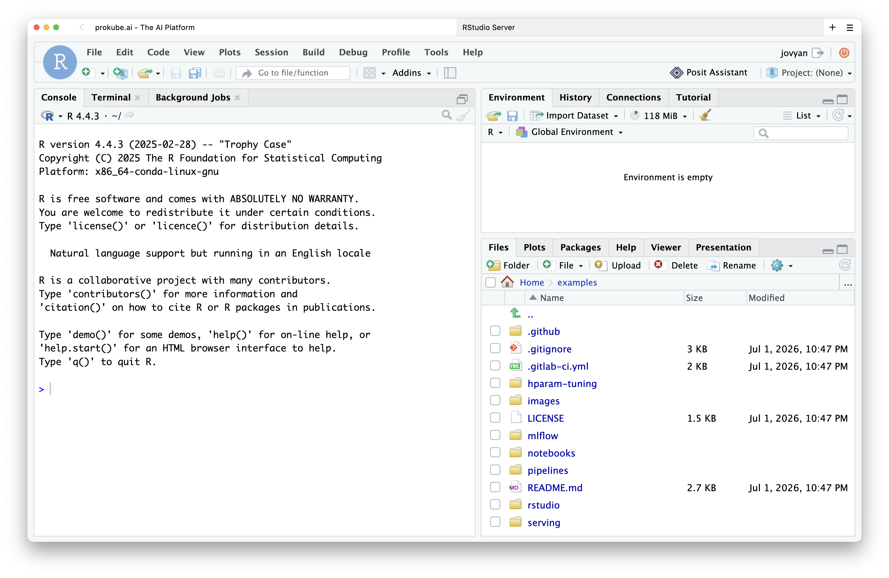

# RStudio

RStudio Labs provide a browser-based R development environment inside a prokube workspace.

Use RStudio when your workflow is centered around R packages, statistical analysis, reports, or notebooks that benefit from an R-native IDE.

## Getting Started

Create an RStudio Lab from the Labs page. The launch dialog uses the same basic options as other Labs: name, image, compute resources, storage, configurations, and security options.

The selected image defines the R version, installed R packages, system libraries, and command-line tools available when the Lab starts.

## Common Uses

- Exploratory data analysis with R.
- Statistical modeling and visualization.
- R Markdown and report generation.
- Accessing workspace storage and platform services from R code.

RStudio uses the same persistence, object-storage, and image-building model as other Labs. See [Using Labs](index.md) for shared workspace, storage, package-installation, and BuildKit details.

::: info RStudio documentation
For RStudio features that are not specific to prokube, use the upstream [RStudio documentation](https://docs.posit.co/ide/user/).
:::

For controlled R package stacks or additional system libraries, use a custom image. prokube can also support custom Lab solutions when the standard images do not fit your team's requirements.

## Related Pages

- [Using Labs](index.md)
- [Custom Notebooks](custom_notebooks.md)
- [Existing documentation](https://docs.prokube.ai/latest/)
