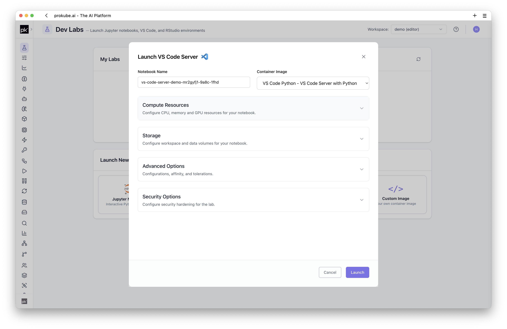
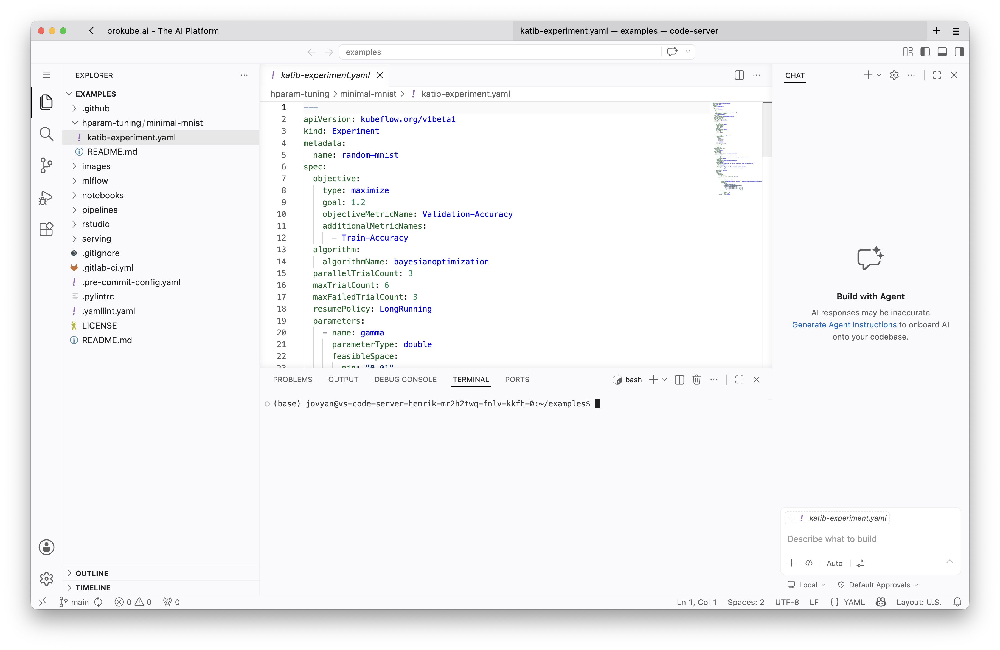
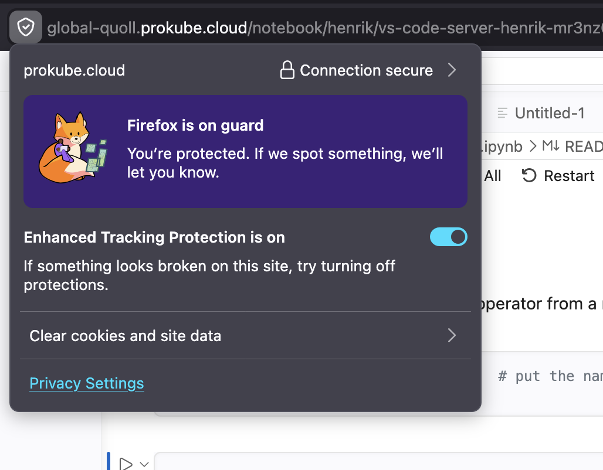
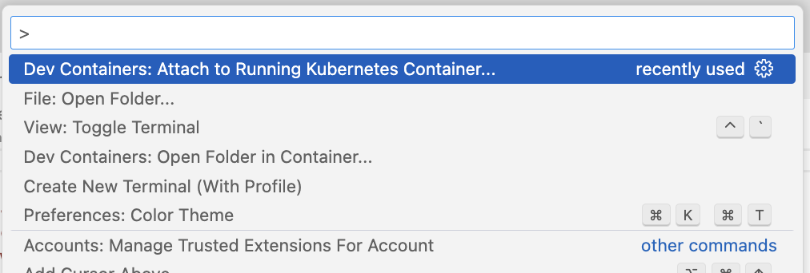
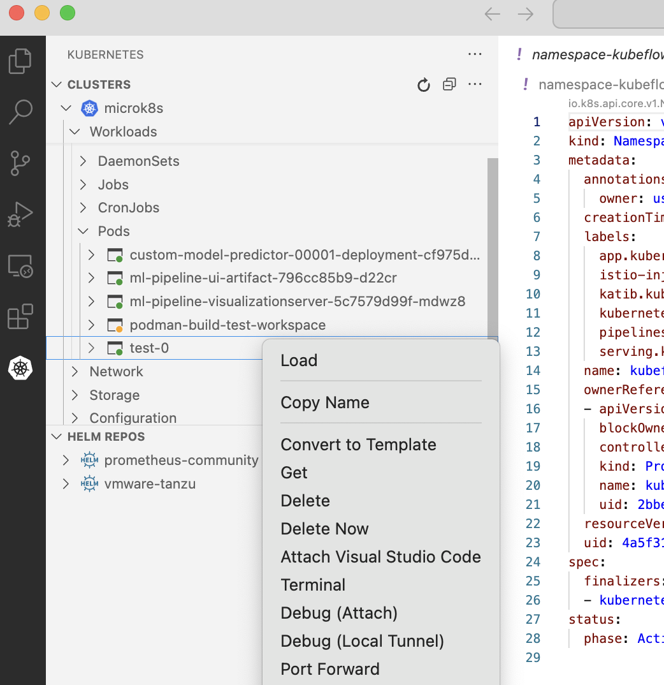

# VS Code

VS Code can be used with Labs in two ways.

- Start a browser-based VS Code Lab. The VS Code server runs inside the workspace and is opened through the browser.
- Attach your local VS Code editor to a running Lab pod through Dev Containers. This can be a VS Code Lab or a JupyterLab Lab.

Both workflows keep code execution inside the prokube workspace, close to workspace storage, cluster services, GPUs, and platform credentials. The difference is mainly where the editor UI runs: in the browser, or in your local VS Code installation.

::: info VS Code documentation
For VS Code features that are not specific to prokube, use the upstream [VS Code documentation](https://code.visualstudio.com/docs). For local attachment workflows, see the [Dev Containers documentation](https://code.visualstudio.com/docs/devcontainers/attach-container#_attach-to-a-container-in-a-kubernetes-cluster).
:::

## When to Use VS Code Labs

Use browser-based VS Code Labs when you want to:

- work on Python packages, pipeline components, model servers, MCP servers, or agent code in a full editor;
- use a terminal with workspace credentials, `kubectl`, SDKs, CLIs, and Git already close to the platform;
- use the [GitHub Copilot extension](https://marketplace.visualstudio.com/items?itemName=GitHub.copilot) in the browser-based editor when it is available in your selected image;
- build and push container images from inside the cluster when the selected image includes Docker CLI, Buildx, and remote BuildKit support;
- keep a development environment running in the workspace instead of depending on your laptop setup;
- use VS Code in the browser without setting up local cluster access first.

Use local VS Code attachment when you want your local extensions, keybindings, editor settings, or window management while the code still runs in the Lab pod.

Use [JupyterLab](jupyterlab.md) instead when the primary artifact is a notebook or exploratory analysis. VS Code is also a good fit for agent-assisted IDE workflows through editor extensions and chat widgets. Use [OpenCode](opencode.md) when you want a more purely agentic setup with long-running agent sessions, terminal-first interaction, or work across multiple projects inside the workspace.

## Start a Browser-Based VS Code Lab

Create a VS Code Lab from the Labs page. The launch dialog uses the same basic options as other Labs: name, image, compute resources, storage, configurations, and security options.



For VS Code, the image choice mainly decides the IDE server, language stack, system tools, and preinstalled packages. Choose an image that is close to your workload instead of relying on ad-hoc system changes after startup.

After the Lab starts, open it from the Labs table. The browser session connects to the VS Code server running inside the Lab pod.



### Browser Notes

Browser-based VS Code needs the browser to forward editor shortcuts and terminal input to the web app. If shortcuts such as `Command+Shift+P` for the command palette do not reach VS Code, or if pasting into the integrated terminal behaves inconsistently, try Chrome. We have had the most reliable results with Chrome for browser-based VS Code Labs.

In Firefox, disabling **Enhanced Tracking Protection** for the Lab page can help with terminal paste behavior and keyboard handling.



Typical first steps:

```bash
pwd
git clone <repository-url>
kubectl get pods
```

The exact tools available depend on the selected image. prokube-maintained images commonly include platform-oriented tooling such as `kubectl`, Git, shell utilities, Python tooling, SDKs, object-storage helpers, and Docker/Buildx support where applicable.

VS Code Labs use the same persistence and package-installation model as other Labs. See [Using Labs](index.md#persistence-and-package-installation) for the shared storage rules and [Custom Notebooks](custom_notebooks.md) for repeatable image-based environments.

## Platform Workflows from VS Code

Because the Lab runs inside your workspace, the terminal can interact with platform services directly when your role allows it.

Common workflows include:

- editing pipeline component code and submitting pipeline runs;
- developing model servers or inference helpers before moving them to model serving;
- building container images for pipelines, model serving, MCP servers, or agent runtimes when the selected image includes [remote BuildKit support](index.md#building-container-images);
- inspecting workspace resources with `kubectl`;
- working with object storage through configured [CLIs or SDKs](index.md#object-storage-from-labs);
- developing and testing code that later runs in [Agent Sandboxes](../agentops/sandboxes.md).

## Attach Local VS Code to a Running Lab

If you prefer your local VS Code setup, you can attach it to the container backing a running Lab. The target does not have to be a browser-based VS Code Lab; attaching to a JupyterLab pod is also a common workflow when you want local editor features against the same files and environment.

Prerequisites:

- a running Lab pod in your workspace;
- local `kubectl` access to the cluster;
- a kubeconfig available at the default VS Code location, usually `~/.kube/config` on macOS/Linux or `%USERPROFILE%\.kube\config` on Windows. If you do not have one yet, open the prokube UI, click your user icon in the top-right corner, and use the `Download kubeconfig` action;
- the [Dev Containers extension](https://marketplace.visualstudio.com/items?itemName=ms-vscode-remote.remote-containers);
- optionally, the [Kubernetes extension](https://marketplace.visualstudio.com/items?itemName=ms-kubernetes-tools.vscode-kubernetes-tools) for a visual pod browser.

Attach through the command palette:

1. Open VS Code locally.
2. Run `Dev Containers: Attach to Running Kubernetes Container...` from the command palette.
3. Select the Lab pod in your workspace namespace.
4. Select the main Lab container, not the sidecar container such as `istio-proxy`.
5. Open the persistent home directory, usually `/home/jovyan`.



Attach through the Kubernetes extension:

1. Open the Kubernetes explorer in VS Code.
2. Navigate to your namespace and find the Lab pod.
3. Right-click the main Lab container.
4. Select `Attach Visual Studio Code`.
5. Open the persistent home directory, usually `/home/jovyan`.



If the container restarts or becomes unstable after attaching, increase the memory assigned to the Lab. A local VS Code attachment can consume additional memory inside the container.

## Working with Notebooks from Local VS Code

Local VS Code attachment is useful for editing files and running terminals inside the Lab container. For JupyterLab pods, it can also be useful when you want to edit notebooks or supporting Python modules locally while keeping execution in the cluster.

Notebook kernel integration depends on the selected image and the VS Code extensions installed in the remote container. If notebooks are the main artifact and you do not need local editor integration, use [JupyterLab](jupyterlab.md). If you edit notebooks from local VS Code, keep them under `/home/jovyan` or another mounted directory so changes are persisted with the Lab storage.

## Operational Notes

Browser-based VS Code and RStudio Labs may not report idleness in the same way as JupyterLab. Do not rely on automatic idle shutdown unless your administrator has confirmed it for your environment.

For start, stop, delete, recreate, and troubleshooting behavior, see [Managing Labs](index.md#managing-labs) and [Troubleshooting Labs](index.md#troubleshooting-labs).

## Related Pages

- [Using Labs](index.md)
- [JupyterLab](jupyterlab.md)
- [OpenCode](opencode.md)
- [Custom Notebooks](custom_notebooks.md)
- [Agent Sandboxes](../agentops/sandboxes.md)
