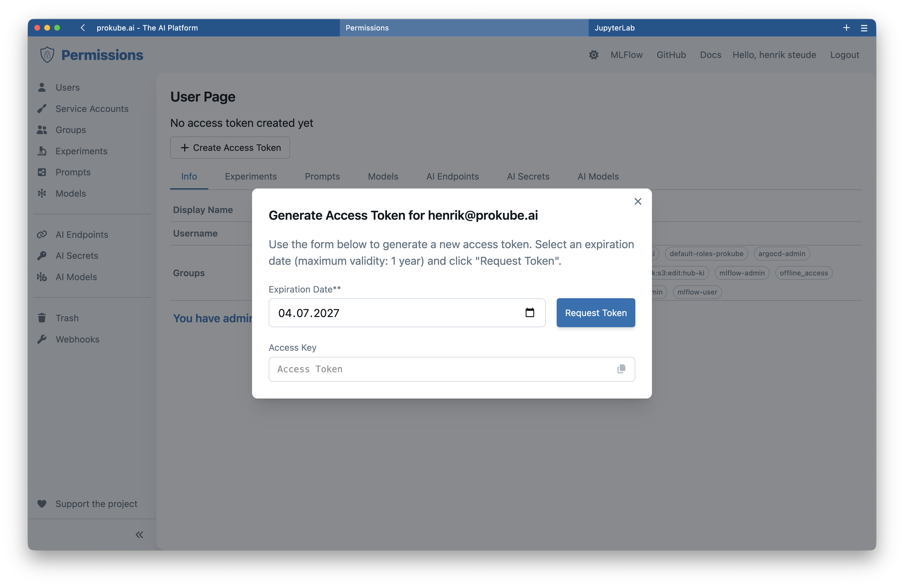
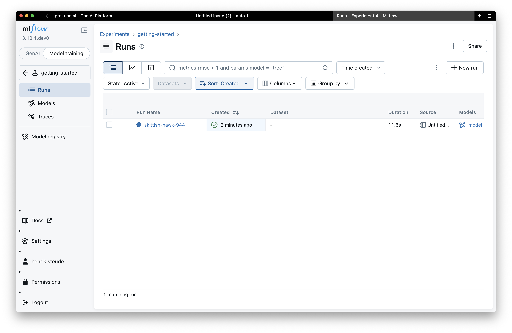

# MLflow

prokube.ai exposes MLflow for experiment tracking, model registry, and artifact management in your workspace.

::: info MLflow documentation
For MLflow features that are not specific to prokube.ai, use the upstream documentation:

- [MLflow documentation](https://mlflow.org/docs/latest/ml/)
- [MLflow API reference](https://mlflow.org/docs/latest/api_reference/index.html)
- [MLflow Tracking guide](https://mlflow.org/docs/latest/ml/tracking/)
:::

Use this page for the prokube.ai-specific parts: how to access the MLflow UI, create credentials, manage permissions, and integrate MLflow with Pipelines and Model Serving.

## Get Started

### 1) Access the MLflow UI

Open the MLflow sidebar link (under ML Tools) – it opens the MLflow tracking UI in a new tab. You will be prompted to log in through the platform's OIDC provider.

<!-- TODO: add screenshot -- MLflow tracking UI main page showing experiments list -->

### 2) Create a Personal Access Token

Programmatic access uses a personal access token (PAT). Navigate to the MLflow **Users** admin page (accessible from the MLflow UI or directly at `/mlflow/users`). Click **Generate Token** and copy the token value.



Set these environment variables in your Lab, pipeline task, hyperparameter tuning job, or any other workload:

```sh
export MLFLOW_TRACKING_URI=https://<cluster-domain>/mlflow
export MLFLOW_TRACKING_USERNAME=<your-email>
export MLFLOW_TRACKING_PASSWORD=<your-pat>
export MLFLOW_ENABLE_PROXY_MULTIPART_UPLOAD=true
```

The `MLFLOW_ENABLE_PROXY_MULTIPART_UPLOAD` flag is required because the MLflow API is accessed through a proxy. The PAT authenticates you against the MLflow API. Tokens are cached and can be rotated or revoked from the same admin page at any time.

### 3) Log your first experiment

Open a [JupyterLab](../labs/jupyterlab.md) or [VS Code Lab](../labs/vscode.md) in your workspace and run this cell:

```python
import os

os.environ["MLFLOW_TRACKING_URI"] = "https://<cluster-domain>/mlflow"
os.environ["MLFLOW_TRACKING_USERNAME"] = "<your-email>"
os.environ["MLFLOW_TRACKING_PASSWORD"] = "<your-pat>"
os.environ["MLFLOW_ENABLE_PROXY_MULTIPART_UPLOAD"] = "true"

import mlflow
from sklearn import datasets, svm

iris = datasets.load_iris()
model = svm.SVC().fit(iris.data, iris.target)

mlflow.set_experiment("getting-started")

with mlflow.start_run():
    mlflow.log_param("model", "SVC")
    mlflow.log_param("dataset", "iris")
    mlflow.log_metric("accuracy", 0.97)
    mlflow.log_metric("f1_score", 0.96)
    mlflow.sklearn.log_model(
        sk_model=model,
        name="model",
    )
```

Replace `<cluster-domain>`, `<your-email>`, and `<your-pat>` with your values.

After the run completes, refresh the MLflow UI to see the experiment, run, metrics, and registered model.



## Authentication and Credentials

In a Lab or on your local machine, set the environment variables `MLFLOW_TRACKING_USERNAME`, `MLFLOW_TRACKING_PASSWORD`, and `MLFLOW_TRACKING_URI` directly – the MLflow SDK reads them from the process environment.

For automated workloads (pipelines, Katib experiments, training containers, Dask workers, KServe InferenceServices), create a Kubernetes secret named `mlflow-credentials` in the namespace where the workload runs. It contains the same three values:

```sh
kubectl create secret generic mlflow-credentials \
  --from-literal=MLFLOW_TRACKING_URI=https://<cluster-domain>/mlflow \
  --from-literal=MLFLOW_TRACKING_USERNAME=<your-email> \
  --from-literal=MLFLOW_TRACKING_PASSWORD=<your-pat>
```

You can also create the secret from the prokube.ai UI – open the namespace's **Secrets** page and add the three keys with the same values.

## Run the Examples

The [`prokube/examples` repository](https://github.com/prokube/examples) contains MLflow notebooks and supporting files you can run directly from a Lab.

| Example | Use when |
|---|---|
| [`mlflow/mlflow-quickstart-example`](https://github.com/prokube/examples/tree/main/mlflow/mlflow-quickstart-example.ipynb) | You want the shortest end-to-end: train, log, register, and verify in the MLflow UI. |
| [`mlflow/mlflow-image-example`](https://github.com/prokube/examples/tree/main/mlflow/mlflow-image-example.ipynb) | You need to log figures, plots, or structured data alongside model metrics. |
| [`mlflow/mlflow-kfp-example`](https://github.com/prokube/examples/tree/main/mlflow/mlflow-kfp-example.ipynb) | You want to use MLflow tracking inside a Kubeflow Pipeline. Shows secret injection via `use_secret_as_env`. |
| [`mlflow/mobile-price-classification`](https://github.com/prokube/examples/tree/main/mlflow/mobile-price-classification) | You want a full MLOps pipeline with hyperparameter tuning, MLflow tracking, and model registry in a single workflow. |

Related serving examples are on the [Model Serving](model_serving.md#run-the-examples) page.

## Manage Access to Experiments and Models

MLflow experiments and models are private by default – each user can only see their own resources.

### Permission Levels

| Level | Can |
|---|---|
| READ | View experiments, runs, and model versions |
| EDIT | Log runs, register new model versions |
| MANAGE | Change permissions, delete resources |

### Groups and Team Access

Keycloak realm roles are synchronised as MLflow groups. An administrator can grant an entire group READ, EDIT, or MANAGE access to an experiment or model. This is the recommended way to share resources within a team.

### Service Accounts

For automated workloads (pipelines, scheduled training), create a service account from the **Users** admin page. Generate a PAT for the service account and store it in a Kubernetes secret. The service account owns the resources it creates; team members with MANAGE access on the relevant group can also manage them.

<!-- TODO: add screenshot -- MLflow Users admin page listing users and service accounts -->

## Integrations

### With Kubeflow Pipelines

Inject MLflow credentials into pipeline components using the KFP Kubernetes SDK:

```python
from kfp import kubernetes

kubernetes.use_secret_as_env(
    task,
    secret_name="mlflow-credentials",
    secret_vals_to_env={
        "MLFLOW_TRACKING_URI": "MLFLOW_TRACKING_URI",
        "MLFLOW_TRACKING_USERNAME": "MLFLOW_TRACKING_USERNAME",
        "MLFLOW_TRACKING_PASSWORD": "MLFLOW_TRACKING_PASSWORD",
    },
)
```

The components then use the standard `mlflow` Python SDK to log parameters, metrics, and models. See the [Pipelines](pipelines.md) page for the base workflow.

### With Model Serving

Deploy a model from the MLflow Model Registry as a KServe InferenceService. From the **Create Model** wizard, click **Import from MLflow** to browse registered models and select a version or run artifact.

The wizard generates a `storageUri` in the `mlflow://` format and sets the correct framework. The `mlflow-credentials` secret must exist in the namespace before deployment.

For `kubectl`-based deployment, use one of these URI patterns:

- `mlflow://models/<model-name>/<version>` – specific version
- `mlflow://models/<model-name>/<stage>` – stage alias (`staging`, `production`, `latest`)
- `mlflow://runs/<run-id>/<artifact-path>` – run artifact

See [Model Serving – MLflow Model Registry](model_serving.md#mlflow-model-registry) for details.

## Troubleshooting

- **401 Unauthorised** – the PAT is missing, expired, or invalid. Generate a new token from the MLflow **Users** admin page and update the environment variable or secret.
- **403 Forbidden** – the experiment or model exists but you (or your PAT) do not have the required permission level. Request access from the resource owner or an administrator.
- **Run not visible in the UI** – verify that `MLFLOW_TRACKING_URI` points to the correct cluster domain and that the PAT belongs to the user who created the experiment.
- **mlflow:// URI fails in KServe** – confirm the `mlflow-credentials` secret exists in the InferenceService namespace and contains all three required keys (`MLFLOW_TRACKING_URI`, `MLFLOW_TRACKING_USERNAME`, `MLFLOW_TRACKING_PASSWORD`).
- **Token revoked** – invalidating or regenerating a PAT immediately blocks all clients using the old token. Update all secrets and environment variables that reference the old token.
- **Model not found in registry** – model names must be unique across the platform. If a model name is taken, use a name that includes a personal or team identifier.

## Related Pages

- [Model Serving](model_serving.md)
- [Pipelines](pipelines.md)
- [Labs](../labs/index.md)
