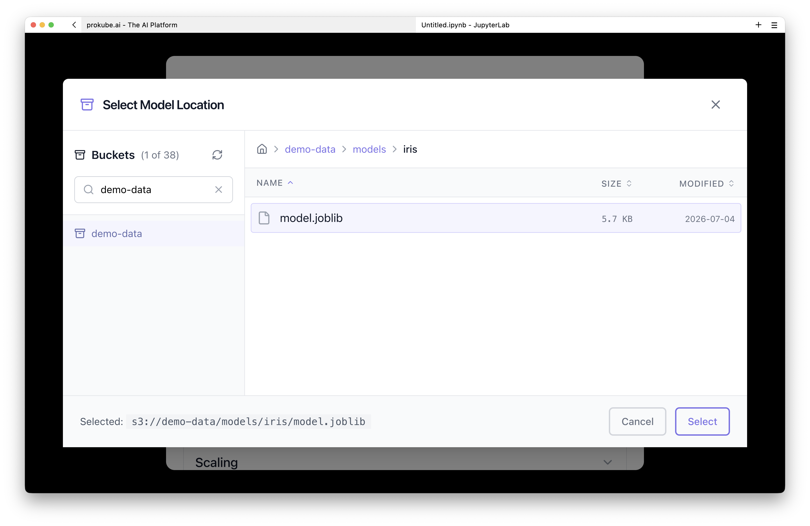
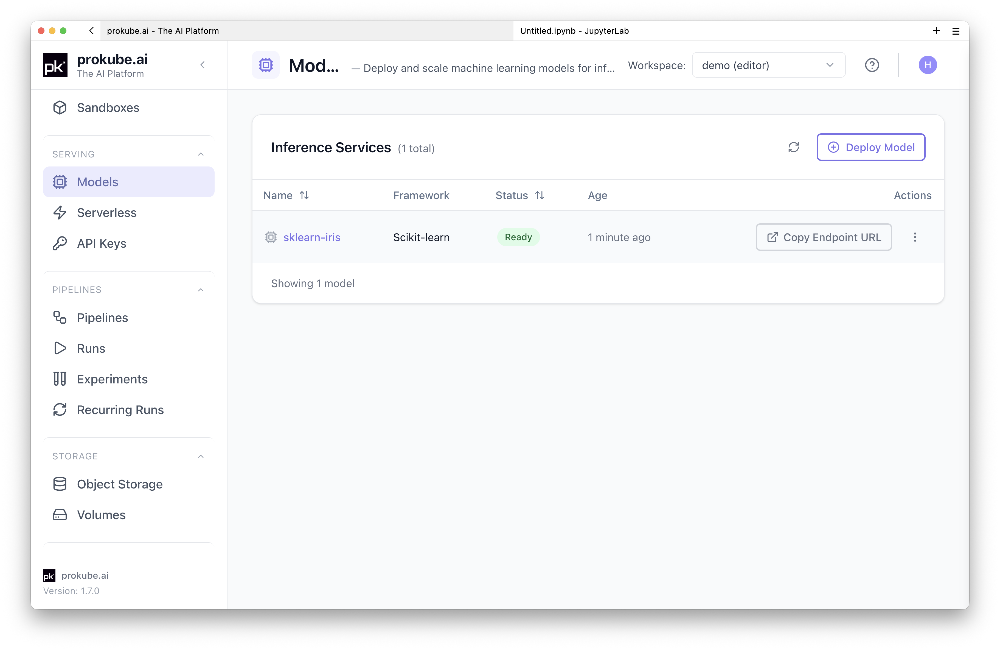
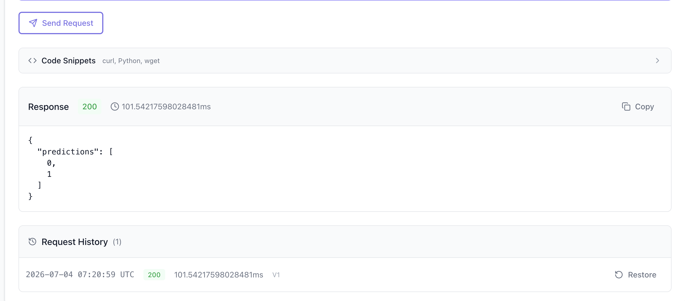
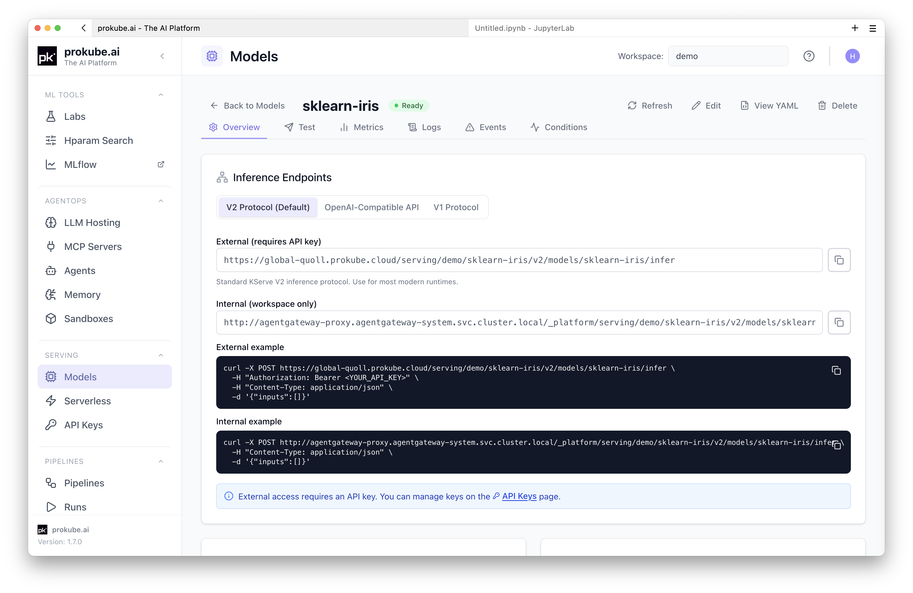

# Model Serving

prokube exposes KServe for deploying and scaling machine learning models as inference endpoints in your workspace.

::: info KServe documentation
Upstream references:

- [KServe documentation](https://kserve.github.io/website/)
- [KServe inference protocol (V2)](https://kserve.github.io/website/latest/modelserving/data_plane/v2_protocol/)
- [KServe autoscaling](https://kserve.github.io/website/docs/model-serving/predictive-inference/autoscaling/)
:::

## When to Use Model Serving

Use KServe InferenceServices when a trained model should be available as an API endpoint:

- serve models trained or tracked in the same workspace;
- deploy models from S3-compatible file storage or from the MLflow model registry;
- scale inference replicas automatically based on request concurrency, QPS, or custom metrics;
- test model behaviour interactively before integrating into production;
- use the v2 inference protocol for framework-agnostic model access;
- expose endpoints for external applications through the Agent Gateway with API key authentication.

Use [Labs](../labs/index.md) or [Pipelines](pipelines.md) for training and exporting models. Move to Model Serving when the model should become a reachable endpoint.

This page covers classic KServe model serving: deploying sklearn, PyTorch, MLflow, and similar models as inference endpoints. For LLM-focused serving (vLLM, TGI, OpenAI-compatible APIs), see the [AgentOps documentation](../agentops/index.md) – large language models follow a different operational pattern and are documented separately there.

## Get Started

The simplest way to get started is to train a small model in a Lab, upload it to the workspace S3 bucket, and deploy it – all from a notebook cell or Python script.

### 1) Train and upload a model

Open a [JupyterLab](../labs/jupyterlab.md) or [VS Code Lab](../labs/vscode.md) in your workspace and run this cell:

```python
import joblib
from sklearn import datasets, svm
import s3fs

iris = datasets.load_iris()
model = svm.SVC().fit(iris.data, iris.target)
joblib.dump(model, "model.joblib")

namespace = open("/var/run/secrets/kubernetes.io/serviceaccount/namespace").read().strip()  # for automation only
bucket = f"{namespace}-data"
s3_path = f"{bucket}/models/iris"

s3 = s3fs.S3FileSystem()
s3.put("model.joblib", f"{s3_path}/model.joblib")
print(f"Uploaded to s3://{s3_path}")
```

### 2) Create the InferenceService

Open the **Models** page, click **Deploy Model**, and use the **Form** tab:

- **Model Name** – `sklearn-iris`.
- **Framework** – select **Scikit-learn**.
- **Storage URI** – pick the `models/iris` directory using **Browse S3** or type the exact path from the script output (`s3://<namespace>-data/models/iris`).



Click **Deploy Model**. Once deployed, you will find a new entry in the model list. It will take a minute or two for the model to become ready.



### 3) Test the endpoint

Open the model detail page and switch to the **Test** tab. Select **V1** protocol and send sample data:

```json
{
  "instances": [[5.1, 3.5, 1.4, 0.2], [6.8, 2.8, 4.8, 1.4]]
}
```

The response shows the predicted class for each row.



For more realistic examples that cover different frameworks, storage backends, and deployment patterns, use the [`prokube/examples`](https://github.com/prokube/examples) repository. It is cloned into managed Labs by default (under `~/examples/serving/`) and includes notebooks and scripts you can run directly.

## Run the Examples

| Example | Use when |
|---|---|
| [`serving/minimal-s3-model`](https://github.com/prokube/examples/tree/main/serving/minimal-s3-model) | You want an end-to-end workflow: train a model, upload to S3-compatible storage, deploy as InferenceService, and test it. Includes a Jupyter notebook. |
| [`serving/mlflow-kserve-minimal`](https://github.com/prokube/examples/tree/main/serving/mlflow-kserve-minimal) | You have a model tracked in MLflow and want to deploy it with the `mlflow://` storage URI and v2 protocol. No custom container required. |
| [`serving/mlflow-kserve-inference-protocols`](https://github.com/prokube/examples/tree/main/serving/mlflow-kserve-inference-protocols) | You want to compare v1 vs v2 inference protocol request bodies and InferenceService manifests for MLflow models. |
| [`serving/hf-vllm-completion`](https://github.com/prokube/examples/tree/main/serving/hf-vllm-completion) | You want to serve an LLM with vLLM (GPU) or Hugging Face (CPU) backend, with OpenAI-compatible chat completion API. |
| [`serving/minimal-custom-kserve-predictor`](https://github.com/prokube/examples/tree/main/serving/minimal-custom-kserve-predictor) | You need a custom inference container with your own logic. Shows local development, container image building, and deployment. |
| [`serving/kserve-keda-autoscaling`](https://github.com/prokube/examples/tree/main/serving/kserve-keda-autoscaling) | You need KEDA-based autoscaling with custom Prometheus metrics (e.g. vLLM token throughput). Includes load generator and calibration scripts. |
| [`serving/minimal-example-shadow-deployment`](https://github.com/prokube/examples/tree/main/serving/minimal-example-shadow-deployment) | You want to test a new model variant against production traffic without serving real users. Uses Istio VirtualService for traffic mirroring. |

## UI Reference

The creation wizard has two tabs: **Form** and **YAML**.

### Form Tab

The form guides you through the required fields:

- **Model Name** – a Kubernetes-safe name for the InferenceService.
- **Framework** – select the ML framework your model was trained with. Supported frameworks include Scikit-learn, TensorFlow, PyTorch, ONNX, XGBoost, LightGBM, Triton, Hugging Face, and Custom (for arbitrary container images).
- **Storage URI** – the path to your model artifact. Use the buttons next to the field to pick a source:
  - **Browse S3** – opens the S3 browser for your workspace. Navigate buckets and select a model directory.
  - **Import from MLflow** – opens the MLflow model picker. Browse the Model Registry by version or stage alias, or select a run artifact directly. The resulting URI uses the `mlflow://` scheme, which KServe resolves through a custom storage initializer that downloads the model via the MLflow API (no cross-namespace S3 credentials required).
- **Runtime Version** – optional; pins the KServe serving runtime image version.

When **Custom** framework is selected, the Storage URI field is replaced by **Container Image** (the full image reference) and **Container Port** (default `8080`).

Optional sections (collapsible):

- **Scaling** – min and max replicas. Set min replicas to `0` for scale-to-zero.
- **Resources** – CPU and memory requests and limits, plus optional GPU count.

### YAML Tab

Paste a raw KServe `InferenceService` manifest, optionally with a `ScaledObject` separated by `---`. Use **Load Example** to populate the editor with a valid template:

```yaml
apiVersion: serving.kserve.io/v1beta1
kind: InferenceService
metadata:
  name: my-model
spec:
  predictor:
    model:
      modelFormat:
        name: sklearn
      storageUri: s3://my-bucket/my-model
      resources:
        requests:
          cpu: 100m
          memory: 256Mi
        limits:
          cpu: "1"
          memory: 1Gi
```

You can also **Upload File** to load a `.yaml` or `.yml` manifest from disk.

Switching to the YAML tab auto-generates a preview from the form data. Switching back parses the YAML back into form fields and warns about unsupported fields (transformer, explainer, nodeSelector, tolerations, affinity, etc.).

Click **Deploy from YAML** to create the resource directly.

<!-- TODO: add screenshot -- Deploy Model YAML tab with editor, Load Example link, Upload File link -->

The YAML tab makes the pattern explicit: use the UI for quick creation, inspect the generated manifest to understand the resource, and use the same manifest with `kubectl` for GitOps-driven production deployments.

### After Deployment

The detail page shows the InferenceService status, endpoint URLs, configuration, and resource allocation across several tabs:

| Tab | Content |
|---|---|
| **Overview** | Endpoint URLs (V2 and V1 protocols), configuration card, resources card, timestamps |
| **Test** | Interactive inference testing panel |
| **Metrics** | Grafana dashboards for the endpoint |
| **Logs** | Inference pod logs |
| **Events** | Kubernetes events for the InferenceService |
| **Conditions** | KServe condition status |



From the detail page header you can **Edit**, **View YAML**, or **Delete** the model. The View YAML modal shows the live manifest and allows editing with an **Apply Changes** flow – the same YAML can be checked into version control and applied through `kubectl`.

## Test a Deployed Model

The **Test** tab provides an interactive panel for sending inference requests without leaving the UI.

1. **Protocol** – select V2 (Open Inference Protocol) or V1 (TensorFlow Serving style). The panel auto-generates a starter request body for the selected protocol.
2. **Request body** – edit the JSON payload in the monospace editor. Use **Format** to prettify. Validation runs live.
3. **Timeout** – set a timeout in seconds (5–300, default 60).
4. **Send Request** – submits the payload to the live endpoint. The response shows HTTP status code, latency, and the response body.

The panel also generates **code snippets** (curl, Python, wget) with the `Authorization: Bearer` header pre-filled, so you can reproduce the request outside the UI. You need a valid API key for external requests — see [API Keys](../platform/api_keys.md).

Request history (last 10) is preserved during the session; click **Restore** to reload a previous payload.

## Autoscaling

::: info Upstream documentation
For autoscaling features that are not specific to prokube, use the upstream documentation:

- [KServe autoscaling](https://kserve.github.io/website/docs/model-serving/predictive-inference/autoscaling/)
- [Knative Pod Autoscaler (KPA)](https://kserve.github.io/website/docs/model-serving/predictive-inference/autoscaling/kpa-autoscaler/)
- [Kubernetes HPA](https://kserve.github.io/website/docs/model-serving/predictive-inference/autoscaling/hpa-autoscaler/)
- [KEDA](https://kserve.github.io/website/docs/model-serving/predictive-inference/autoscaling/keda-autoscaler/)
:::

KServe supports three autoscaling strategies:

- **Knative Pod Autoscaler (KPA)** – the default. Scales on concurrency or QPS. Supports scale-to-zero when min replicas is `0`.
- **Kubernetes HPA** – scales on CPU or memory utilisation.
- **KEDA** – scales on custom Prometheus metrics, useful for LLM workloads (e.g. vLLM token throughput). See the [`kserve-keda-autoscaling`](https://github.com/prokube/examples/tree/main/serving/kserve-keda-autoscaling) example.

Configure scaling through the **Scaling** section in the deployment form, or set `scaleTarget`, `scaleMetric`, and `minReplicas`/`maxReplicas` directly in the YAML manifest.

For strict per-replica request concurrency, use KServe/Knative YAML fields such as `containerConcurrency`. For LLM workloads, request count is often not enough to model load accurately; token throughput, queue depth, and GPU memory pressure can be better scaling signals. The [`kserve-keda-autoscaling`](https://github.com/prokube/examples/tree/main/serving/kserve-keda-autoscaling) example shows a KEDA-based pattern for this.

KEDA and the Knative Pod Autoscaler should not manage the same workload at the same time. If you configure KEDA manually, use the deployment mode and annotations required by your KServe version and cluster policy.

For a detailed KPA walkthrough and a manual KEDA/vLLM token-throughput example, see [Model Serving Autoscaling](model_serving_autoscaling.md).

## Storage and Credentials

### S3-compatible Storage

InferenceServices access models in S3-compatible file storage through a `ServiceAccount` annotated with S3 endpoint details. The prokube workspace is preconfigured with S3-compatible storage; use the **File Storage** page in the UI to see available buckets. See [File Storage](../platform/file_storage.md) for storage browser, path, and client details.

For models stored in workspace buckets, the deployment wizard's **Browse S3** button selects the path directly. For `kubectl`-based deployment, a secret named `s3creds` with the correct KServe annotations already exists in the workspace namespace and grants access to the buckets the workspace can see. Reference it from the InferenceService via `spec.predictor.serviceAccountName`.

### MLflow Model Registry

Use `storageUri` values starting with `mlflow://` to deploy models registered in MLflow without exposing S3 credentials across namespaces. This requires a secret named `mlflow-credentials` in the same namespace as the InferenceService, containing `MLFLOW_TRACKING_URI`, `MLFLOW_TRACKING_USERNAME`, and `MLFLOW_TRACKING_PASSWORD`. The wizard's **Import from MLflow** button helps select the model; the secret must exist in the namespace before deployment. See [MLflow](mlflow.md) for instructions on creating the secret and obtaining your credentials.

The URI format:

- `mlflow://models/<model-name>/<version>` – specific version
- `mlflow://models/<model-name>/<stage>` – stage alias (`staging`, `production`, `latest`)
- `mlflow://runs/<run-id>/<artifact-path>` – run artifact

A custom [`mlflow-storage-initializer`](https://github.com/prokube/prokube-images/tree/main/mlflow-storage-initializer) init container resolves these URIs by fetching the model artifact through the MLflow API using namespace-scoped credentials (`MLFLOW_TRACKING_URI`, `MLFLOW_TRACKING_USERNAME`, `MLFLOW_TRACKING_PASSWORD`). The wizard's **Import from MLflow** button handles the credential setup automatically.

## External Access

To call a model endpoint from outside the cluster, you need a workspace-scoped API key. Create one on the **API Keys** page under AI Gateway — keys can be scoped to a specific workspace or to individual services. See [API Keys](../platform/api_keys.md) for details.

Include the key in requests:

```
Authorization: Bearer <api-key>
```

The inference URL follows this pattern:

```
https://<cluster-domain>/serving/<namespace>/<inference-service-name>/v2/models/<model-name>/infer
```

The UI shows the exact URL for each protocol (V1 and V2) on the model detail page.

## Version Matching

Python library versions used during training should match the versions in the KServe serving runtime. Mismatches cause `ModuleNotFoundError` or pickle deserialisation failures at model load time.

To check the cluster KServe version from your own InferenceService:

```sh
kubectl get pod <your-pod-name> -n <your-namespace> \
  -o jsonpath="{.spec.initContainers[?(@.name=='storage-initializer')].image}" \
  | cut -d':' -f2
```

Alternatively, ask your administrator for the current KServe version.

To find library versions pinned in a runtime image, browse the KServe repository at the matching tag under `python/<runtime>/pyproject.toml`. See the upstream [version matching guide](https://kserve.github.io/website/) for details.

Version matching is especially important for models serialized with `pickle`, `joblib`, or framework-native formats that load Python objects. A model trained with one scikit-learn, PyTorch, XGBoost, or Python version can fail during serving even when the artifact path and credentials are correct.

Administrators can inspect installed `ServingRuntime` and `ClusterServingRuntime` resources to identify the runtime image used by a deployment:

```bash
kubectl get servingruntime,clusterservingruntime -A
```

## Local Model Cache

Some KServe versions support local model cache resources for large S3-backed models. A local cache can reduce cold-start time by keeping model artifacts on selected nodes, but it is a cluster-level feature that requires administrator configuration and enough node-local storage.

Use local cache only when the installed KServe version and platform configuration support it. Users should not assume that adding a large model to S3-compatible file storage automatically enables node-local caching.

## Troubleshooting

Start with the model detail page in the UI. The **Conditions** tab surfaces KServe condition states. The **Logs** tab shows predictor pod logs. The **Events** tab shows Kubernetes events.

Use the [Logs browser](../platform/observability.md#logs-browser) when you need to search retained logs by pod, container, label, or time range.

Common causes:

- **Model not Ready** – check the Conditions tab for the failure reason. Common issues: invalid storage URI, missing credentials, insufficient resources.
- **ModuleNotFoundError** – library version mismatch between training and serving runtime. See [Version Matching](#version-matching).
- **Image pull errors** – verify the container image reference and registry credentials for custom predictors.
- **401 Unauthorized** – missing or invalid API key. Create an API key from the user menu under **API Keys**.
- **Pods are running but the InferenceService is not ready** – check KServe conditions first. If the model and transformer pods look healthy but readiness does not progress, an administrator may need to inspect Knative Serving controller logs and route status.
- **Model load timeout** – large models may need a longer Knative progress deadline or an administrator-configured local model cache. In YAML, set `serving.knative.dev/progress-deadline` under `spec.predictor.annotations` when supported by your cluster.
- **Service IP range exhausted** – errors such as `failed to allocate a serviceIP: range is full` are cluster-level capacity issues. Ask an administrator to inspect stale Services, Knative revision garbage collection, and service CIDR capacity.
- **Model needs a specific node type** – use YAML to set `spec.predictor.nodeSelector`, affinity, or tolerations when the cluster allows those fields. The form may not expose advanced scheduling fields.

Example progress-deadline annotation:

```yaml
apiVersion: serving.kserve.io/v1beta1
kind: InferenceService
metadata:
  name: large-model
spec:
  predictor:
    annotations:
      serving.knative.dev/progress-deadline: 180m
    model:
      modelFormat:
        name: huggingface
      storageUri: s3://models/large-model
```

Example node selector:

```yaml
apiVersion: serving.kserve.io/v1beta1
kind: InferenceService
metadata:
  name: gpu-model
spec:
  predictor:
    nodeSelector:
      nvidia.com/gpu.product: NVIDIA-H100-NVL
    model:
      modelFormat:
        name: huggingface
      storageUri: s3://models/gpu-model
```

## Related Pages

- [Labs](../labs/index.md)
- [File Storage](../platform/file_storage.md)
- [MLflow](mlflow.md)
- [Pipelines](pipelines.md)
- [Model Serving Autoscaling](model_serving_autoscaling.md)
- [API Keys](../platform/api_keys.md)
