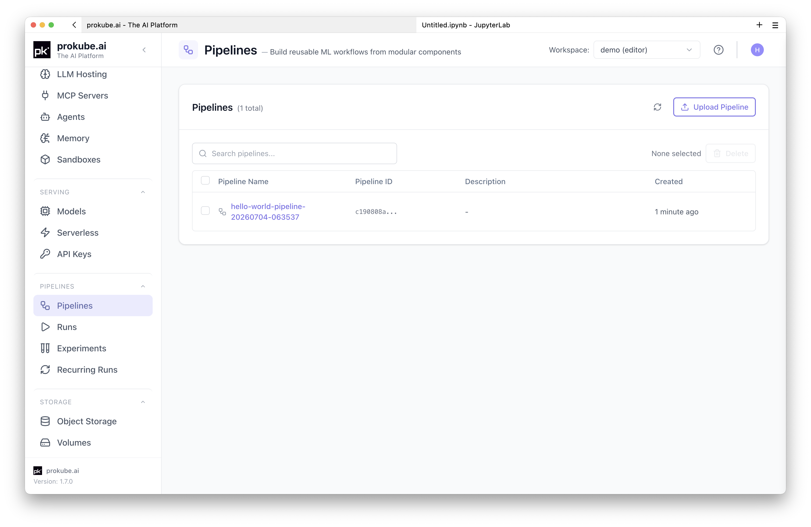
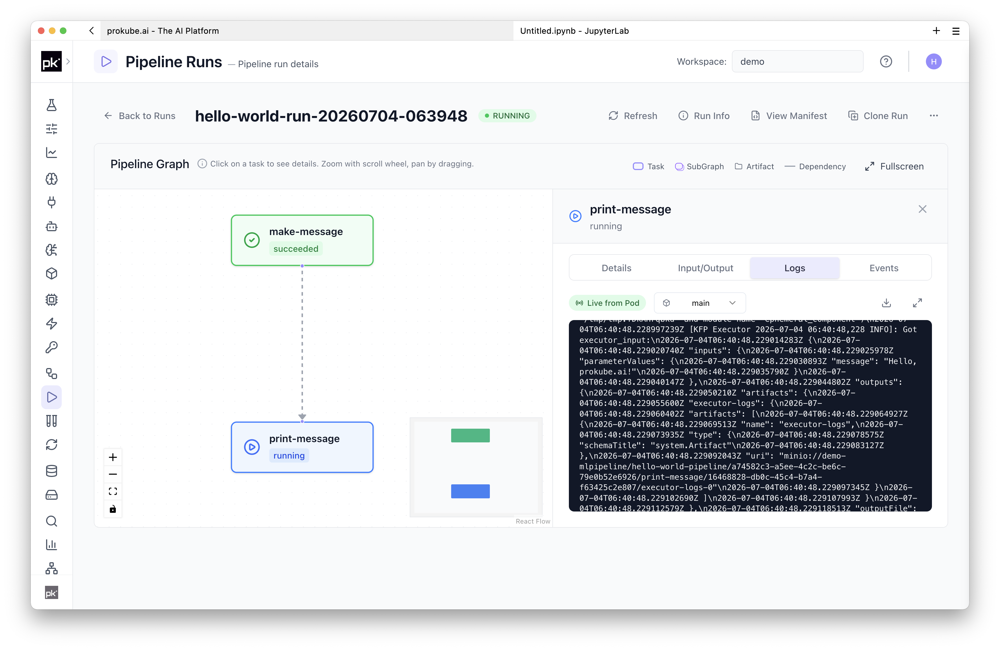
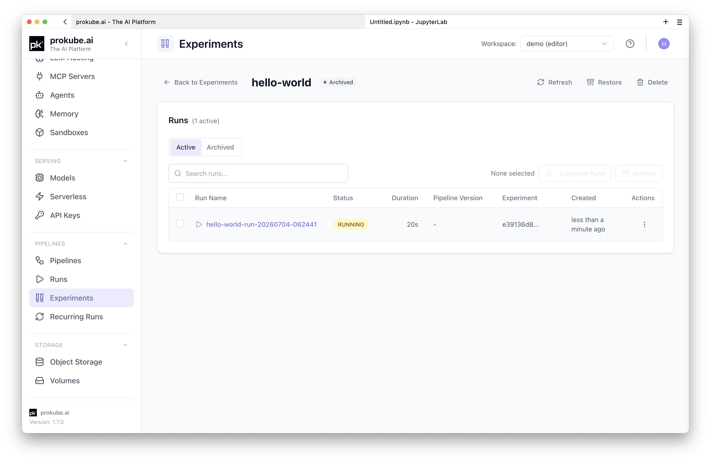
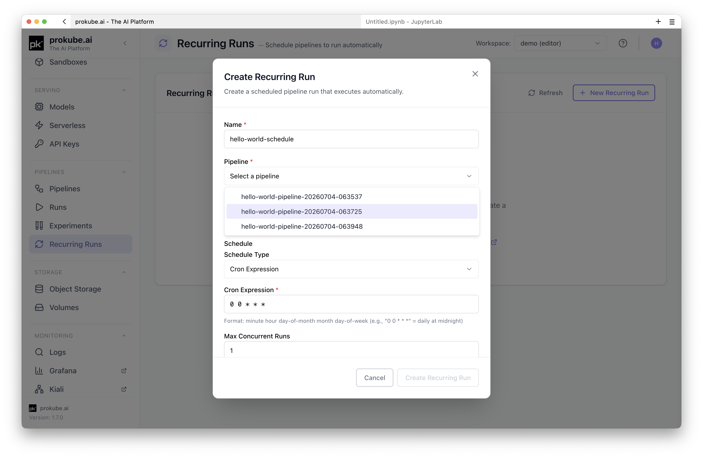
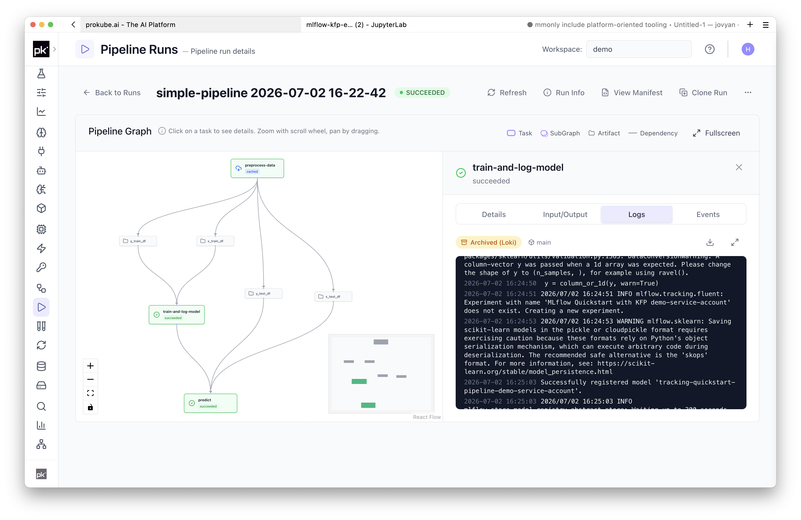

# Pipelines

prokube exposes Kubeflow Pipelines for reproducible workflow execution in your workspace.

::: info Kubeflow Pipelines documentation
Upstream references:

- [Kubeflow Pipelines documentation](https://www.kubeflow.org/docs/components/pipelines/)
- [Kubeflow Pipelines SDK documentation](https://kubeflow-pipelines.readthedocs.io/)
- [Kubeflow Pipelines Kubernetes documentation](https://kfp-kubernetes.readthedocs.io/)
:::

## When to Use Pipelines

Use Pipelines when interactive work should become repeatable, inspectable, or scheduled:

- train or evaluate models with the same steps and parameters;
- split notebooks or scripts into reusable pipeline components;
- run preprocessing, training, evaluation, and registration as one workflow;
- run recurring workflows without manually restarting the same job;
- parallelize independent steps, parameter combinations, or data-processing tasks;
- scale individual components with the CPU, memory, and GPU resources they need;
- compare runs inside an experiment;
- move work from a Lab into a cluster-executed workflow.

Use [Labs](../labs/index.md) for exploration and pipeline authoring. You can write, compile, and start Pipelines directly from a Lab. Move to Pipelines when the workflow should become a shared, cluster-executed process rather than an interactive session.

## Core Concepts

Kubeflow Pipelines uses a few recurring concepts:

- **Components** are the individual steps of a workflow. Lightweight components package Python functions; container components run an explicit container image and command.
- **Pipelines** define the directed graph of components, parameters, and dependencies.
- **Runs** are concrete executions of a pipeline.
- **Experiments** group related runs so you can compare results and navigate history.
- **Recurring runs** start pipeline runs on a schedule.
- **Artifacts** are files, models, metrics, or other outputs produced by components, usually stored in object storage.
- **Parameters** are small typed values passed into pipelines or between components; use artifacts or explicit `s3://` paths for larger data.

The examples in these docs use current KFP SDK patterns. Avoid starting new work with legacy KFP v1 DSL examples unless your administrator confirms that compatibility is required for your deployment.

## Get Started

The simplest way to get started is to submit a small pipeline from a Lab running inside the same workspace. Paste this code into a notebook cell in [JupyterLab](../labs/jupyterlab.md) or into a Python file in a [VS Code Lab](../labs/vscode.md), then run it.

This minimal pipeline defines two Python components, compiles the pipeline to YAML, uploads it as a pipeline definition, and starts a run. For direct one-off runs, you can also skip the explicit compile step and submit the pipeline function directly with the KFP SDK [`Client.create_run_from_pipeline_func`](https://kubeflow-pipelines.readthedocs.io/en/stable/source/client.html#kfp.client.Client.create_run_from_pipeline_func) method.

```python
import datetime

from kfp import compiler, dsl
from kfp.client import Client


@dsl.component
def make_message(name: str) -> str:
    return f"Hello, {name}!"


@dsl.component
def print_message(message: str) -> None:
    print(message)


@dsl.pipeline(name="hello-world-pipeline")
def hello_world_pipeline(name: str = "prokube"):
    message_task = make_message(name=name)
    print_message(message=message_task.output)


compiler.Compiler().compile(hello_world_pipeline, "pipeline.yaml")

client = Client()
timestamp = datetime.datetime.now().strftime("%Y%m%d-%H%M%S")
namespace = open("/var/run/secrets/kubernetes.io/serviceaccount/namespace").read().strip()

client.upload_pipeline(
    "pipeline.yaml",
    pipeline_name=f"hello-world-pipeline-{timestamp}",
    namespace=namespace,
)

client.create_run_from_pipeline_package(
    "pipeline.yaml",
    arguments={"name": "prokube"},
    experiment_name="hello-world",
    run_name=f"hello-world-run-{timestamp}",
)
```

Use this pattern for first tests and for checking that your Lab can reach the Pipelines API in the selected workspace.

Once submitted, the prokube UI shows entries for the uploaded pipeline definition, the experiment, and the run. Select the workspace first; the selected workspace determines which namespace, runs, experiments, and pipeline definitions you can see.

The **Pipelines** page shows the uploaded `hello-world-pipeline-*` definition. Open it to inspect versions and start runs from the UI.



The **Pipeline Runs** page shows the `hello-world-run-*` execution. Open the run to inspect the DAG and component logs; the example below shows the second step selected.



The **Experiments** page shows the `hello-world` experiment used by the run. Use experiments to group related runs for comparison and navigation.



## Run the Examples

Use the public [`prokube/examples`](https://github.com/prokube/examples) repository for more realistic examples. prokube managed Labs clone this repository into the Lab home directory by default.

Start with the lightweight-components notebook if you want to inspect the pipeline interactively. Open `~/examples/pipelines/lightweight-components/mobile-price-classifications.ipynb` in JupyterLab and execute the cells step by step.

Or run the minimal container-components example from its own directory to start the container-based pipeline:

```bash
cd ~/examples/pipelines/minimal-container-components
python submit-cluster.py
```

The submission script compiles `pipeline.py` from that directory and creates a run. Run it from the example directory so the `from pipeline import ...` import resolves correctly. If your examples repository is in a different location, adjust the `cd` path accordingly.

Relevant examples:

| Example | Use when |
| --- | --- |
| [`pipelines/lightweight-components`](https://github.com/prokube/examples/tree/main/pipelines/lightweight-components) | You want the simplest Python-first approach. Components are inline Python functions, KFP handles artifact I/O, and no custom image build is required. This works well when each pipeline step can be described clearly inside one function. |
| [`pipelines/lightweight-python-package`](https://github.com/prokube/examples/tree/main/pipelines/lightweight-python-package) | You want lightweight components backed by a real Python package. Component functions stay small, while reusable code lives in normal Python modules with imports, tests, and package structure. This requires building and pushing a custom base image that contains the package and dependencies. |
| [`pipelines/minimal-container-components`](https://github.com/prokube/examples/tree/main/pipelines/minimal-container-components) | You want full container-level control. Each step runs an explicit container command, so the pattern is language-independent and can run anything that can be containerized. KFP artifact handling is more manual than with lightweight components. |

## Schedule Recurring Runs

Use recurring runs when the same pipeline should run automatically, for example for daily preprocessing, scheduled model evaluation, or regular batch scoring. A recurring run references a pipeline and version, then adds a schedule and concurrency settings.



## Storage and Artifacts

Pipeline components commonly exchange artifacts through object storage. prokube workspaces are configured with S3-compatible object storage, and Labs can use the same storage for datasets, intermediate files, and model artifacts.

Practical rules:

- use object storage for datasets, model files, and pipeline artifacts;
- avoid relying on a Lab's persistent volume for pipeline runtime data;
- pass explicit S3 object paths into pipelines when an example expects them;
- use the **Object Storage** page in the prokube UI to see which buckets are available to your workspace.

For object-storage access from Labs, external clients, and storage security notes, see [Object Storage](../platform/object_storage.md).

## Component Images

For small experiments, lightweight Python components can be convenient. For team workflows or dependencies that are slow to install at runtime, build a component image and reference it from your pipeline.

The [`lightweight-python-package`](https://github.com/prokube/examples/tree/main/pipelines/lightweight-python-package) example shows this pattern with a `Dockerfile`, Python package, pipeline definition, and cluster submission script.

You can build and push images from supported Labs using the remote BuildKit setup. You also need a container registry that accepts pushes from your Lab, and the workspace must be able to pull the resulting images. Ask your administrator which registry to use. For private registries, add pull credentials from the prokube user menu under **Registry Credentials**; they are attached to the workspace namespace so pipeline pods can pull private images. See [Building Container Images](../labs/index.md#building-container-images) and [Registry Credentials](../platform/kubernetes.md#registry-credentials).

## Common Patterns

### Use Secrets in Components

Create workspace secrets from the prokube user menu under **K8s Secrets**. Secrets are namespace-scoped key-value pairs and can be referenced by workloads without putting the secret values into pipeline code or compiled pipeline YAML. See [Kubernetes Secrets](../platform/kubernetes.md#kubernetes-secrets).

Use [`kfp-kubernetes`](https://kfp-kubernetes.readthedocs.io/) to expose selected secret keys to a component as environment variables:

```python
from kfp import dsl, kubernetes


@dsl.component
def read_private_data():
    import os

    access_key = os.environ["AWS_ACCESS_KEY_ID"]
    secret_key = os.environ["AWS_SECRET_ACCESS_KEY"]
    # Use the credentials without printing them.


@dsl.pipeline
def private_data_pipeline():
    task = read_private_data()
    kubernetes.use_secret_as_env(
        task,
        secret_name="s3creds",
        secret_key_to_env={
            "AWS_ACCESS_KEY_ID": "AWS_ACCESS_KEY_ID",
            "AWS_SECRET_ACCESS_KEY": "AWS_SECRET_ACCESS_KEY",
        },
    )
```

Keep secret names and key names stable. Changing them requires updating every pipeline that references them.

### Control Caching for Scheduled Workflows

KFP caching is useful when expensive steps should not rerun unnecessarily. For scheduled workflows, make the cache boundary explicit by passing a cache-key input such as the current day, month, data version, or source snapshot ID into the component that should be reused.

For example, a daily pipeline can pass `YYYY-MM` to an expensive data-loading component so it reruns monthly, while downstream daily steps still rerun with daily inputs. Disable caching only on the small component that generates the changing key; avoid disabling caching globally unless every step must rerun.

### Send Completion Notifications

Use [`dsl.ExitHandler`](https://www.kubeflow.org/docs/components/pipelines/user-guides/core-functions/control-flow/#exit-handling) for cleanup or notifications that should run when a pipeline exits. Keep webhook URLs and tokens in workspace secrets, not in pipeline source code.

### Access Multiple Outputs

When a component has more than one output, do not rely on `task.output`. Access the output by name:

```python
from typing import Dict

from kfp import dsl
from kfp.dsl import Dataset, Output


@dsl.component
def write_dataset(name: str, dataset: Output[Dataset]) -> Dict:
    return {"column": name}


@dsl.component
def print_metadata(metadata: Dict):
    print(metadata)


@dsl.pipeline
def multiple_outputs_pipeline(column_name: str):
    write_task = write_dataset(name=column_name)
    print_metadata(metadata=write_task.outputs["Output"])
```

Named artifact outputs use their parameter name, for example `write_task.outputs["dataset"]`.

### Access Run Metadata

If a component needs run metadata, prefer Kubernetes field-path environment variables through `kfp-kubernetes` over parsing KFP internals. For example, expose the KFP run ID from the pod label:

```python
from kfp import dsl, kubernetes


@dsl.component
def print_run_id():
    import os

    print(os.environ["KFP_RUN_ID"])


@dsl.pipeline
def run_metadata_pipeline():
    task = print_run_id()
    kubernetes.use_field_path_as_env(
        task,
        env_name="KFP_RUN_ID",
        field_path="metadata.labels['pipeline/runid']",
    )
```

### Schedule Components on Specific Nodes

By default, pipeline pods are scheduled on any node that satisfies their resource requests. If a component needs a specific node pool, GPU type, or other node label, add a node selector constraint to that task.

Example:

```python
from kfp import dsl


@dsl.component
def train():
    print("training")


@dsl.pipeline
def training_pipeline():
    task = train()
    task.add_node_selector_constraint("nvidia.com/gpu.product", "NVIDIA-H100-NVL")
```

The label must exist on a suitable node, and the workspace must be allowed to use that scheduling option. If the task stays `Pending`, check pod events and resource requests.

## Pod Quota and Cleanup

Large pipelines can approach the workspace pod quota quickly because completed pipeline step pods remain in the workspace namespace for a while after the run finishes. The prokube UI surfaces pod-quota pressure next to the workspace selector and can clean up completed pipeline pods. See [Kubernetes Resources](../platform/kubernetes.md#pod-quota-and-cleanup) for details.

## Troubleshooting

Start with the Pipeline Runs page. Open the run details and inspect failed steps, UI warnings, pod events, and component logs. The UI surfaces common operational problems, for example missing secrets or workspace pod-count limits. Logs are available from the running pod where possible and from Loki after the pod has already terminated.

Use the [Logs browser](../platform/observability.md#logs-browser) when the pipeline details page does not show the logs you need or when you want to search across pods by time range, pod name, container, or label.



Common causes:

- **Image pull errors**: verify the component image reference and registry credentials.
- **Missing input data**: check S3 paths, bucket names, and object-storage credentials.
- **Import errors in components**: move dependencies into the component image or declare them explicitly for lightweight components.
- **Permission errors**: confirm that the selected workspace has access to the required secrets, buckets, and Kubernetes resources.
- **Slow startup**: avoid installing large dependencies at component runtime; use a custom image instead.
- **Wrong CPU architecture**: if a component fails with `exec format error`, rebuild the image for the cluster node architecture, commonly `linux/amd64`.

## Related Pages

- [Labs](../labs/index.md)
- [JupyterLab](../labs/jupyterlab.md)
- [Custom Notebooks](../labs/custom_notebooks.md)
- [MLflow](mlflow.md)
- [Model Serving](model_serving.md)
