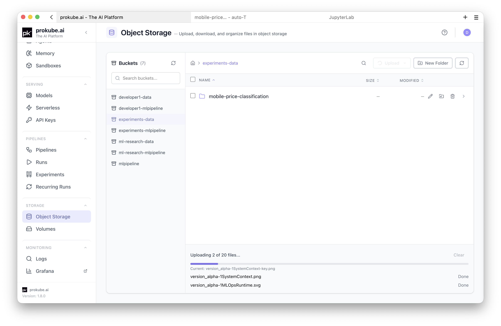
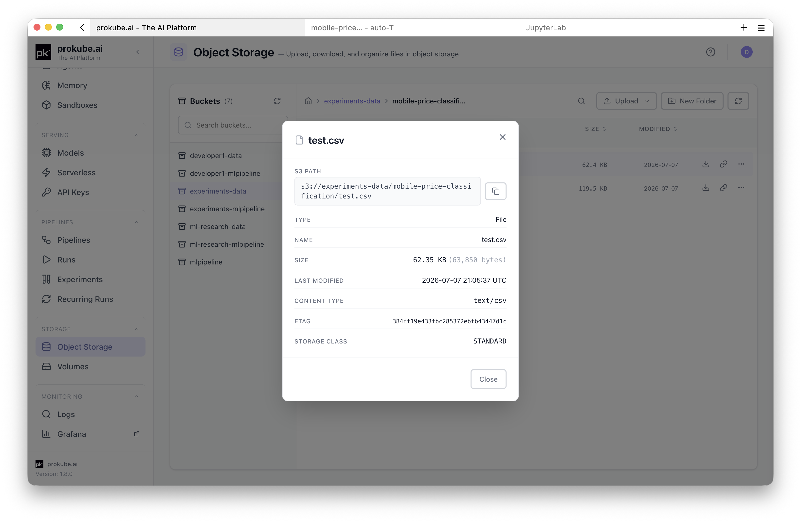

# File Storage

File storage covers persistent files used by Labs, pipelines, model serving, and other workspace workloads. In prokube, shared files are usually stored in S3-compatible storage, while Lab home directories and mounted data volumes use Kubernetes PersistentVolumeClaims (PVCs).

Use S3-compatible storage for data that moves between tools. Use PVC-backed storage when a workload needs a mounted filesystem path.

::: info MinIO documentation
For MinIO concepts and client reference that are not specific to prokube, use the upstream documentation.

- [MinIO documentation](https://docs.min.io/community/minio-object-store/)
:::

## File Storage Browser

Open **File Storage** in the prokube UI to inspect and manage the buckets available to your workspace. **The File Storage browser uses S3-compatible object storage in the background.** It uses your platform session and shows only storage you are allowed to access.

The browser is intended for routine interactive file operations. Use it to browse buckets and folders, find files, upload or download data, and inspect object metadata. It also covers path copying and simple organization tasks such as creating folders, moving objects, deleting objects, and generating temporary share links.

If you are already working in a notebook, the [JupyterLab S3 browser](../labs/jupyterlab.md#file-storage-in-jupyterlab) provides similar access from the JupyterLab sidebar.



::: tip Large transfers
For large transfers, repeatable commands, or automation, use a Lab terminal with `rclone` or another S3-compatible client.
:::

### Get S3 Paths

Many prokube workflows expect S3-compatible file paths in this form.

```text
s3://<bucket>/<path>/<object>
```

Use these paths as stable references to data, independent of the tool that created or consumes it. Copy paths from the File Storage browser when possible. This avoids mistakes in bucket names, prefixes, and model artifact locations.



## Access S3-Backed Files

The examples in this section use the S3 configuration available in prokube-maintained Lab images. The same tools can be used outside Labs, but external clients may require explicit endpoint and credential configuration. See [External S3 Clients](#external-s3-clients).

For more complete examples, see the [`prokube/examples/storage/s3`](https://github.com/prokube/examples/tree/main/storage/s3) examples. Labs can use S3-backed file storage through UI extensions, Python libraries, command-line tools, and S3-compatible SDKs.

::: tip
JupyterLab images can also include an S3 browser extension in the JupyterLab sidebar.
See [JupyterLab](../labs/jupyterlab.md#file-storage-in-jupyterlab).
:::

### CLI
The prokube-maintained `pk-*` notebook images include `rclone` with a preconfigured `minio` remote when workspace file-storage configuration is available.

```bash
rclone lsd minio:
rclone copy local-file minio:my-bucket/path/
rclone copy minio:my-bucket/path/file ./file
```


### Python
Python clients can use the S3-compatible API with `s3fs`.

```python
import s3fs

s3 = s3fs.S3FileSystem()

with s3.open("my-bucket/path/file.txt", "rb") as f:
    print(f.read())
```

Use pandas with an `s3://` path.

```python
import pandas as pd

df = pd.read_parquet("s3://my-bucket/path/data.parquet")
csv = pd.read_csv("s3://my-bucket/path/data.csv")
```


### R
R clients can use S3-compatible libraries such as `aws.s3`. In a managed RStudio Lab, credentials are usually provided by the workspace configuration.

```r
library(aws.s3)
library(readr)

bucket <- "my-bucket"
key <- "path/data.csv"

obj <- get_object(
  object = key,
  bucket = bucket,
  use_https = FALSE, # Internal MinIO only; use TRUE for external endpoints.
  region = ""
)
df <- read_csv(rawToChar(obj))
```


## External S3 Clients

Some workflows need access from outside the cluster, for example from a local development machine or external automation. The exact endpoint depends on your deployment and is usually exposed under a MinIO or S3-compatible domain.

```text
https://minio.<your-prokube-domain>
```

External S3 clients need these settings:
- endpoint URL;
- access key ID;
- secret access key.

For deployments that expose the MinIO Console, create and rotate personal S3 access keys in the MinIO UI, usually under `https://<your-prokube-domain>/minio/`. Sign in with the same SSO account you use for prokube, open **Access Keys**, and create a new access key. Store the secret key in a password manager or secret store when it is shown. Do not commit secret keys to notebooks, repositories, pipeline definitions, or container images.

**Example:** Configure `s3fs` explicitly for external access.

```python
import getpass
import s3fs

AWS_ENDPOINT_URL = "https://minio.<your-prokube-domain>"
AWS_ACCESS_KEY_ID = "<access-key-id>"
AWS_SECRET_ACCESS_KEY = getpass.getpass("S3 secret access key: ")

s3 = s3fs.S3FileSystem(
    key=AWS_ACCESS_KEY_ID,
    secret=AWS_SECRET_ACCESS_KEY,
    endpoint_url=AWS_ENDPOINT_URL,
)
```

## Access S3-Backed Files from Workloads

Labs and model-serving workloads usually receive S3-compatible file-storage configuration automatically. Other Kubernetes workloads, such as custom pods, Katib trials, PyTorchJobs, or pipeline components, may need the workspace `s3creds` secret injected explicitly.

For a plain pod or training-job manifest, inject only the keys the workload needs.

```yaml
env:
  - name: AWS_ACCESS_KEY_ID
    valueFrom:
      secretKeyRef:
        name: s3creds
        key: AWS_ACCESS_KEY_ID
  - name: AWS_SECRET_ACCESS_KEY
    valueFrom:
      secretKeyRef:
        name: s3creds
        key: AWS_SECRET_ACCESS_KEY
```

For Kubeflow Pipelines, use `kfp-kubernetes` instead of embedding credentials in pipeline code or compiled YAML. See [Use Secrets in Components](../mlops/pipelines.md#use-secrets-in-components).

## Local PVC-Based File Storage

Labs and some Kubernetes workloads use PVC-backed file storage when they need mounted filesystem paths. In default Lab images, the most important PVC-backed path is the Lab home directory, usually `/home/jovyan`. Files stored there survive Lab restarts and can be reused when a Lab is recreated with the same volume.

Use PVC-backed storage for:

- notebooks, source code, and cloned repositories;
- user-installed packages and project environments;
- local configuration files that should survive Lab restarts;
- working directories, caches, or tools that expect a filesystem path;
- additional data volumes mounted into Labs or workload pods.

PVC behavior depends on the StorageClass used by the deployment. Confirm these properties before treating a PVC as shared or durable storage:

- access mode, such as `ReadWriteOnce` or `ReadWriteMany`;
- volume expansion support;
- snapshot and backup support;
- reclaim policy;
- node-local versus replicated behavior;
- expected latency and throughput for the workload.

Do not use the same PVC from multiple running Labs at the same time unless your administrator has explicitly designed the storage setup for that pattern. For datasets, model artifacts, pipeline outputs, or files that multiple workloads need to read, copy the data to S3-compatible file storage instead.

For shared Lab persistence rules, see [Using Labs](../labs/index.md#persistence-and-package-installation). For administrator-level StorageClass and PVC operations, see [Storage Administration](../admin/storage.md).

## Security and Access Control

::: warning Storage access is workspace-scoped
S3-backed file storage access depends on the workspace and your permissions. A bucket visible in one workspace or tool may not be visible in another.

PVC-backed storage access depends on namespace permissions and the volumes mounted into a workload. Users with sufficient workspace access may be able to inspect Kubernetes resources or access mounted data.
:::

Availability, retention, backups, lifecycle policies, and storage redundancy depend on the deployment. Do not assume file storage is a permanent archive unless your administrator has documented the retention and backup policy for your workspace.

::: info Follow these rules:
- use workspace or service credentials for shared workloads instead of personal credentials;
- avoid storing broad cloud, registry, or administrator credentials in shared buckets or mounted volumes;
- treat temporary share links as bearer-access links and share them only with intended recipients;
- remove old exports, model artifacts, and intermediate data when they are no longer needed;
- prefer S3-compatible file storage over PVC-backed storage for large datasets and artifacts that multiple workloads need to read.
:::

## FAQ

### When Should I Use Each Backend?

| Backend | Use it for | Important limits |
|---|---|---|
| S3-compatible file storage | Datasets, model artifacts, pipeline outputs, MLflow artifacts, shared files, and data that must be read by multiple workloads. | Not a POSIX filesystem. Applications interact with it through S3 APIs, `s3://` paths, SDKs, or compatible tools. |
| PVC-backed filesystem storage | Lab home directories, notebooks, source code, user-installed packages, local configuration, caches, and workloads that require mounted filesystem paths. | Access modes, expansion, snapshots, and performance depend on the installed StorageClass. Many PVCs are `ReadWriteOnce`, so concurrent mounts can be limited. |

For shared artifacts and platform handoffs, prefer S3-compatible file storage. For interactive work or software that expects local filesystem semantics, use PVC-backed storage.

### Where Can I Find S3 Examples?

The public [`prokube/examples`](https://github.com/prokube/examples) repository contains S3-backed file storage examples for Python notebooks and RStudio. Managed Labs clone this repository into `~/examples` by default. If it is missing, clone it into your Lab home directory.

```bash
git clone https://github.com/prokube/examples.git ~/examples
```

| Example | Use it for |
|---|---|
| `~/examples/storage/s3/python/s3_access.ipynb` | Writing and reading the Iris dataset from S3-compatible file storage with `s3fs`. Set the bucket name at the top of the notebook. |
| `~/examples/storage/s3/r/s3_access.R` | Writing and reading the Iris dataset from RStudio with `aws.s3`. Set the bucket name at the top of the script. |

The R example uses `use_https = FALSE` for the preconfigured internal MinIO endpoint, where in-cluster traffic is protected by the platform. Do not use that setting for external S3 endpoints.

### When to Use the MinIO UI?

The prokube File Storage browser covers normal file browsing, upload, download, organization, and path-copying workflows.

Use the MinIO UI only when you need account-level or storage-administration functions that are not exposed in the prokube browser:

- creating or managing personal S3 access keys for external clients, if enabled;
- reviewing MinIO-specific account settings;
- performing bucket or policy administration tasks allowed by your administrator.

## Troubleshooting

| Symptom | Check |
|---|---|
| Bucket is not visible | Confirm that the selected workspace or user has access to the bucket. |
| Upload fails | Check file size limits, available storage, and whether the bucket policy allows writes. For large files, use a Lab terminal, `rclone`, or another S3-compatible client instead of the browser upload path. |
| Pipeline cannot read a file | Verify the exact `s3://` path and the workspace credentials used by the pipeline pod. |
| Katib, PyTorchJob, or a custom pod cannot read S3-backed files | Inject the workspace `s3creds` secret into the workload container and verify the S3 client uses those environment variables. |
| Model serving cannot load a model | Verify the storage URI, model artifact layout, and KServe storage credentials. See [Model Serving](../mlops/model_serving.md#s3-compatible-storage). |
| DuckDB cannot read a file | Load the `httpfs` extension, use `s3://` paths, and confirm DuckDB can discover or is explicitly given the S3 credentials. |
| External client returns authentication errors | Check endpoint URL, access key, secret key, and whether the credential has permission for the bucket. |
| A file disappears after Lab recreation | Confirm the file was stored under a mounted home or data volume, not in the container filesystem. |
| PVC remains pending | Check StorageClass name, provisioner health, capacity, allowed topology, and quota. Ask an administrator if you do not manage cluster storage. |
| Lab cannot attach a volume | Another running pod may still be using a `ReadWriteOnce` volume on another node, or the cluster may have a stale volume attachment. Stop other Labs using the volume and contact an administrator if it does not clear. |

## Related Pages

- [Labs](../labs/index.md)
- [JupyterLab](../labs/jupyterlab.md)
- [Pipelines](../mlops/pipelines.md)
- [MLflow](../mlops/mlflow.md)
- [Model Serving](../mlops/model_serving.md)
- [Storage Administration](../admin/storage.md)
