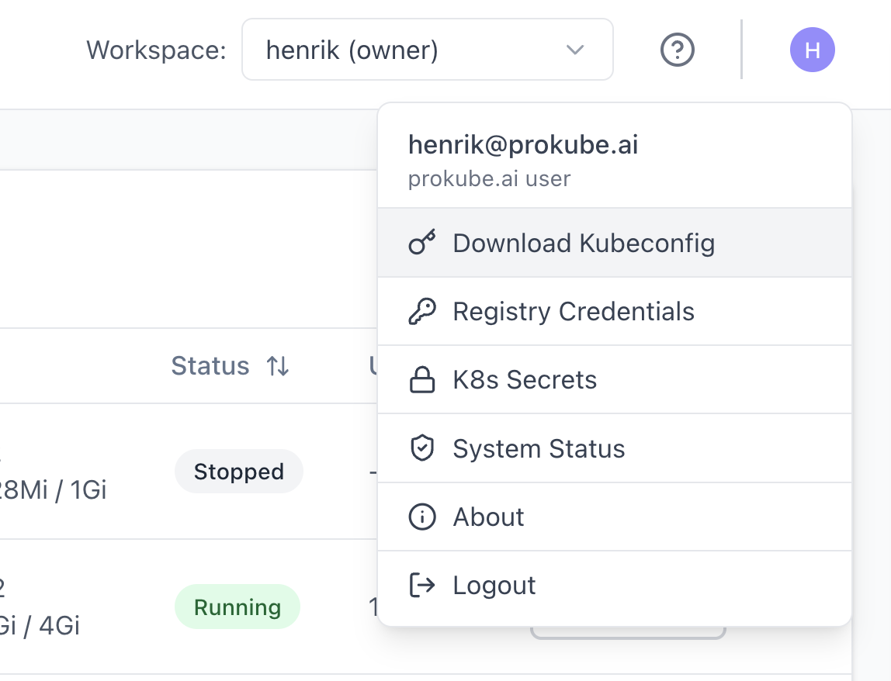
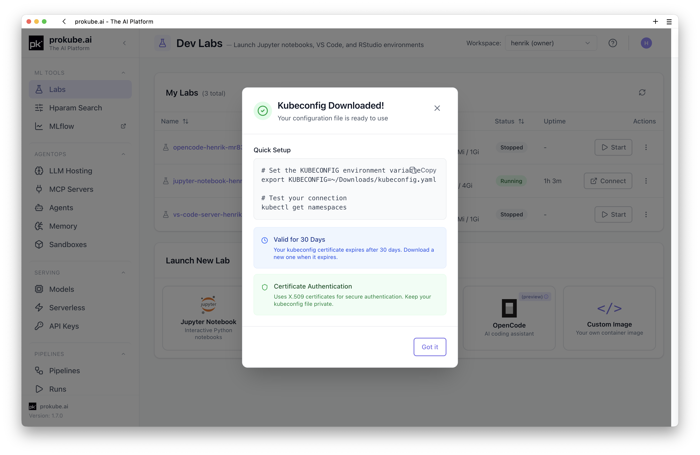
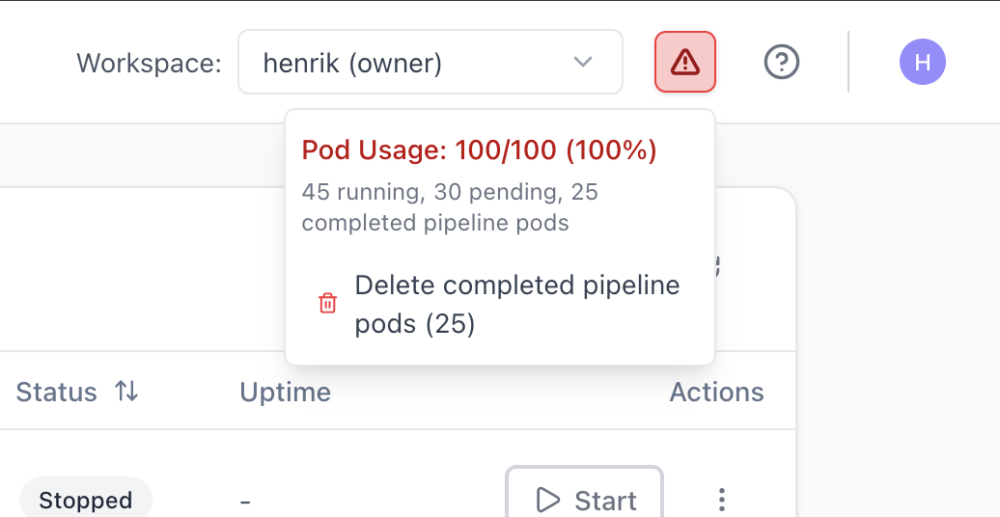
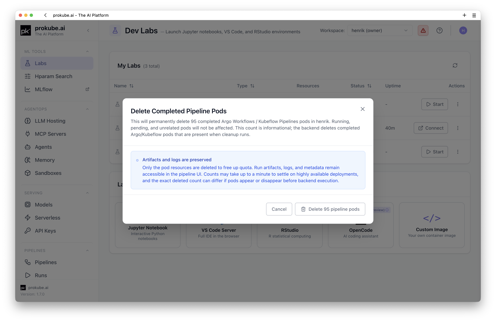
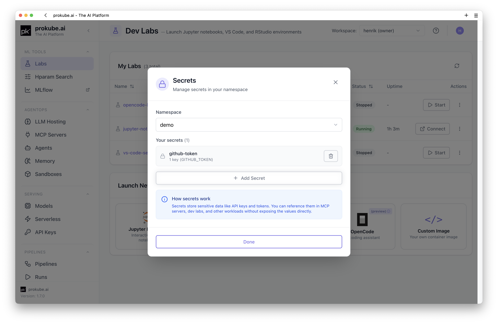
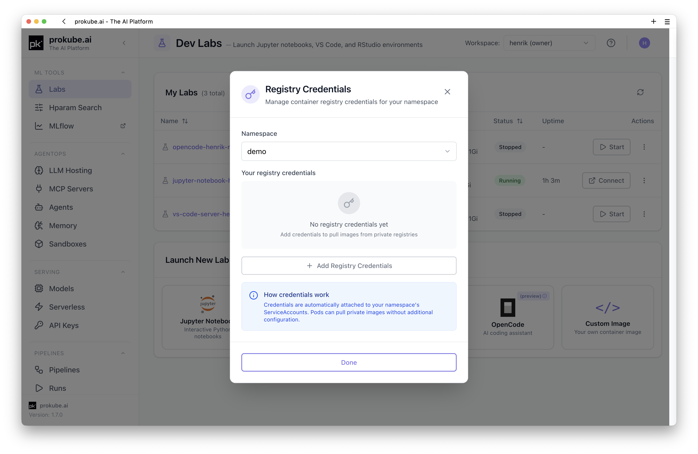

# Kubernetes Resources

prokube runs on Kubernetes. Most users do not need to manage raw Kubernetes objects directly, but Kubernetes concepts still show up when you debug workloads, use `kubectl`, configure secrets, or hit workspace pod limits.

::: info Kubernetes documentation
For Kubernetes features that are not specific to prokube, use the upstream documentation:

- [Kubernetes documentation](https://kubernetes.io/docs/home/)
- [`kubectl` reference](https://kubernetes.io/docs/reference/kubectl/)
- [Debug running pods](https://kubernetes.io/docs/tasks/debug/debug-application/debug-running-pod/)
:::

This page focuses on prokube-specific behavior.

## Workspace Namespaces

Each [workspace](workspaces.md) has its own Kubernetes namespace. Labs, pipeline steps, model-serving workloads, serverless services, agents, MCP servers, secrets, and related Kubernetes resources run inside that namespace.

The selected workspace determines which namespace is used by workspace-scoped UI pages and platform tools.

## User Menu Actions

Several Kubernetes-related actions are available from the prokube user menu: **Download Kubeconfig**, **Registry Credentials**, and **K8s Secrets**.



## Download Kubeconfig

Use **Download Kubeconfig** from the prokube user menu to download a kubeconfig file for command-line access.

After the file has been created, the UI shows the download result and basic usage instructions.



The kubeconfig can be used with tools such as `kubectl`, [k9s](https://k9scli.io/), and [OpenLens](https://github.com/MuhammedKalkan/OpenLens). Keep the file private. It authenticates as your user and is subject to your workspace permissions.

Example:

```bash
export KUBECONFIG=~/Downloads/kubeconfig.yaml
kubectl get pods -n <workspace>
```

If you have access to multiple workspaces, use the namespace that matches the workspace you want to inspect.

By default, `kubectl` inside a [Lab](../labs/index.md) uses the in-cluster configuration and the Lab pod's service account instead of your downloaded kubeconfig. In that case, access is scoped to the namespace of the Lab's workspace. This only changes if you explicitly configure a different kubeconfig inside the Lab.

## Pod Quota and Cleanup

prokube protects clusters with workspace pod quotas. The default limit is 100 pods per workspace. This prevents one workspace from creating enough pods to affect cluster stability.

Large pipelines can approach this limit quickly because completed pipeline step pods remain in the workspace namespace for a while after the run finishes.

The prokube UI surfaces pod-quota pressure for the selected workspace next to the workspace selector. The System Status page shows detailed quota usage, including running pods, pending pods, and completed pipeline pods.



When completed pipeline pods are present, the UI offers a cleanup action for them.



Cleanup deletes only completed Argo Workflows / Kubeflow Pipelines pods in `Succeeded` or `Failed` state. Running, pending, and unrelated pods are not affected. Pipeline metadata, artifacts, and logs remain available through the usual pipeline and logging views.

If a workspace repeatedly reaches the pod quota, check for large fan-out pipelines, long-running components, stuck pending pods, and completed pipeline pods that can be cleaned up.

## Kubernetes Secrets

Use **K8s Secrets** from the prokube user menu to create workspace-scoped [Kubernetes Secrets](https://kubernetes.io/docs/concepts/configuration/secret/).



Secrets can be referenced by workloads without putting secret values into notebooks, pipeline code, component YAML, or container images.

Treat Kubernetes Secrets as workspace-scoped credentials. Users with sufficient workspace access may be able to read secrets in the workspace namespace. Do not store personal credentials or administrator credentials in shared workspaces.

## Registry Credentials

Use **Registry Credentials** from the prokube user menu when workloads in a workspace need to pull images from a private container registry.



Registry credentials are stored as Kubernetes Secrets in the workspace namespace and used as image pull credentials by workloads such as Labs, pipelines, model-serving endpoints, MCP servers, or agents.

Use credentials intended for the workspace and workload. Do not use broad personal or administrator registry tokens in shared workspaces.

## Debug Workloads

For pod-level debugging, start with the UI pages for the workload. They often surface status, events, warnings, and common configuration problems directly.

For command-line debugging, use `kubectl` with the workspace namespace:

```bash
kubectl get pods -n <workspace>
kubectl describe pod <pod-name> -n <workspace>
kubectl logs <pod-name> -n <workspace> --all-containers
```

Common pod states:

- `ImagePullBackOff`: Kubernetes cannot pull the container image. Check the image name and registry credentials.
- `CreateContainerConfigError`: a referenced secret, config, or key is missing.
- `CrashLoopBackOff`: the container starts and exits repeatedly. Check container logs.
- `Init:Error`: an init container failed. Check the init-container logs with `kubectl logs <pod-name> -n <workspace> -c <init-container-name>`.
- `Pending`: Kubernetes cannot schedule the pod. Check resource requests, quotas, GPUs, and workspace pod limits.

If a container fails with `exec format error`, the image or binary is likely built for the wrong CPU architecture. This commonly happens when an image built on an ARM laptop is used on `amd64` cluster nodes. Rebuild the image for the target platform, for example with `docker buildx build --platform linux/amd64 --push ...`.

For platform log views and retained workload logs, see [Observability](observability.md). For workspace bucket access and S3-compatible storage, see [Object Storage](object_storage.md).

## Port Forward Services

For short-lived local debugging, forward a workspace service to your machine:

```bash
kubectl port-forward -n <workspace> svc/<service-name> <local-port>:<service-port>
```

The service is then available at `localhost:<local-port>` while the command is running.

Port forwards are a debugging tool, not production access. If a port forward exits repeatedly, restart it only while you are actively debugging:

```bash
while true; do
  kubectl port-forward -n <workspace> svc/<service-name> <local-port>:<service-port>
done
```

For stable external access, use the platform feature designed for that workload, such as model-serving endpoints, API gateway routes, Knative services, or agent/sandbox ingress.

## Check Your Permissions

Use `kubectl auth can-i` to check whether your current identity can perform an action in a workspace namespace:

```bash
kubectl auth can-i get pods -n <workspace>
kubectl auth can-i create secrets -n <workspace>
kubectl auth can-i delete pods -n <workspace>
```

If you use tools such as OpenLens and cannot list cluster namespaces, add the namespaces you can access manually in the tool's cluster settings. Non-admin users often cannot list every namespace in the cluster.

## Related Pages

- [Workspaces](workspaces.md)
- [Object Storage](object_storage.md)
- [Observability](observability.md)
- [System Status](system_status.md)
- [Using Labs](../labs/index.md)
- [Pipelines](../mlops/pipelines.md)
- [API Keys](api_keys.md)
