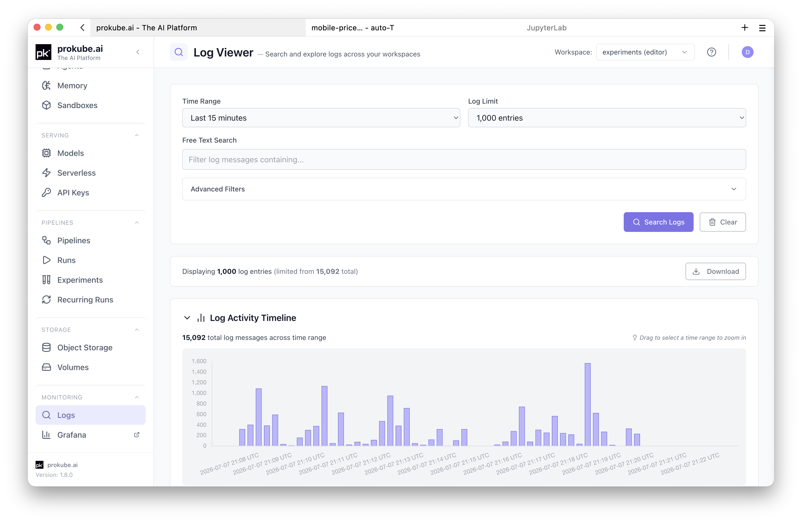
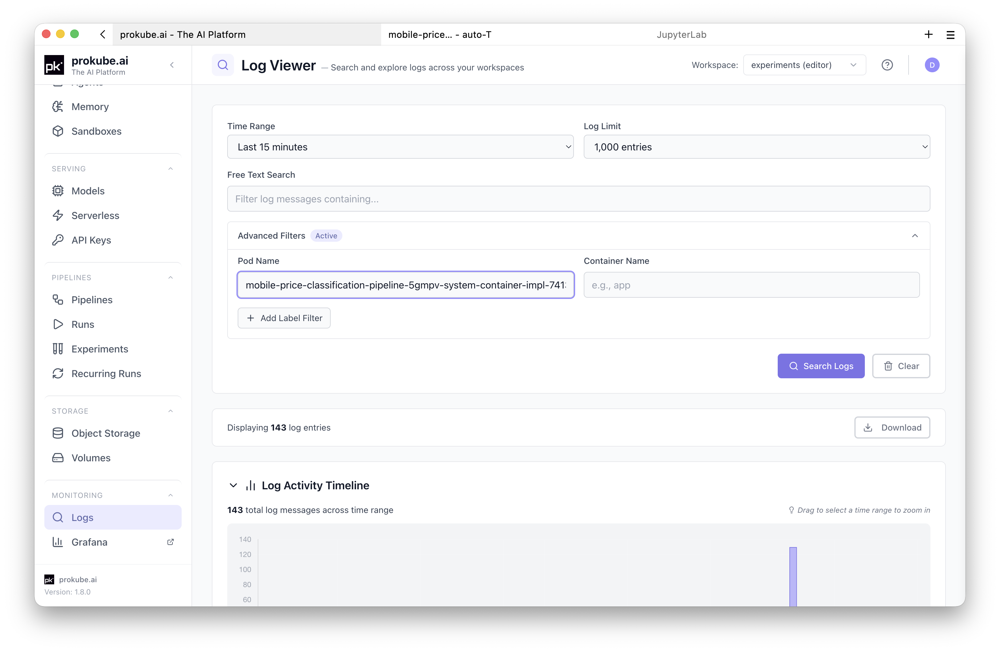
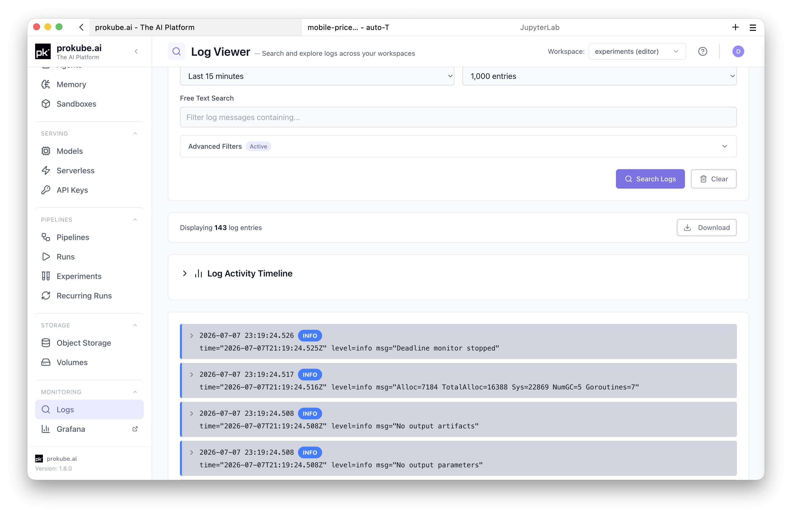

# Observability

prokube collects workload logs and exposes operational views for debugging Labs, pipelines, model deployments, services, agents, and other workspace workloads.

Observability is part of the shared platform foundation. Use workload-specific pages first when they provide status, events, metrics, or logs directly. Use the shared views when you need to search across workloads or inspect retained logs.

## Logs Browser

Open **Logs** in the prokube UI to search application and container logs without opening Grafana or using `kubectl` for every query.

Basic workflow:

1. Open **Logs** in the prokube UI.
2. Select the workspace you want to inspect.
3. Choose a time range.
4. Add filters when needed.
5. Click **Search Logs**.

Access is scoped to the workspaces you can access.

## Filter Logs

Start with broad filters and narrow the query when needed:

- **Time range**: select a preset such as the last 15 minutes, 1 hour, or 24 hours, or provide a custom range.
- **Free text search**: filter log messages that contain specific text.
- **Log limit**: choose how many entries to return. The UI caps requests to keep queries responsive.

Use advanced filters for targeted debugging:

- **Pod name**: filter by an exact pod name or a prefix pattern such as `training-job-*`.
- **Container name**: filter a specific container in a multi-container pod.
- **Label filters**: filter by Kubernetes labels discovered from the selected workspace.

## Read and Export Results

After a search, the Logs page shows returned entries and a histogram for the selected time range. Use the histogram to spot bursts of activity and narrow the time window.

Use **Download** to save the shown log entries as a text file for sharing or offline analysis. Review downloaded logs before sharing them outside your team; application logs can contain user data, object paths, request payloads, or other sensitive values.

## Common Uses

- **Pipeline debugging**: search for pods created by a pipeline run when a step fails or when no logs are shown in the pipeline details page.
- **Lab debugging**: search for the Lab pod when the environment fails to start or crashes after startup.
- **Model-serving debugging**: search by model pod name or labels to inspect startup, model loading, and request-handling logs.
- **Application debugging**: search logs for custom services deployed into your workspace.
- **AgentOps debugging**: search sandbox, MCP server, gateway, or agent runtime logs when the feature-specific page does not show enough detail.

## Metrics and Dashboards

Metrics dashboards are exposed through workload pages where possible. Platform-wide dashboards are usually an administrator/operator workflow and are exposed through [Grafana](https://grafana.com/docs/grafana/latest/) when the deployment includes it.

Examples:

- model detail pages can link to model-serving metrics;
- platform administrators use Grafana, [Prometheus](https://prometheus.io/docs/introduction/overview/), and [Alertmanager](https://prometheus.io/docs/alerting/latest/alertmanager/) for service health, alerts, and capacity;
- workload pages can surface events or conditions directly when Kubernetes already provides the relevant signal.

Use metrics to understand rates, latency, resource pressure, and longer-term behavior. Use logs to inspect specific failures, startup output, stack traces, and request-level details.

When these tools are exposed by your deployment:

- use Grafana for curated dashboards and ad hoc exploration;
- use Prometheus or Grafana Explore for metrics queries;
- use Loki or Grafana Explore for log queries that need LogQL beyond the prokube Logs page.

Broad Grafana or Loki access can expose logs and metrics across namespaces depending on the configured permissions. Treat platform dashboards as administrator-facing unless your administrator has documented the access scope for your user or group.

## Kubernetes Events

Logs do not replace Kubernetes events. Events are often the best first signal for scheduling failures, image pull errors, missing secrets, failed volume mounts, admission failures, and quota pressure.

Start with the workload detail page when available. For command-line debugging, see [Kubernetes Resources](kubernetes.md#debug-workloads).

## Retention and Limits

Log availability depends on platform retention settings. Older logs may no longer be available.

The Logs page searches application and container logs stored in Loki. It does not guarantee that every platform component, audit event, or Kubernetes event is available as a log entry.

## Related Pages

- [Kubernetes Resources](kubernetes.md)
- [System Status](system_status.md)
- [Labs](../labs/index.md)
- [Pipelines](../mlops/pipelines.md)
- [Model Serving](../mlops/model_serving.md)
- [Admin Documentation](../admin/index.md)
