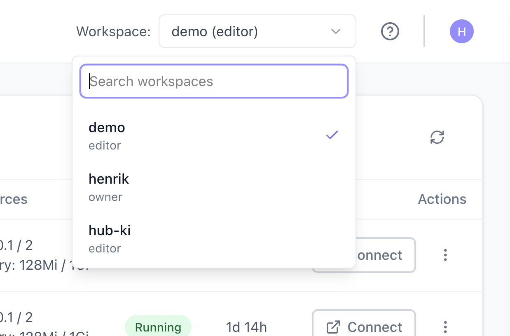

# Workspaces

Workspaces are the main scope boundary in prokube. They group the workloads, storage, credentials, and access rules that belong to a user or team.

Use this page to understand what changes when you switch workspaces, what access levels mean, and which security implications matter when sharing a workspace.

## What a Workspace Controls

The selected workspace affects which resources you can see and create across the platform:

- Labs and their mounted workspace storage
- pipeline runs, experiments, and related Kubernetes resources
- model-serving endpoints and serverless workloads
- workspace-scoped secrets and registry credentials
- file-storage buckets and access credentials
- AgentOps resources such as sandboxes, MCP servers, and memory stores where enabled

Each workspace has its own Kubernetes namespace. That namespace is one part of the workspace boundary; the workspace also includes platform-level access rules, storage configuration, UI scope, and integrations with other services.

## Personal and Shared Workspaces

### Personal Workspaces

Each user gets a personal workspace for their own experiments, development environments, and private platform resources.

Personal workspaces are tied to user lifecycle. Administrators manage them through user and workspace administration; attached personal workspaces are not deleted as regular project workspaces from the Workspaces page.

### Shared Workspaces

Shared workspaces are for teams that work together on cluster resources such as pipelines, models, agents, Labs, file-storage buckets, and workspace-scoped credentials.

Use a shared workspace when multiple users need to collaborate on the same resources.

Shared workspace access can be granted directly to users or through groups. Group-based access is preferred for teams because it keeps membership and workspace access separate: administrators grant the group access to a workspace once, then add or remove users from the group.

::: warning Keep workspace boundaries intentional
Do not invite contributors into personal workspaces. Personal workspaces commonly contain user-specific Labs, storage, credentials, and temporary experiments.

Do not put personal credentials, administrator tokens, or unrelated customer data into a shared workspace. Use credentials created for that team and workload instead.
:::

## Access Levels

Workspace access determines what a user can do inside that workspace.

| Access level | Typical capabilities |
| --- | --- |
| View | Inspect workloads, metadata, logs, and workspace resources where read access is allowed. |
| Edit | Create, update, and delete workspace workloads such as Labs, pipelines, model-serving resources, and secrets. |
| Owner | Manage the workspace and its contributors where owner-level access is enabled. |

Exact permissions can depend on platform configuration. When in doubt, check with your platform administrator before storing sensitive credentials or production data in a shared workspace.

## Select a Workspace

Some platform views are workspace-scoped. Select the active workspace before using services that create or inspect workload resources, such as Labs, Pipelines, MCP servers, agents, model-serving endpoints, or Kubernetes resources.

The workspace selector controls which workspace-scoped resources are shown or created in those views.

As a rule of thumb, workspace selection matters for services that schedule workloads or create workspace-scoped Kubernetes resources.

Other services handle access through their own integration with prokube. For example, file-storage browsers, MLflow, or similar integrated tools can use OIDC-based user and workspace permissions configured by the platform backend. In those cases, the active workspace selector is not necessarily the control that determines which buckets, experiments, models, or artifacts the current user can access.

## Manage Your Own Workspace

When owner self-service is enabled, workspace owners can open **My Workspaces** to manage members of workspaces they own. This page is not the same as administrator workspace management:

- owners see only workspaces they own;
- owners can add members by email and remove members from their workspace;
- owners do not create or delete workspaces from this page;
- administrator-only settings such as security policy and egress profiles remain under **User Management**.

Members added through owner self-service receive editor access.

## Workspace-Level Policies

Administrators can attach additional policy controls to a workspace:

- **Security policy**: requires new and updated Labs in the workspace to use hardened security settings.
- **Egress profile**: restricts outbound network access for covered workloads to approved destinations.

Egress profiles are managed under **User Management** > **Network Policies**. See [Network Policies](../admin/network_policies.md).

## Security Implications

Workspace access affects more than UI pages. It can also affect Kubernetes resources, mounted storage, file-storage credentials, registry credentials, and workload configuration.

Users with sufficient workspace access may be able to read [Kubernetes Secrets](https://kubernetes.io/docs/concepts/configuration/secret/) in the workspace namespace. Store only credentials that are intended for that workspace and workload.

For production workloads, use dedicated credentials with the minimum required access.

## Request or Change Access

Workspace access is managed by platform administrators in prokube, and by workspace owners when owner self-service is enabled. If you need access to a workspace, contact the workspace owner or platform administrator.

If you administer prokube, see [User Management](../admin/user_management.md).

## Related Pages

- [Using Labs](../labs/index.md)
- [User Management](../admin/user_management.md)
- [Network Policies](../admin/network_policies.md)
- [API Keys](api_keys.md)
