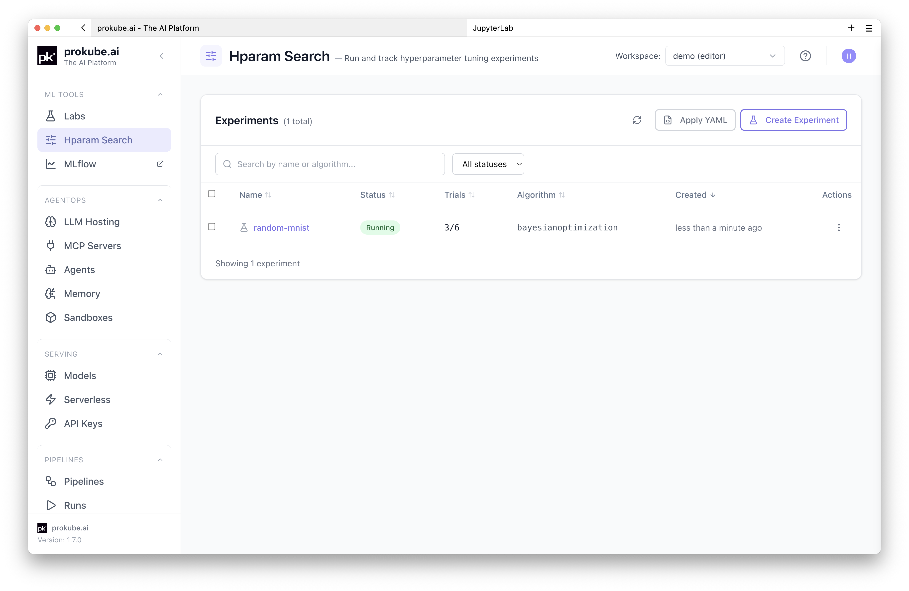
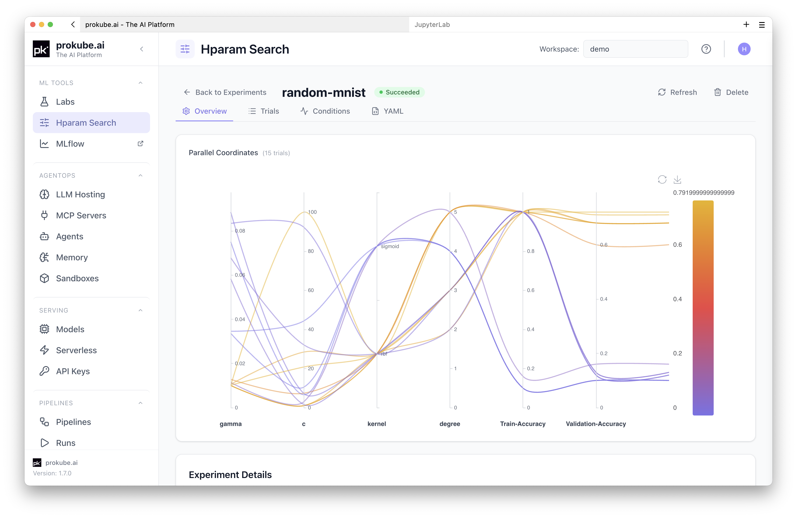

# Hparam Search

prokube exposes Kubeflow Katib for running hyperparameter tuning experiments in your workspace.

::: info Katib documentation
Upstream references:

- [Kubeflow Katib documentation](https://www.kubeflow.org/docs/components/katib/)
- [Katib trial templates](https://www.kubeflow.org/docs/components/katib/user-guides/trial-template/)
:::

## When to Use Hparam Search

Use Hparam Search when you have training code that should run as repeatable Kubernetes jobs and you want Katib to try parameter combinations for you:

- optimize model parameters such as learning rate, batch size, number of layers, hidden dimensions, kernel size, dropout, or weight decay;
- compare trials with a consistent objective metric;
- use cluster compute to run several trials in parallel inside the workspace namespace;
- keep experiment, trial, log, metric, and YAML inspection in one UI;
- move from manual notebook experiments to repeatable Kubernetes jobs.

Katib schedules trial jobs and tracks their metrics. It does not write your training code, build your image, choose a valid search space, or persist model artifacts automatically. Your container must accept trial parameters and print or expose the objective metric in the format configured by the experiment.

## What Katib Optimizes

Katib is framework-agnostic. It works with PyTorch, TensorFlow, JAX, XGBoost, scikit-learn, or custom training code in any language, as long as the trial job can receive parameters and report metrics.

Common use cases include:

- hyperparameter tuning for existing training code;
- neural architecture search, where the search space describes model structure;
- early stopping of underperforming trials, when configured by the experiment.

Katib is not a full AutoML system. It does not choose the model family, clean data, perform feature engineering, or decide which metric matters. You define the training workload, objective metric, parameter ranges, search algorithm, and resource requirements.

Supported search algorithms depend on the Katib installation, but common choices include random search, Bayesian optimization, TPE, Hyperband, CMA-ES, and neural-architecture-search algorithms such as ENAS or DARTS. Katib can also integrate with Optuna-based suggestion services where enabled by the platform.

## Workspace Scope

Hparam Search is scoped to the selected prokube workspace. The selected workspace determines the Kubernetes namespace where Katib `Experiment`, `Trial`, `Suggestion`, `Job`, and `Pod` resources are created and listed.

Before creating or applying an experiment, select the correct workspace in the prokube UI. For workspace behavior and access implications, see [Workspaces](../platform/workspaces.md). For kubeconfig, pod quota, image pull credentials, and Kubernetes troubleshooting, see [Kubernetes Resources](../platform/kubernetes.md).

## Quick Start with the Katib SDK

The Katib Python SDK is useful for quick experiments from a notebook because it can create an experiment directly from a Python objective function.

This pattern only works from inside the cluster, for example in a prokube [JupyterLab](../labs/jupyterlab.md) or [VS Code Lab](../labs/vscode.md), where the notebook already has Kubernetes service account credentials for the selected workspace. If the SDK is not available in your Lab image, install it first:

```python
%pip install kubeflow-katib
```

Then run a minimal experiment:

```python
# [1] Create an objective function.
def objective(parameters):
    import time

    time.sleep(5)
    result = 4 * int(parameters["a"]) - float(parameters["b"]) ** 2
    print(f"result={result}")


import kubeflow.katib as katib


# [2] Create the hyperparameter search space.
parameters = {
    "a": katib.search.int(min=10, max=20),
    "b": katib.search.double(min=0.1, max=0.2),
}


# [3] Create a Katib Experiment with 12 trials.
katib_client = katib.KatibClient()

name = "tune-experiment"
katib_client.tune(
    name=name,
    objective=objective,
    parameters=parameters,
    objective_metric_name="result",
    max_trial_count=12,
    resources_per_trial={"cpu": "2"},
)


# [4] Wait until the experiment is complete.
katib_client.wait_for_experiment_condition(name=name)


# [5] Get the best hyperparameters.
print(katib_client.get_optimal_hyperparameters(name))
```

When running this from a prokube Lab, leave the namespace unset. The Katib client then uses the namespace of the running notebook pod, which keeps the experiment in the selected workspace.

Use the SDK for fast iteration and small examples. For production-like experiments, prefer the containerized training-script pattern below: it gives you explicit control over the image, dependencies, resource requests, metric collection, and the exact Katib `Experiment` YAML you can review and reuse.

For a more realistic experiment with richer trial results in the UI, continue with the MNIST example below.

## Run the Minimal MNIST Example

The public [`prokube/examples`](https://github.com/prokube/examples) repository contains a minimal Katib example that trains an scikit-learn SVM on the MNIST digits dataset.

Managed Labs clone this repository into `~/examples` by default. If your Lab does not have it, clone it manually:

```bash
git clone https://github.com/prokube/examples.git ~/examples
```

The example is split into two parts:

| Path | Purpose |
|---|---|
| [`images/minimal-mnist`](https://github.com/prokube/examples/tree/main/images/minimal-mnist) | Training script, Python dependencies, and Dockerfile for the training image. |
| [`hparam-tuning/minimal-mnist`](https://github.com/prokube/examples/tree/main/hparam-tuning/minimal-mnist) | Katib `Experiment` manifest that references the training image. |

### 1. Check the Training Script

The training script accepts hyperparameters as CLI options:

```bash
python ./training_script.py --gamma 0.01 --c 1 --kernel rbf --degree 3 --coef0 0.0
```

For Katib, the important part is metric output. The script prints timestamped metrics to stdout:

```text
2026-07-06T12:00:00.000Z Train-Accuracy=0.99
2026-07-06T12:00:00.000Z Validation-Accuracy=0.97
2026-07-06T12:00:00.000Z Test-Accuracy=0.96
```

The example experiment uses `Validation-Accuracy` as the objective metric and collects metrics from stdout.

### 2. Build and Push the Training Image

For your own experiments, build a training image and push it to a registry that your workspace can pull from. Authenticate to the registry before pushing; the exact login command depends on the registry you use.

```bash
cd ~/examples/images/minimal-mnist
docker build . -t <registry>/<project>/minimal-mnist:latest
docker push <registry>/<project>/minimal-mnist:latest
```

Then update the `image` field in `~/examples/hparam-tuning/minimal-mnist/katib-experiment.yaml` to your pushed image.

For convenience, the example manifest references a prepared image in a prokube registry by default:

```text
europe-west3-docker.pkg.dev/prokube-internal/prokube-customer/minimal-mnist:latest
```

Your cluster may already be able to pull this image. If it cannot, use your own pushed image instead.

For private registries, create pull credentials from the prokube user menu under **Registry Credentials** before starting the experiment. See [Registry Credentials](../platform/kubernetes.md#registry-credentials).

### 3. Inspect the Experiment Manifest

The minimal example defines a Katib `Experiment` named `random-mnist`:

```yaml
apiVersion: kubeflow.org/v1beta1
kind: Experiment
metadata:
  name: random-mnist
spec:
  objective:
    type: maximize
    goal: 1.2
    objectiveMetricName: Validation-Accuracy
    additionalMetricNames:
      - Train-Accuracy
  algorithm:
    algorithmName: bayesianoptimization
  parallelTrialCount: 3
  maxTrialCount: 6
  maxFailedTrialCount: 3
```

The parameter search space is declared under `spec.parameters`:

```yaml
parameters:
  - name: gamma
    parameterType: double
    feasibleSpace:
      min: "0.01"
      max: "0.1"
  - name: c
    parameterType: double
    feasibleSpace:
      min: "1"
      max: "100"
  - name: kernel
    parameterType: categorical
    feasibleSpace:
      list:
        - rbf
        - sigmoid
```

The trial template maps Katib trial parameters into the container command:

```yaml
command:
  - "python"
  - "./training_script.py"
  - "--gamma=${trialParameters.gamma}"
  - "--c=${trialParameters.c}"
  - "--kernel=${trialParameters.kernel}"
  - "--degree=${trialParameters.degree}"
```

Keep parameter names consistent across `spec.parameters`, `trialTemplate.trialParameters`, and the command arguments accepted by your training script.

### 4. Start the Experiment

From a Lab in the target workspace, run:

```bash
cd ~/examples/hparam-tuning/minimal-mnist
kubectl create -f katib-experiment.yaml
```

Inside a managed Lab, `kubectl` uses the Lab pod service account and defaults to the Lab workspace namespace. If you run the command outside prokube, use a kubeconfig for the target workspace. See [Download Kubeconfig](../platform/kubernetes.md#download-kubeconfig).

### 5. Track Results in the UI

Open **Hparam Search** in the prokube UI.

The experiment list shows experiments in the selected workspace. Use **Refresh** if the list does not update immediately. Open `random-mnist` to inspect:



| Tab | Content |
|---|---|
| **Overview** | Objective, algorithm, parameter search space, current optimal trial, and run status. |
| **Trials** | Trial status, sampled parameter assignments, observed metrics, and best-trial highlighting. |
| **Conditions** | Katib condition history for debugging scheduling, success, and failure states. |
| **YAML** | Live experiment manifest for inspection and reuse. |

Open a trial from the trials table to inspect trial details, logs, and collected metrics.

The experiment detail view also includes a parallel coordinates plot for comparing trial parameters against the objective metric. Use it to identify which parameter ranges produced better trials before narrowing the search space in a follow-up experiment.



### 6. Delete the Experiment

When you are done, delete the experiment and its trials:

```bash
cd ~/examples/hparam-tuning/minimal-mnist
kubectl delete -f katib-experiment.yaml
```

You can also delete experiments from the **Hparam Search** UI. Deleting an experiment terminates running trials and removes the associated Katib resources.

## Extend an Experiment

You can adjust a Katib experiment while it is running, for example when early trial results look useful and you want to run more trials or change how many trials run in parallel.

Katib only supports changing these trial-count fields on an existing experiment:

- `parallelTrialCount` - how many trials Katib may run at the same time;
- `maxTrialCount` - the maximum number of trials for the experiment;
- `maxFailedTrialCount` - how many failed trials are allowed before the experiment fails.

Apply a small update manifest in the workspace namespace:

```yaml
apiVersion: kubeflow.org/v1beta1
kind: Experiment
metadata:
  name: random-mnist
spec:
  parallelTrialCount: 3
  maxTrialCount: 12
  maxFailedTrialCount: 3
```

```bash
kubectl apply -f random-mnist-update.yaml
```

Increase `spec.maxTrialCount` to let Katib create additional trials. The new value must be greater than the number of trials that have already succeeded. Change `spec.parallelTrialCount` to increase or decrease parallel execution, subject to workspace quota and available cluster resources.

To resume an experiment after it has reached `Succeeded` because `maxTrialCount` was reached, set a resume policy before running it:

```yaml
spec:
  resumePolicy: LongRunning
```

With `LongRunning`, Katib keeps the suggestion service running after the experiment succeeds, so you can increase `maxTrialCount` later and continue the search. Without a resumable policy, the default behavior is `Never`: Katib cleans up the suggestion service after completion and the finished experiment cannot be restarted.

Use this for iterative search refinement, not as a substitute for versioning experiments. If you change the training image, objective metric, command, or search space structure, create a new experiment so results remain comparable.

## Create Experiments from the UI

Hparam Search supports two creation paths:

- **Create Experiment** opens a guided form for objective, algorithm, parameters, trial thresholds, metric collection, and trial template configuration.
- **Apply YAML** applies a complete Katib `Experiment` manifest directly.

Use the form when you want to build a simple experiment interactively. Use YAML when you already have a reviewed manifest, want to reuse an example, or manage experiments through version control.

Trial templates can be inline YAML or a **ConfigMap Reference**. Use inline YAML for most first experiments. Use ConfigMap references when several experiments should share the same trial job template. For the ConfigMap format and template-reference fields, see the upstream [Katib trial templates](https://www.kubeflow.org/docs/components/katib/user-guides/trial-template/) documentation.

## Training Image Requirements

Your training image should make trial inputs and metric output explicit.

It should:

- accept all tunable parameters from command-line arguments or environment variables;
- print the objective metric name exactly as configured in `objectiveMetricName`;
- exit with a non-zero status when training fails so Katib can count failed trials;
- include all runtime dependencies in the image instead of installing them interactively;
- write models and artifacts to object storage if they must survive trial pod cleanup.

For image builds from Labs, see [Building Container Images](../labs/index.md#building-container-images). For workspace object storage, see [Object Storage](../platform/object_storage.md).

## Operational Notes

Katib trials create Kubernetes jobs and pods in your workspace namespace. Large experiments can consume pod quota quickly, especially with high `parallelTrialCount` values or retained trial resources. Monitor quota and clean up completed pods when needed. See [Pod Quota and Cleanup](../platform/kubernetes.md#pod-quota-and-cleanup).

Start conservatively:

- keep `maxTrialCount` small while validating the image and metric collector;
- keep `parallelTrialCount` below the number of trials your quota and resources can support;
- set `maxFailedTrialCount` low enough to stop broken manifests early;
- use `retain: true` while debugging, then lower retention once completed pods accumulate.

Set trial CPU, memory, and GPU resources explicitly. In Katib `Experiment` YAML, set them under the container's `resources` field in the trial template. With the Katib SDK, use `resources_per_trial`. Too-small limits can make trials slow or unstable even when the search algorithm is working correctly.

Deep learning workloads that use multi-worker data loaders may need more shared memory than the Kubernetes default. This commonly affects PyTorch `DataLoader` workers and can show up as errors such as:

```text
Unexpected bus error encountered in worker. This might be caused by insufficient shared memory.
```

To increase shared memory for a Katib trial, mount an in-memory `emptyDir` at `/dev/shm` in the trial pod. In an `Experiment` manifest, `volumeMounts` belong to the training container and `volumes` belong to the pod spec:

```yaml
trialTemplate:
  trialSpec:
    apiVersion: batch/v1
    kind: Job
    spec:
      template:
        spec:
          containers:
            - name: training-container
              image: <registry>/<project>/<image>:<tag>
              volumeMounts:
                - name: dshm
                  mountPath: /dev/shm
          volumes:
            - name: dshm
              emptyDir:
                medium: Memory
                sizeLimit: "512Mi"
          restartPolicy: Never
```

Adjust `sizeLimit` to the workload and node capacity. This memory is backed by node memory, so avoid setting it higher than the trial actually needs.

## Troubleshooting

| Symptom | Check |
|---|---|
| Experiment does not appear in Hparam Search | Confirm the selected workspace matches the namespace where you applied the manifest. Run `kubectl get experiments.kubeflow.org`. |
| Trials stay pending | Check pod quota, requested resources, image pull errors, and namespace events. |
| Trials are slow | Check CPU, memory, and GPU requests and limits in the trial template or `resources_per_trial`. Also check whether `parallelTrialCount` is lower than expected. |
| Trials fail immediately | Open the trial logs. Verify the image exists, the command path is correct, and the script accepts all generated arguments. |
| No objective metric is shown | Confirm `objectiveMetricName` exactly matches the metric printed by the training script and that `metricsCollectorSpec.collector.kind` matches the output method. |
| Private image cannot be pulled | Add registry credentials for the workspace and confirm the image reference includes the correct registry, project, repository, image, and tag. |
| Trial logs show shared-memory or bus errors | Increase `/dev/shm` for the trial pod with an in-memory `emptyDir` volume. This is common with PyTorch data loaders using multiple workers. |
| New trials stop being scheduled after earlier trials finish | Check Katib suggestion pods and events. If a suggestion controller is `OOMKilled` or CPU-throttled, an administrator may need to increase suggestion-controller resources in the Katib configuration. |
| Too many completed pods | Delete completed pods from the prokube System Status view or reduce experiment size and trial retention. |
