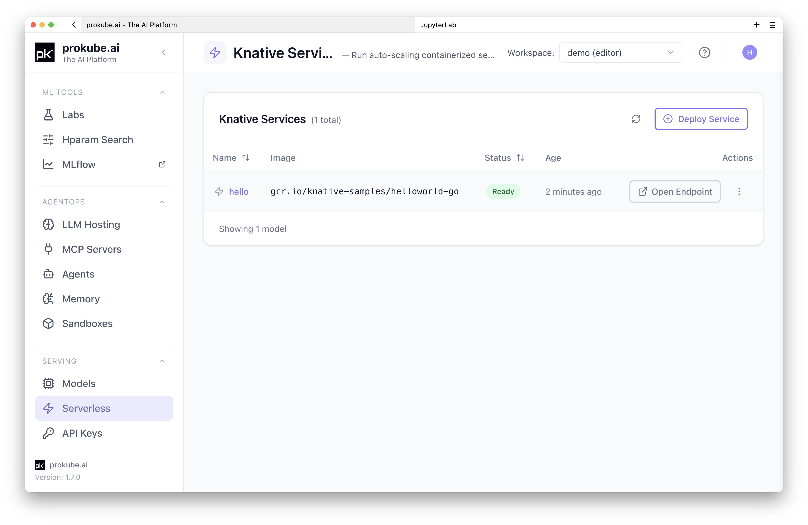
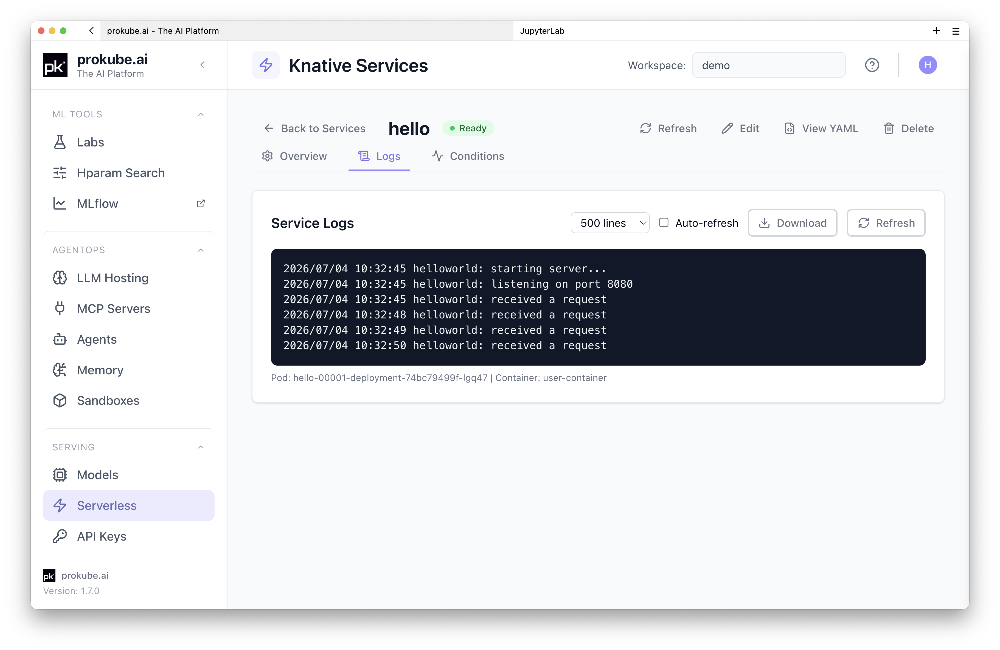
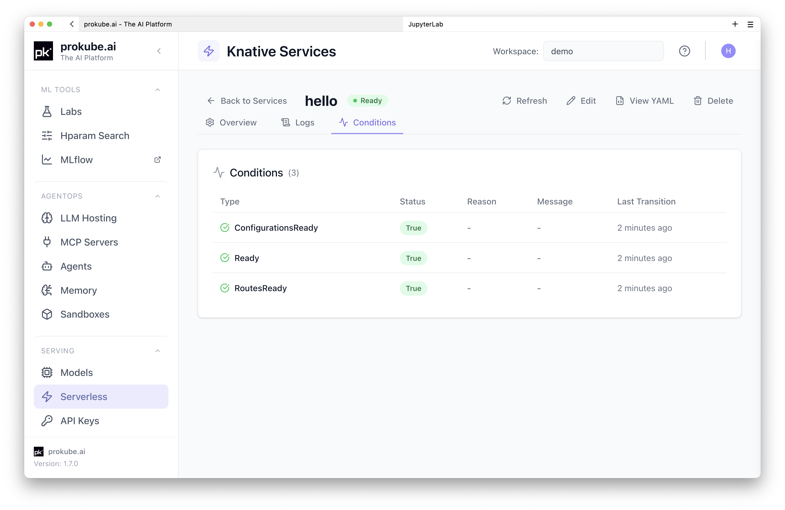

# Knative Services

prokube exposes Knative Serving for running auto-scaling containerised HTTP services in your workspace.

::: info Knative documentation
Upstream references:

- [Knative Serving documentation](https://knative.dev/docs/serving/)
- [Knative Service YAML reference](https://knative.dev/docs/serving/services/)
- [Knative autoscaling](https://knative.dev/docs/serving/autoscaling/)
:::

## When to Use Knative Directly

Knative Serving runs any HTTP container with automatic scaling, including scale-to-zero. Use it to host classic microservices – REST APIs, web apps, background workers, or any HTTP workload that does not fit a higher-level abstraction.

The platform provides dedicated solutions for common workload types. Prefer those over a plain Knative service:

| Workload | Use instead |
|---|---|
| ML model inference | [KServe InferenceServices](model_serving.html) – model runtimes, storage, inference protocols, automatic `/serving/...` URL |
| LLM serving (vLLM, TGI) | [AgentOps documentation](../agentops/index.md) – OpenAI-compatible endpoints, GPU scaling, dedicated runtimes |
| Agent execution | [Agent Sandboxes](../agentops/sandboxes.html) – isolated environments with workspace boundaries |
| MCP servers | [MCP Servers](../agentops/mcp_servers.html) – tool-provisioning protocol with lifecycle management |

Knative services do not get automatic external exposure through the `/serving/...` path – they need an additional VirtualService to be reachable from outside the cluster.

| Aspect | KServe InferenceService | Knative Service |
|---|---|---|
| Use case | ML model inference | Any HTTP container |
| External URL | Automatic `/serving/...` | Requires VirtualService |
| Model storage | Built-in (S3, MLflow, HTTP) | Manual |
| Inference protocol | V1 / V2 built-in | Custom |
| UI page | Models | Knative Services |

## Get Started

Deploy the official Knative hello world sample – no container image to build.

### 1) Create the Service

The example uses `gcr.io/knative-samples/helloworld-go` – a public image that responds with `Hello World!` on any request. Paste this manifest into the **YAML** tab of the **Deploy Service** wizard and click **Deploy from YAML**:

```yaml
apiVersion: serving.knative.dev/v1
kind: Service
metadata:
  name: hello
spec:
  template:
    spec:
      containers:
        - image: gcr.io/knative-samples/helloworld-go
          ports:
            - containerPort: 8080
```

Or save it as `hello.yaml` and apply it from a Lab terminal:

```sh
kubectl apply -f hello.yaml
```

### 2) Test the Service

After submitting, a new entry appears in the Knative Services list. Once its status shows **Ready**, the service is reachable from inside the cluster. In a Lab terminal, run:

```sh
curl http://hello.<namespace>.svc.cluster.local
```

Expected response: `Hello World!`

The Knative Services list shows the `hello` service with a **Ready** status. Open its detail page to inspect the service further.



The **Logs** tab streams pod logs for the service instance.



The **Conditions** tab shows the Knative service readiness conditions.



For your own services, build a container image that listens on the port declared by Knative's `PORT` environment variable (default `8080`). You can [build and push images from a Lab](../labs/index.md#building-container-images) – the prokube-maintained notebook images include Docker CLI and Buildx with a remote BuildKit service.

Knative can run any HTTP container. Upstream Knative provides [samples for common languages and frameworks](https://knative.dev/docs/samples/); one of the most straightforward patterns is a [FastAPI service](https://knative.dev/docs/samples/serving/hello-world/helloworld-python/) – define a few routes, build a container, and deploy it as a Knative service.

## Expose the Service Externally

Knative services are not automatically reachable through the prokube `/serving/...` URL. To expose the `hello` service from the example, create an Istio `VirtualService` in your namespace:

```yaml
apiVersion: networking.istio.io/v1
kind: VirtualService
metadata:
  name: expose-hello
  namespace: <namespace>
spec:
  gateways:
    - istio-system/cluster-local-gateway
  hosts:
    - <cluster-domain>
  http:
    - headers:
        request:
          set:
            Host: hello.<namespace>.svc.cluster.local
      match:
        - uri:
            exact: /serving/<namespace>/hello
        - uri:
            prefix: /serving/<namespace>/hello/
      rewrite:
        uri: /
      route:
        - destination:
            host: knative-local-gateway.istio-system.svc.cluster.local
            port:
              number: 80
```

Replace `<cluster-domain>` and `<namespace>` with your values. After applying, the service is reachable at `https://<cluster-domain>/serving/<namespace>/hello`.

## Access Notes

Inside the cluster, call the Knative service directly through its internal URL (`<service-name>.<namespace>.svc.cluster.local`). From outside, requests to `/serving/*` require an API key. See [API Keys](../platform/api_keys.md) for details.

From a Lab terminal, test the `hello` service with:

```sh
curl http://hello.<namespace>.svc.cluster.local
```

## Scaling

Knative scales automatically based on HTTP request concurrency. The defaults work for most services. To prevent scale-to-zero, set the minimum number of instances:

```yaml
spec:
  template:
    metadata:
      annotations:
        autoscaling.knative.dev/min-scale: "1"
```

See the upstream [Knative autoscaling documentation](https://knative.dev/docs/serving/autoscaling/) for detailed options.

## Troubleshooting

Check the service status from the **Conditions** tab in the UI or via kubectl:

```sh
kubectl describe ksvc hello
```

Common causes:

- **Image pull errors** – verify the image reference and registry credentials.
- **Container crash loop** – check pod logs from the **Logs** tab.
- **Not becoming ready** – the container must listen on the port declared by `PORT`. Verify the application binds to `0.0.0.0` and the correct port.
- **External URL returns 404** – verify the VirtualService path matches the request path and the `Host` header is correct.
- **External URL returns 401** – missing or invalid API key. See [API Keys](../platform/api_keys.md).

## Related Pages

- [Model Serving](model_serving.html)
- [API Keys](../platform/api_keys.md)
- [Labs](../labs/index.md)
