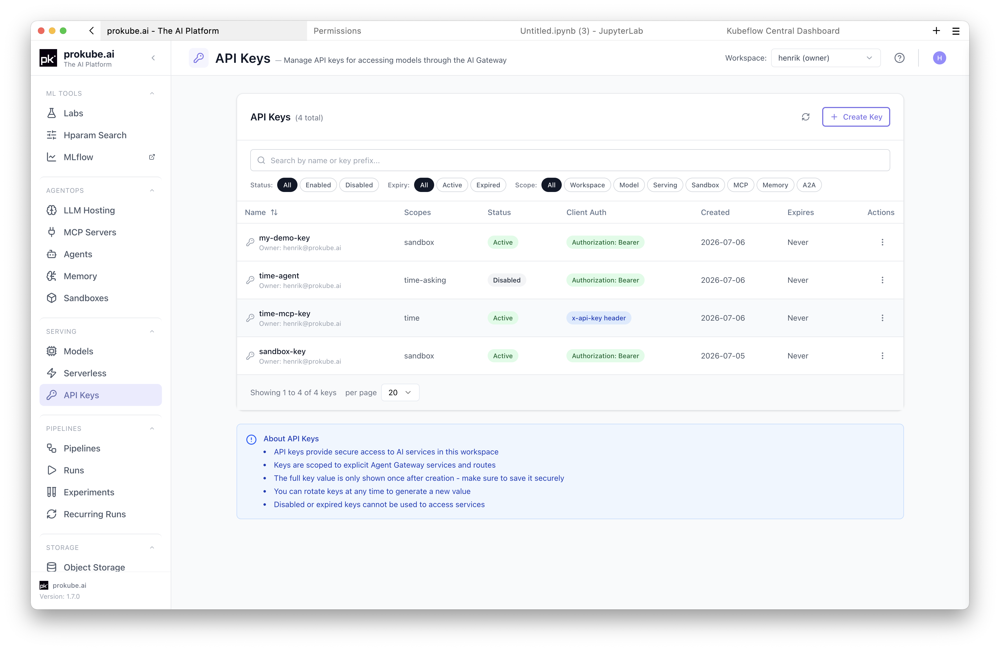
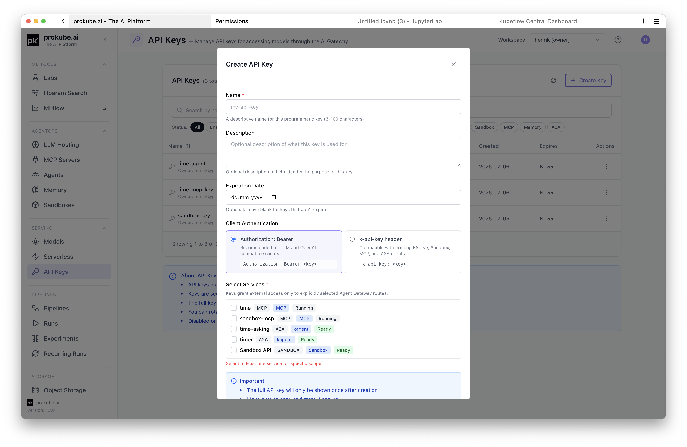
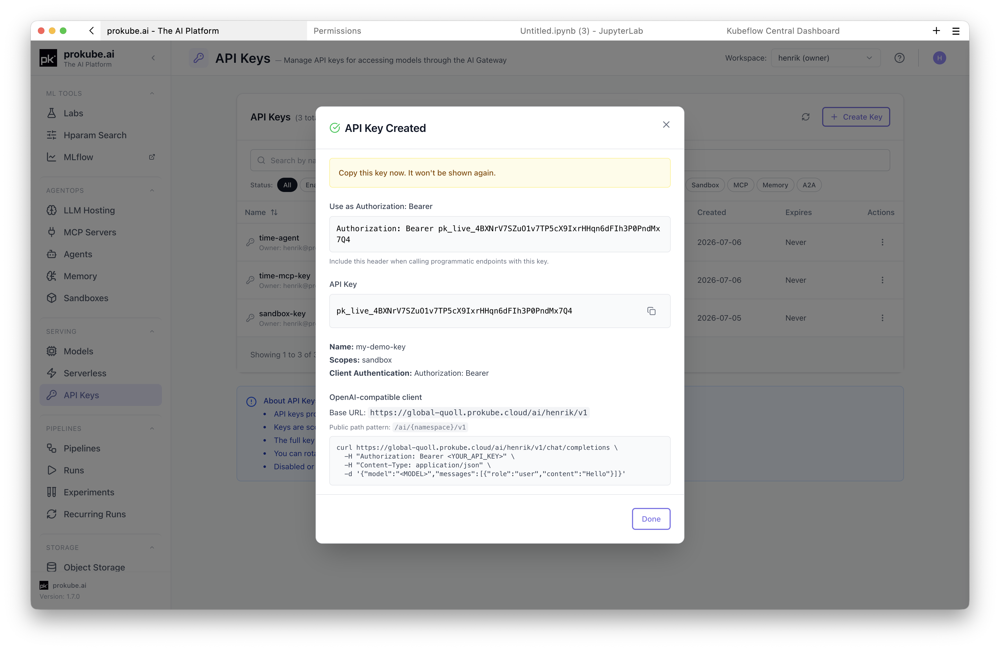
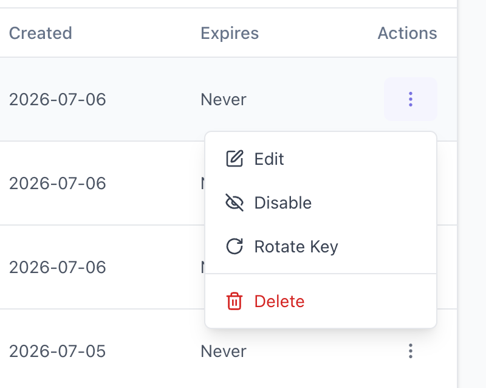

# API Keys

API keys provide scoped programmatic access to selected prokube services without a browser session. Use them for SDKs, automation, CI jobs, serving clients, sandbox clients, MCP clients, and external integrations.

A key belongs to the workspace that was selected when it was created. prokube routes public API traffic through [Agent Gateway](../agentops/agent_gateway.html), the shared routing and policy layer for API clients, but you do not need to configure Agent Gateway to create a key.

Use API keys when a workload or external client needs repeatable access without an interactive login. For browser-based work in the prokube UI, use your normal user session instead.

## Manage Keys in the UI

Open **API Keys** from the sidebar under **Serving**. Select the workspace before creating or editing keys.

Regular users see only their own keys in the selected workspace. Administrators can see and manage all keys in the workspace.



The table shows key metadata, not the full key value.

Visible metadata includes the key name, prefix, owner, status, expiration, authentication format, and scope summary. The prefix helps identify which key a client is using without exposing the secret value.

## Ownership and Workspace Scope

API keys are scoped by both workspace and owner:

- A key can only grant access inside the workspace where it was created.
- Regular users can list, edit, rotate, disable, and delete only their own keys.
- Administrators can list and manage all keys in the selected workspace.

For shared automation, avoid personal long-lived keys where possible. Prefer a key created by the user or service account that owns the automation, and document where the secret is stored.

## Create a Key

Click **Create Key** and fill in the form:

- **Name**: a descriptive name for the key.
- **Description**: optional context for who or what uses the key.
- **Expiration Date**: optional. Use expirations for automation keys unless there is a clear rotation process.
- **Client Authentication**: choose how clients send the key.
- **Select Services**: choose the services this key may access.



The service list is built from services available in the selected workspace. It can include:

- **Models** for KServe and LLM endpoints.
- **Sandbox API** for Agent Sandbox programmatic access.
- **MCP servers** for tool access.
- **Memory stores** exposed through MCP-compatible routes.
- **A2A agents** for kagent agent-to-agent access.
- **Knative services** exposed through gateway routes.

Select only the services the client needs. If no services are available, deploy or expose the service first, then create the key.

Service-specific scopes are the default choice for production clients. They reduce blast radius if a key is exposed and make it clear which integration depends on which platform service.

## Client Authentication

Choose the authentication format expected by the client:

| Format | Use when |
|---|---|
| `Authorization: Bearer <key>` | The client is OpenAI-compatible or expects bearer authentication. This is the recommended format for LLM clients. |
| `x-api-key: <key>` | The client uses existing prokube service examples for Sandboxes, MCP, A2A, or other non-OpenAI-style APIs. |

Use the service page for the exact URL and request body. Examples:

Sandbox-style APIs commonly use `x-api-key`:

```bash
curl "https://<your-prokube-domain>/sandbox/<workspace>/sandboxes" \
  -H "x-api-key: <api-key>"
```

OpenAI-compatible model clients commonly use bearer authentication:

```bash
curl "https://<your-prokube-domain>/ai/<workspace>/v1/chat/completions" \
  -H "Authorization: Bearer <api-key>" \
  -H "Content-Type: application/json" \
  -d '{"model":"<model>","messages":[{"role":"user","content":"Hello"}]}'
```

## Copy the Key Value

prokube shows the full key value only after creation or rotation. Copy it immediately and store it in your secret manager.

If you close the dialog without copying the key, create a new key or rotate the existing key. The old full value cannot be recovered from the UI.



## Manage Existing Keys

From the API Keys page you can:

- search keys by name or prefix;
- filter by status, expiration, and scope type;
- edit metadata, expiration, enabled state, and service scopes;
- disable, rotate, or delete keys.

Disable a key when you need temporary revocation or want to test whether a client still depends on it. Delete a key when it is no longer needed.

Rotating a key invalidates the old value immediately. Update every client or secret that uses the key before relying on the rotated value.



## Security Guidance

- Prefer service-specific keys over broad workspace access.
- Set an expiration date for automation keys where possible.
- Store keys in a secret manager, not in source code, notebooks, screenshots, shell history, or issues.
- Rotate keys when ownership changes, a client is redeployed, or a key may have been exposed.
- Disable a key first if you need to test impact before deleting it.
- Delete keys that are no longer used.

## Troubleshooting

| Symptom | Check |
|---|---|
| No services are available when creating a key | Confirm the target service exists in the selected workspace and is exposed through Agent Gateway-supported routes. |
| A key is not visible to another user in the same workspace | Regular users only see keys they created. Ask an administrator if shared visibility or management is required. |
| Client receives `401` or `403` | Confirm the key is enabled, not expired, sent with the selected authentication header, and scoped to the target service. |
| Client can call one service but not another | The key is scoped to selected services. Edit the key or create a new key for the additional service. |
| Client stopped working after rotation | The old key value stopped working immediately. Update the client secret or environment variable with the new value. |

## Related Pages

- [Sandboxes](../agentops/sandboxes.html)
- [MCP Servers](../agentops/mcp_servers.html)
- [Model Serving](../mlops/model_serving.html)
- [Serverless](../mlops/knative.html)
