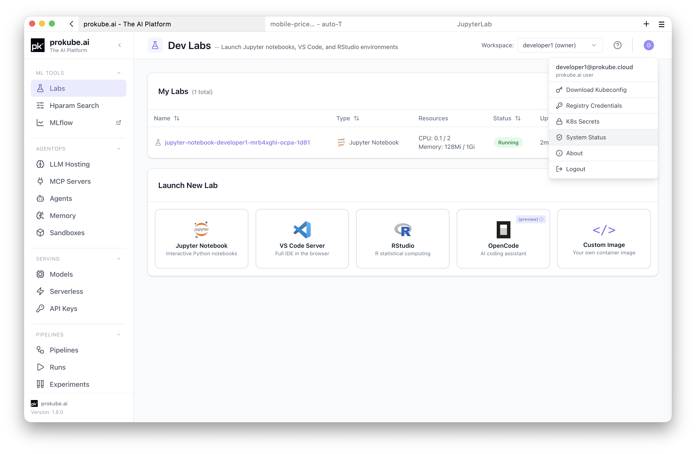
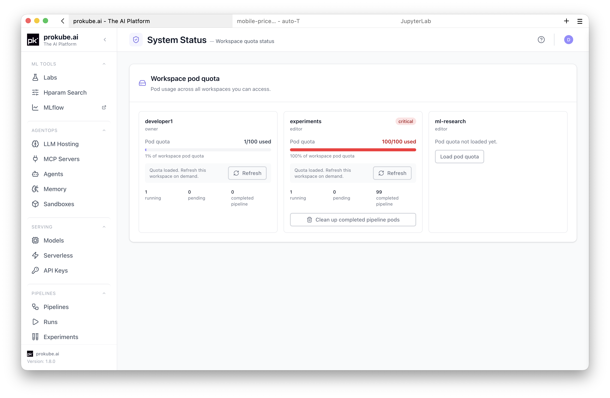
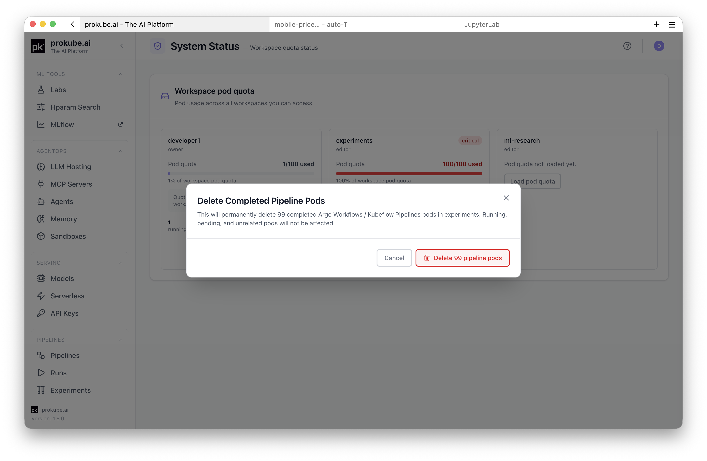
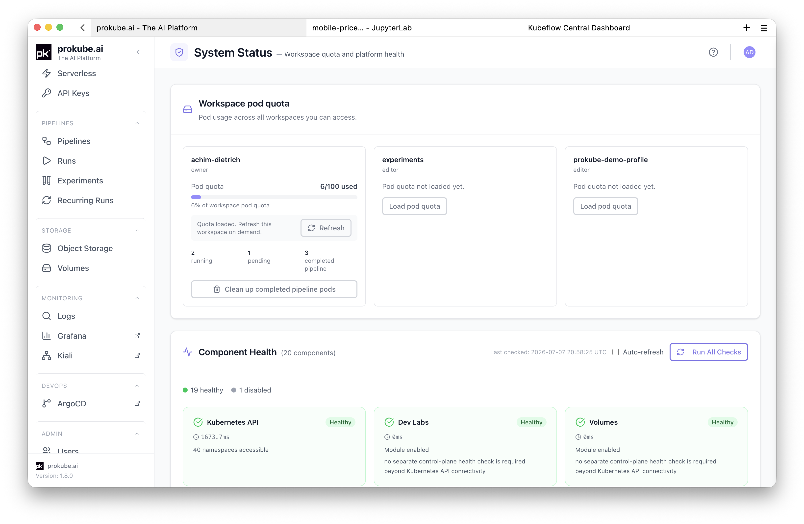
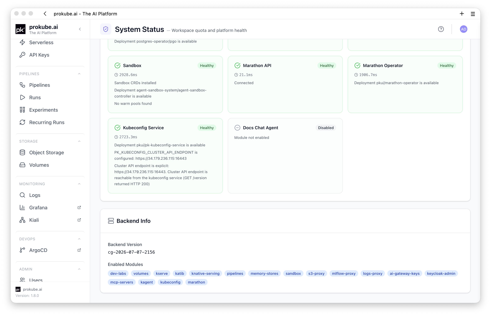

# System Status

The **System Status** page is available from the prokube user menu. It shows workspace pod quota for workspaces you can access. For administrators, it also shows live backend component health checks.

Use this page to inspect pod quota pressure before starting new workloads, clean up completed pipeline pods, and perform a quick platform health check when you have administrator privileges.

## Access

Open the user menu in the prokube UI and select **System Status**.

The page may also be available directly at `/system-status`.

All authenticated users can open the page to inspect workspace pod quota. The **Component Health** and **Backend Info** sections are visible only to realm administrators.

## Workspace Pod Quota

The top section shows pod quota usage across all workspaces you can access. Each workspace card shows:

- workspace name;
- your workspace role;
- pod quota usage, when loaded;
- running pod count;
- pending pod count;
- completed pipeline pod count;
- warning or critical state when usage approaches or exceeds the quota.

To keep the page responsive, quota details are not loaded for every workspace at once. The currently selected workspace is loaded automatically when it is in your accessible workspace list. If the selected workspace is not available, the first visible workspace card is loaded. Other workspace cards show **Load pod quota** until you load them manually.

Use **Refresh** on a workspace card to update that workspace's quota numbers on demand. If you have many workspaces, use **Load more workspaces** to show additional cards.

## Clean Up Completed Pipeline Pods

When a workspace has completed pipeline pods, the workspace card can show **Clean up completed pipeline pods**.

This action deletes completed Argo Workflows / Kubeflow Pipelines pod resources in that workspace. It does not delete running pods, pending pods, unrelated pods, pipeline metadata, artifacts, or logs.

Use this when completed pipeline pods are consuming workspace pod quota and blocking new work.

## Admin Component Health

Realm administrators also see **Component Health**. This section runs live health checks against backend components and shows whether platform services are healthy, degraded, unhealthy, or disabled.

Each component card includes:

- component name;
- health state;
- check latency in milliseconds when the component is enabled;
- a short detail message from the health check.

Possible states:

| State | Meaning |
|---|---|
| **Healthy** | The component is enabled and responded successfully. |
| **Degraded** | The component responded, but the check found a non-fatal issue. |
| **Unhealthy** | The component is enabled but failed its health check. |
| **Disabled** | The component is not enabled in the current deployment. |

The summary bar counts healthy, degraded, unhealthy, and disabled components.

## Admin Backend Info

Realm administrators also see **Backend Info**, including backend version and enabled backend modules.

Use this to confirm which backend version and modules are active in the current deployment before debugging feature behavior.

## Refresh Checks

Click **Run All Checks** to rerun administrator health checks manually.

Enable **Auto-refresh** when you want the page to rerun checks periodically while watching a rollout or investigating an incident. Auto-refresh runs every 30 seconds.

Use manual refresh for normal checks. Use auto-refresh only while actively monitoring; for long-running observability, use Grafana, Prometheus, and alerting instead.

## Recommended Workflow

When a user reports that workloads cannot start:

1. Open **System Status** from the user menu.
2. Check the workspace pod quota card for the affected workspace.
3. If completed pipeline pods are consuming quota, clean them up from the workspace card.
4. If you are an administrator, run **Component Health** checks.
5. Use unhealthy or degraded component messages as a starting point, then continue in Grafana, Loki, Argo CD, Kubernetes events, or pod logs.

## Limitations

- Workspace pod quota cards show only workspaces you can access.
- Quota details are loaded per workspace, not all at once.
- Component health checks are administrator-only.
- The page checks backend components and integrations, not every workload in every workspace.
- A healthy component status means the health check passed; it does not guarantee that all user workflows are healthy.
- A disabled status can be expected when a module is intentionally not enabled in a deployment.
- Detailed historical metrics, alerts, and logs remain in Grafana, Prometheus, Alertmanager, and Loki.

## Related Pages

- [Kubernetes Resources](kubernetes.md)
- [Observability](observability.md)
- [Pipelines](../mlops/pipelines.md)
- [Admin Documentation](../admin/index.md)
