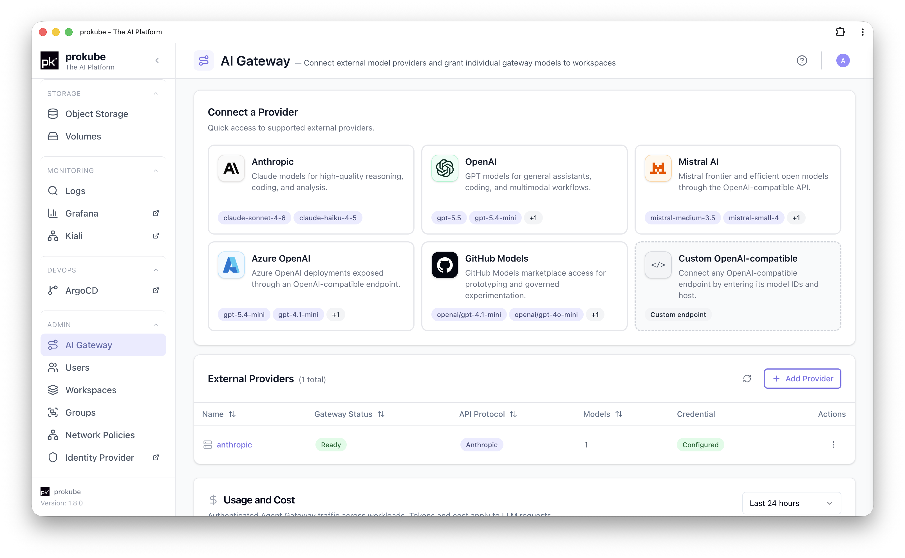
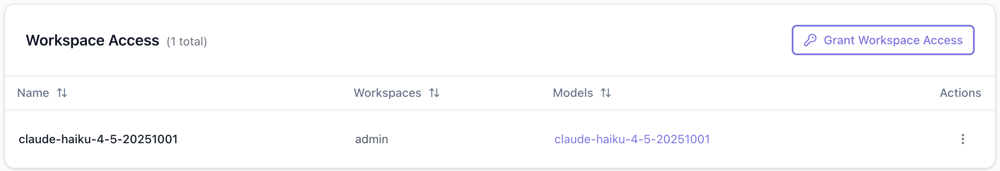
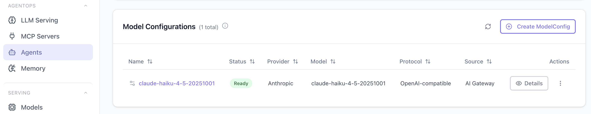

# External Models

The **AI Gateway** admin page connects centrally managed model providers to prokube. Administrators can add provider credentials once, register models from those providers, and grant specific workspaces access to specific models.

Use this workflow when you need to:

- offer Mistral AI, Azure OpenAI, GitHub Models, or a custom OpenAI-compatible endpoint;
- share a centrally managed provider credential without copying it into workspace Secrets;
- control which workspaces can use each external model.

For OpenAI, Anthropic, or Gemini, workspace users can instead create their own Model Configuration backed by a workspace Kubernetes Secret. See [Agents](../agentops/agents.html#_2-choose-or-create-a-model-configuration).

## Provider Options

The admin-managed provider catalog supports:

- Anthropic;
- OpenAI;
- Mistral AI;
- Azure OpenAI;
- GitHub Models;
- custom OpenAI-compatible endpoints.

Anthropic uses its native protocol. The other provider types use an OpenAI-compatible protocol. Custom and Azure OpenAI providers require an upstream host and path prefix.

## Connect a Provider

Open **AI Gateway** under **Admin**, then select **Add Provider**. Configure:

- **Provider**: select an entry from the provider catalog.
- **Provider name**: unique name for the provider connection.
- **Provider API key**: credential stored centrally by prokube.
- **Upstream host** and **Path prefix**: required for custom and Azure OpenAI providers.
- **Models**: optional comma- or newline-separated model IDs to add immediately.

Provider API keys are write-only. To rotate one later, edit the provider and enter a **Replacement API key**.

## Add Models

Open a provider and switch to its **Models** tab. Models can be added in two ways:

- **Discover models** queries the provider and lets you select one or more returned model IDs.
- **Add manually** registers a model ID directly.

The main **Models** table shows each model's provider, API protocol, workspace-access count, and base URL. A model cannot be deleted while a workspace grant still references it. Revoke those grants first.

## Grant Workspace Access

Select **Grant Workspace Access**, then choose:

- **Workspace**: the workspace that should receive the model.
- **Route ID / ModelConfig name**: the name shown in that workspace's Model Configurations.
- **Resource**: the provider model to grant.

The grant creates a Model Configuration in the target workspace. It appears automatically on the workspace's **Agents** page, tagged **AI Gateway** as its origin. Users can select it when creating an agent without creating their own provider Secret.

The central provider credential is not exposed to the workspace. Revoke the grant from **Workspace Access** when the workspace should no longer use the model.

An admin-granted model is consumed by kagent agents through its generated Model Configuration. It is not selectable as a workload when creating a user API key on the **API Keys** page.

## Usage and Cost

The **Usage and Cost** panel shows authenticated Agent Gateway traffic across all workspaces. Select Last hour, Last 24 hours, Last 7 days, or Last 30 days to view:

- total, successful, and failed requests;
- request trends;
- LLM input and output tokens;
- estimated LLM cost.

These figures are observability estimates, not billing records. Use the workspace [API Key Usage Dashboard](../platform/api_keys.html#usage-dashboard) to inspect usage attributed to visible keys in one workspace.

## Related Pages

- [Agents](../agentops/agents.html)
- [Agent Gateway](../agentops/agent_gateway.html)
- [API Keys](../platform/api_keys.html)
- [LLM Serving](../agentops/llm_serving.html)
