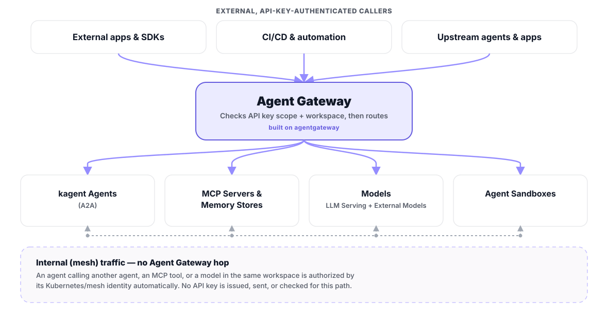

# Agent Gateway

Agent Gateway is prokube's shared routing and policy layer for external API traffic, the same layer that fronts classic model-serving endpoints and Knative services in MLOps. See [Agent Gateway](../platform/agent_gateway.html) in Foundation for the platform-wide routing model: path families, public vs. internal traffic, API keys, and the upstream [agentgateway](https://agentgateway.dev/) project it's built on.

This page covers the AgentOps-specific angle: how Agent Gateway moves traffic between agents, tools, and models, and how agents reach external LLM providers.

## How Agent Gateway Moves Agent Traffic

An external caller (an SDK, a CI job, or another agent outside the workspace) authenticates with an API key scoped to one of the `/a2a`, `/mcp`, `/ai`, or `/sandbox` paths. Agent Gateway checks the key's scope and workspace, then forwards the request to:

- a **kagent agent**, over agent-to-agent (A2A);
- an **MCP server or memory store**, for tool and retrieval access;
- a **model**, self-hosted through [LLM Serving](llm_serving.html) or granted through [External Models](../admin/external_models.html);
- an **Agent Sandbox**, for isolated code execution.

Inside the same workspace, none of this needs an API key: an agent calling another agent, an MCP tool, or a model authenticates automatically over Kubernetes/mesh identity. You only reach for Agent Gateway, and an API key, when the caller is outside the workspace.

## When to Use Agent Gateway for Agents

- Reach kagent agents through agent-to-agent (A2A) calls from outside the cluster.
- Expose MCP servers or memory stores to external agent clients.
- Give an agent access to a sandbox API without handing it browser credentials.
- Call a self-hosted or externally granted model from an external application, script, or CI job.

For interactive work in the prokube UI, use your normal user session instead. Agent Gateway is for programmatic clients. For the general routing/API-key mechanics behind all of this, see [Agent Gateway](../platform/agent_gateway.html) in Foundation.

## External Models

Agents can use external models through two different paths:

| | User-created Model Configuration | Admin-managed external model |
|---|---|---|
| Providers | OpenAI, Anthropic, Gemini | Anthropic, OpenAI, Mistral AI, Azure OpenAI, GitHub Models, or a custom OpenAI-compatible endpoint |
| Credential | API key stored in a workspace Kubernetes Secret | Provider credential managed centrally by an administrator |
| Availability | Available only through that workspace's Model Configuration | Granted to selected workspaces and shown there as an **AI Gateway** Model Configuration |
| Routing | Agent connects to the provider through the Model Configuration | Model traffic is routed through Agent Gateway |

Use a user-created Model Configuration for a workspace-specific provider credential. Use the admin-managed path when credentials should be shared centrally, when workspaces need explicit model grants, or when the provider is not available in the self-service list.

Workspace users select either type from the same Model Configurations list when creating an agent. Administrators configure providers, models, and workspace grants under [External Models](../admin/external_models.html).

## Related Pages

- [Agent Gateway](../platform/agent_gateway.html) (Foundation: path families, API keys, public vs. internal traffic)
- [API Keys](../platform/api_keys.html)
- [Agents](agents.html)
- [LLM Serving](llm_serving.html)
- [Agent Sandboxes](sandboxes.html)
- [MCP Servers](mcp_servers.html)
- [Memory Stores](memory_stores.html)
- [External Models](../admin/external_models.html)
- [Model Serving](../mlops/model_serving.html)
- [Serverless](../mlops/knative.html)
