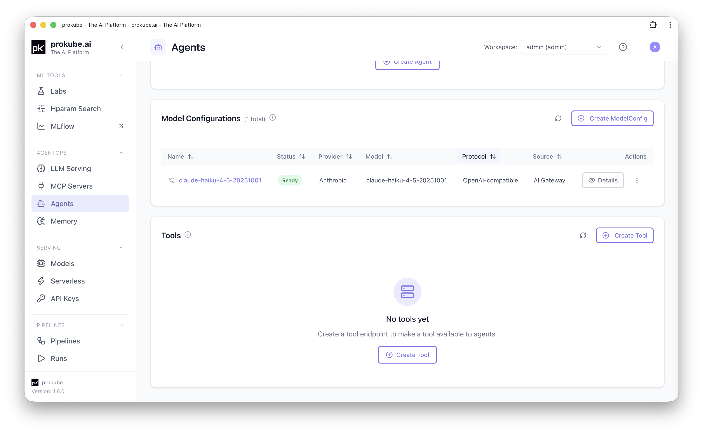
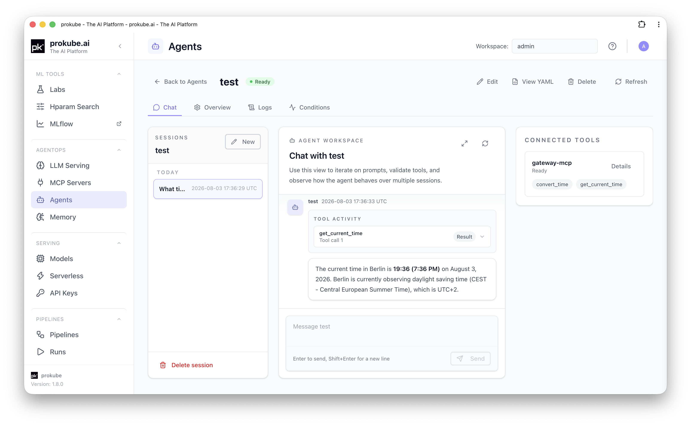

# Agents

prokube runs agents on [kagent](https://kagent.dev/), a Kubernetes-native agent runtime. Agents, their model configuration, and their tools are Kubernetes custom resources, managed through the pkui **Agents** page in your workspace.

::: info kagent documentation
Upstream references:

- [kagent documentation](https://kagent.dev/docs)
- [Model Context Protocol (MCP)](https://modelcontextprotocol.io/)
:::

This page covers the prokube-specific workflow for wiring a model, tools, and an agent together, and testing the result. For tool hosting itself, see [MCP Servers](mcp_servers.html).

## When to Use Agents

Use the Agents page when you need a conversational or task-driven agent that calls an LLM and tools exposed through MCP servers or other agents. Use it when you want the agent to run on the platform: its configuration versioned as Kubernetes resources, observable through pkui, and reachable by other workloads over A2A.

## Typical Workflow

Building a working agent is a short chain of dependent resources:

1. If needed, store an external provider API key as a Kubernetes Secret.
2. Choose an available **Model Configuration**, or create one for an external provider or in-cluster model. Some models might already be available, if pre-configured by an administrator.
3. Create an **Agent**, attach the Model Configuration, and select MCP tools.
4. Test the agent in the built-in chat.

### 1. Store the Provider API Key

Skip this step if you will use an admin-provided Model Configuration or an **Internal** (in-cluster) model. Admin-provided configurations use a credential the administrator already manages centrally. Internal models don't need a stored credential at all: the platform authenticates them automatically as in-cluster workloads.

Otherwise, for an **external** provider (OpenAI, Anthropic, Gemini), create a Kubernetes Secret first: open the user menu (top right) → **K8s Secrets** → **Add Secret**, and store the provider API key as a key/value pair in the workspace, for example `ANTHROPIC_API_KEY: sk-ant-...` or `OPENAI_API_KEY: sk-...`. See [Kubernetes Secrets](../platform/kubernetes.html#kubernetes-secrets) for the full flow.

### 2. Choose or Create a Model Configuration

Check **Model Configurations** on the **Agents** page first. An administrator may already have granted the workspace access to an external model through AI Gateway. These configurations appear automatically with **AI Gateway** as their origin and can be selected when creating an agent.

If no suitable configuration exists, select **Create ModelConfig**. The **Provider** field selects how kagent reaches the backend:

| Provider | Type | Needs a Secret? |
|---|---|---|
| OpenAI (external) | External | Yes |
| Anthropic (external) | External | Yes |
| Gemini (external) | External | Yes |
| Internal - OpenAI-compatible | In-cluster | No |
| Internal - Ollama | In-cluster | No |

- For an **external** provider, select the Secret and the secret key created in step 1, and enter the model name.
- For **Internal - OpenAI-compatible**, either pick a **Ready** model deployed through [LLM Serving](llm_serving.html) in the workspace, or enter a custom in-cluster OpenAI-compatible base URL and model name manually.
- For **Internal - Ollama**, enter the in-cluster Ollama host, for example `http://ollama.<workspace>.svc.cluster.local:11434`.

The structured form covers the common presets above. For another kagent-supported provider, open the Model Configuration YAML editor and define its provider-specific fields. OpenAI-compatible services can use the `OpenAI` provider with an `openAI.baseUrl` and a workspace Secret containing the API key; Azure OpenAI uses its dedicated kagent provider configuration. This keeps the endpoint and credential within the workspace configuration.

When provider credentials and model access are managed centrally, administrators can configure Azure OpenAI, Mistral AI, GitHub Models, or another OpenAI-compatible endpoint through Agent Gateway. Granted models then appear in the workspace as **AI Gateway** Model Configurations. See [External Models](../admin/external_models.html) for the administrator workflow.

::: info Tool calling with internal models
For a self-hosted text-generation model used with MCP tools, enable **automatic tool calling** in [LLM Serving: Enable Tool Calling for Agents](llm_serving.html#enable-tool-calling-for-agents) and select the parser that matches the model. This option is available for the vLLM and HuggingFace runtimes.
:::

### 3. Create an Agent

Still on the Agents page, open **Configured Agents** → **Create Agent**. Choose an **Agent type**:

- **Declarative**: the common case. Requires a **Name**, the **Model Configuration** from step 2, and a required **System message** describing the agent's behavior.
- **BYO**: wraps your own container image, invoked over A2A, instead of a declarative kagent agent.

For a declarative agent, attach tools:

- **MCP tools**: a searchable, filterable table of every tool discovered from MCP servers (Tools) available to the workspace. Check individual tools, or use **"Use all current and future tools from `<server>`"** per server to keep the agent in sync with a tool server automatically instead of a fixed snapshot.
- **Agent tools**: let this agent call other agents in the same workspace as tools.

MCP tools come from **Tools** on the same Agents page. Connect an MCP endpoint there first if the tool you need isn't listed yet. See [MCP Servers](mcp_servers.html) for details. If the agent uses [Agent Sandboxes](sandboxes.html)-backed skills, attach the Tool that points at `sandbox-mcp`.

### 4. Test the Agent

Open the agent from the Agents list. The detail page's **Chat** tab is available once the agent is `Ready`, and shows:

- A session sidebar (new/previous sessions).
- The chat itself.
- A **Connected Tools** panel listing attached tools and their readiness.

Each response that used a tool shows a **Tool Activity** entry with the tool's arguments and result, so you can verify what the agent actually called and with what inputs. This is useful for debugging both prompt and tool wiring before relying on the agent elsewhere.

For programmatic access instead of the chat UI, the agent's Overview tab lists its A2A endpoint. External callers need an API key scoped to the agent (`a2a`). See [API Keys](../platform/api_keys.html). Callers inside the same workspace can reach the agent over the internal A2A path without a key.

## Related Pages

- [Agent Gateway](agent_gateway.html)
- [LLM Serving](llm_serving.html)
- [MCP Servers](mcp_servers.html)
- [Agent Sandboxes](sandboxes.html)
- [Memory Stores](memory_stores.html)
- [External Models](../admin/external_models.html)
- [API Keys](../platform/api_keys.html)
- [Kubernetes Resources](../platform/kubernetes.html)
