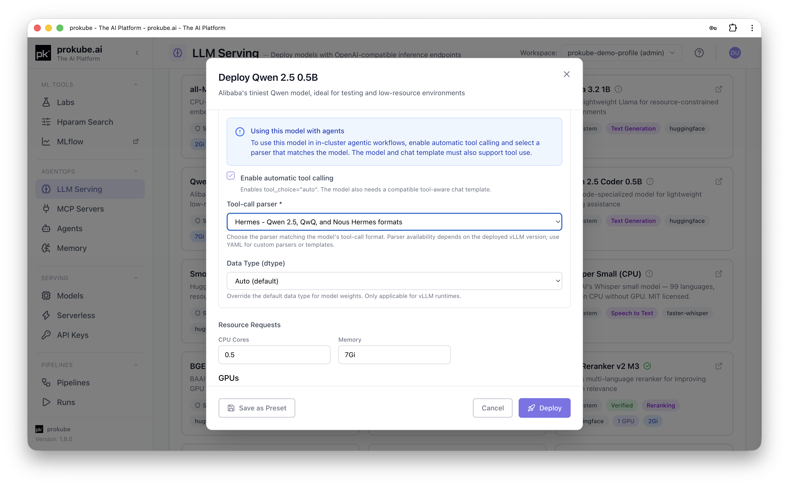

# LLM Serving

LLM Serving deploys self-hosted models as OpenAI-compatible inference endpoints on KServe. It supports text generation, embedding, reranking, text-to-speech, and speech-to-text models. Use it when you want to host a model in the cluster instead of calling an external provider such as OpenAI, Anthropic, or Gemini.

::: info Upstream references
LLM Serving builds on:

- [KServe](https://kserve.github.io/website/) for the serving control plane and OpenAI-compatible protocol
- [vLLM](https://docs.vllm.ai/) and [KServe's HuggingFace runtime](https://kserve.github.io/website/latest/modelserving/v1beta1/llm/huggingface/) for text generation and embeddings
- [Hugging Face Text Embeddings Inference (TEI)](https://huggingface.co/docs/text-embeddings-inference) for CPU-optimized embeddings
- [faster-whisper](https://github.com/SYSTRAN/faster-whisper) for CPU speech-to-text
:::

LLM Serving is an AgentOps capability. For classic model serving with scikit-learn, PyTorch, and similar predictors, see [Model Serving](../mlops/model_serving.html). Both features use KServe, but they provide different deployment forms and endpoints.

## When to Use LLM Serving

- Host an open-weight model (Llama, Mistral, Qwen, Gemma, and similar) in-cluster instead of calling an external API.
- Serve embedding or reranking models for retrieval workloads.
- Serve text-to-speech or speech-to-text models.
- Provide an in-cluster model for a kagent [Agent](agents.html) via an **Internal** Model Configuration, with or without tool calling.
- Keep model traffic and data inside the cluster instead of sending it to an external provider.

If you only need OpenAI, Anthropic, or Gemini, create a Model Configuration directly instead. See [Agents: Choose or Create a Model Configuration](agents.html#_2-choose-or-create-a-model-configuration).

## Deploy a Model

Open **LLM Serving** in the sidebar. The page lists deployed models for the selected workspace, filterable by type (**All / Text Generation / Embedding / Reranking**), with columns for name, status, model ID, type, runtime, and age.

Click **Deploy Model** and choose a preset, or select **Deploy Custom Model** to configure the deployment from scratch. Presets provide curated defaults and can be searched or filtered by GPU count, task type, and verification status. Both paths open the same form:

- **Deployment Name**: unique name in the workspace.
- **Model Type**: Text Generation, Embedding, Reranking, Text to Speech, or Speech to Text. Typing a HuggingFace-style model ID (`org/model`) auto-detects the type.
- **Model ID**: a HuggingFace model ID, for example `meta-llama/Llama-2-7b-chat-hf`. HuggingFace is the only model source available in the form; use the YAML editor for other storage URIs.
- **Runtime**: filtered to runtimes that support the selected type. Options include HuggingFace (recommended for text generation and embeddings), TEI (CPU-optimized embeddings), vLLM, vLLM Omni (audio models), and faster-whisper (CPU speech-to-text). vLLM requires a custom ClusterServingRuntime.

If the model is gated on HuggingFace, the form warns you before deploying: accept the license on huggingface.co, create an access token, and store it as a Kubernetes Secret named `storage-config` with key `HF_TOKEN` in the workspace (see [Kubernetes Secrets](../platform/kubernetes.html#kubernetes-secrets)). Deployment fails without it.

Select **Or edit YAML manifest directly** if the form does not cover a setting you need, such as a custom storage URI or extra container arguments.

## Advanced Configuration

The **Advanced Configuration** section is collapsed by default. It covers:

- [**Deployment Mode**](https://kserve.github.io/website/docs/concepts/architecture/control-plane): **Serverless (Knative)** is the default and supports scale-to-zero. **Raw (also called Standard in newer KServe versions) Deployment** creates a plain Kubernetes Deployment for clusters without Knative or for [KEDA](https://keda.sh/docs/latest/concepts/scaling-deployments/) autoscaling. Raw deployments require at least one replica.
- **Runtime settings**: vLLM-based runtimes support quantization options such as AWQ, GPTQ, and FP8, and data types such as Float16, BFloat16, and Float32. The HuggingFace runtime uses vLLM internally, so these settings also apply to it.
- **Resource Requests**: configure CPU, memory, and GPU count and type. GPU options come from the cluster inventory. If limits are left blank, the CPU limit defaults to twice the request and the memory limit matches the request.
- **Auto-Scaling**: configure minimum and maximum replicas, with a maximum of 10. Serverless mode allows a minimum of 0 for scale-to-zero; Raw Deployment requires at least one replica.
- **Automatic tool calling**: configure support for agents that use MCP tools. See [Enable Tool Calling for Agents](#enable-tool-calling-for-agents).

Raw deployments can use [HPA](https://kubernetes.io/docs/tasks/run-application/horizontal-pod-autoscale/) for CPU or memory-based scaling, or [KEDA](https://keda.sh/docs/latest/concepts/scaling-deployments/) for custom Prometheus metrics such as vLLM token throughput. KEDA requires a PromQL query and a scale threshold calibrated against observed traffic. See [Serving Autoscaling](../mlops/model_serving_autoscaling.html) for the general KEDA pattern in prokube.

## Enable Tool Calling for Agents

Not every runtime supports OpenAI-style tool calling. The **Enable automatic tool calling** option appears only for **vLLM** and **HuggingFace** text-generation models. It is not available for TEI, vLLM Omni, faster-whisper, or other model types.

If you plan to attach MCP tools to a kagent agent that uses this model (an **Internal** Model Configuration), turn this on and select a **Tool-call parser** matching the model's tool-call format:

| Parser | Matches |
|---|---|
| Hermes | Qwen 2.5, QwQ, and Nous Hermes formats |
| Qwen3 XML | Qwen3-Coder tool-call format |
| Llama 3 JSON | Llama models using JSON tool calls |
| Pythonic | Llama models using Python-style tool calls |
| Mistral | Mistral tool-call format |
| DeepSeek V3 | DeepSeek V3 format |
| DeepSeek V3.1 | DeepSeek V3.1 format |

This list matches the parsers built into the platform's currently deployed vLLM runtime and may change as that runtime is upgraded; use YAML editing for a parser or chat template not listed here. Without a matching parser, an agent's tool calls against this model will not work reliably even though the Model Configuration and deployment are otherwise valid.

## Test a Deployed Model

Open a **Ready** model from the list. Text-generation models have a **Chat** tab with a built-in streaming chat tester. Embedding and reranking models have an **API** tab. Audio models have an **API** or **Test** tab, depending on the task. These tabs show the endpoint path and a ready-to-run `curl` example for the supported operation.

The Configuration tab also shows Basic Information, Resources, Scaling, and API Endpoints for the model, alongside Metrics, Logs, and Conditions tabs for troubleshooting. While model weights are downloading, a storage panel shows progress (queued, preparing, downloading, or failed) instead of the usual tabs.

## Edit a Model

From the model list or detail page, select **Edit** to change Model Type, Quantization, Data Type, tool-calling settings, resource requests and limits, or auto-scaling. Model ID, runtime, and deployment mode are fixed after creation. To change them, delete and redeploy the model or use the **YAML** tab.

## External Access

Endpoints shown on the model's detail/API tabs are the workspace-internal serving URL, useful for testing from inside the platform. For external clients (SDKs, CI jobs, applications outside the cluster), call the model through [Agent Gateway](../platform/agent_gateway.html) instead, using a URL of the form `/ai/<workspace>/models/<route-id>/v1/...` and an API key scoped to the model. See [API Keys](../platform/api_keys.html). Models granted through [External Models](../admin/external_models.html) are reachable through this same URL pattern.

To use a deployed model from a kagent agent instead of an external client, create an **Internal - OpenAI-compatible** Model Configuration and pick this model from the **LLM Serving model** dropdown. See [Agents](agents.html#_2-choose-or-create-a-model-configuration).

## Related Pages

- [Agents](agents.html)
- [Agent Gateway](agent_gateway.html)
- [API Keys](../platform/api_keys.html)
- [Model Serving](../mlops/model_serving.html)
- [Serving Autoscaling](../mlops/model_serving_autoscaling.html)
