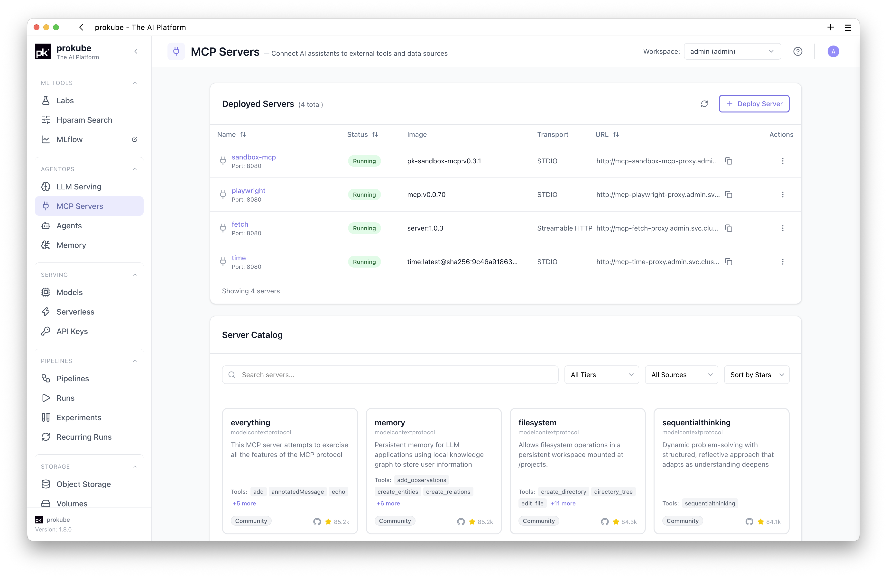
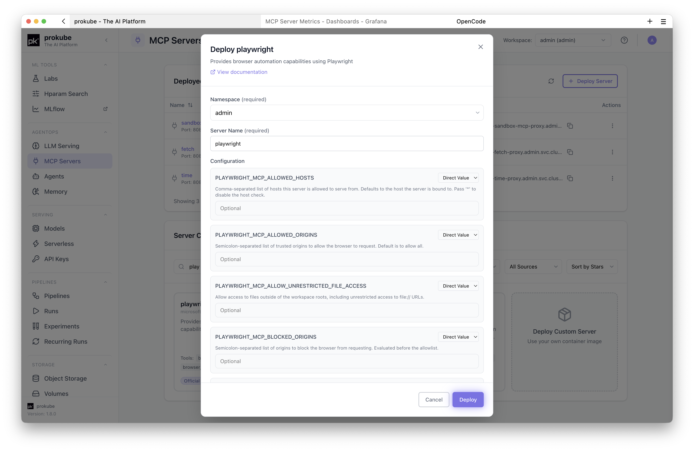
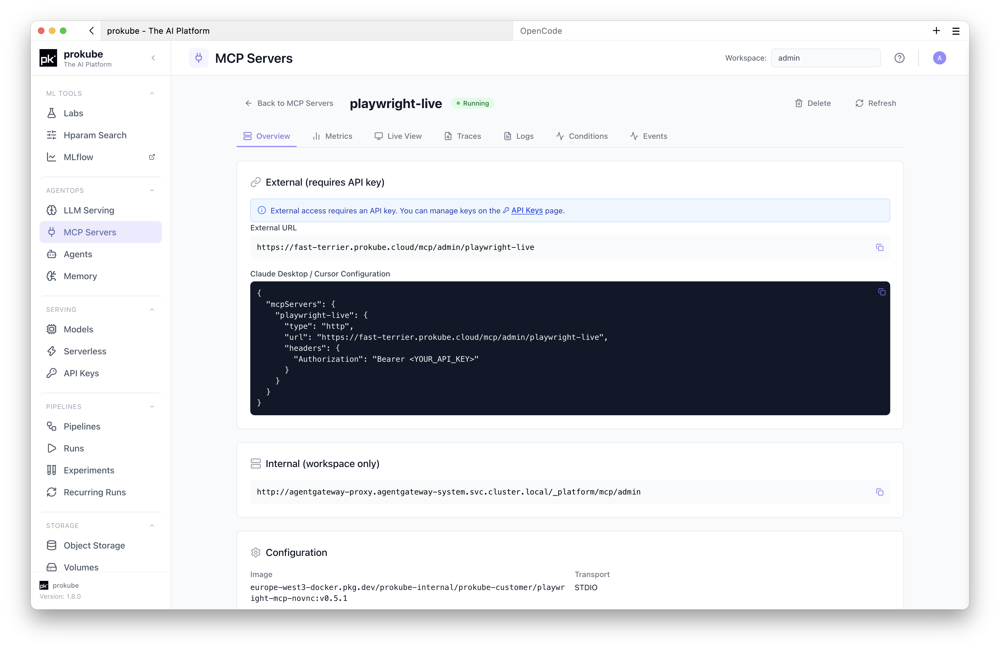
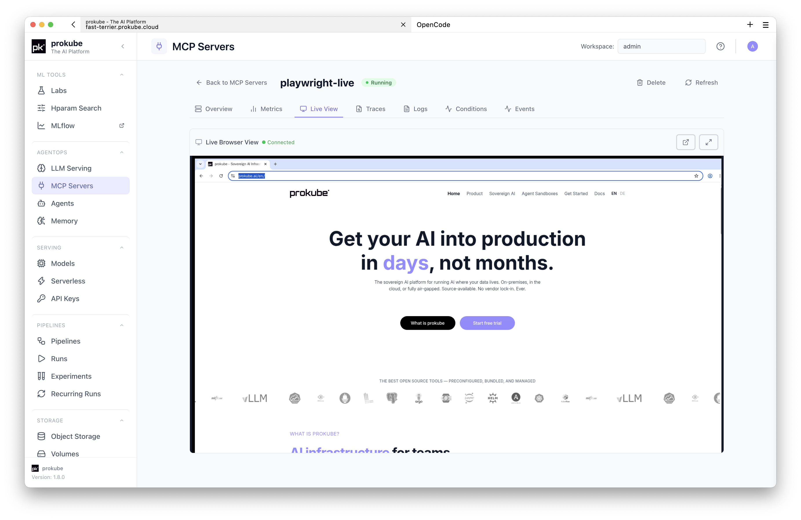
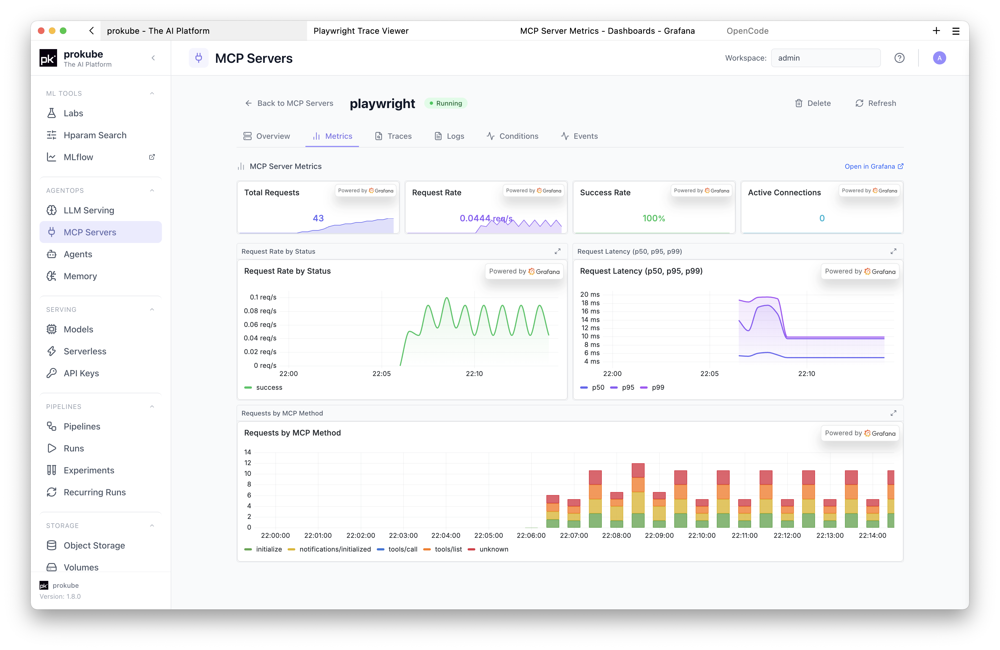
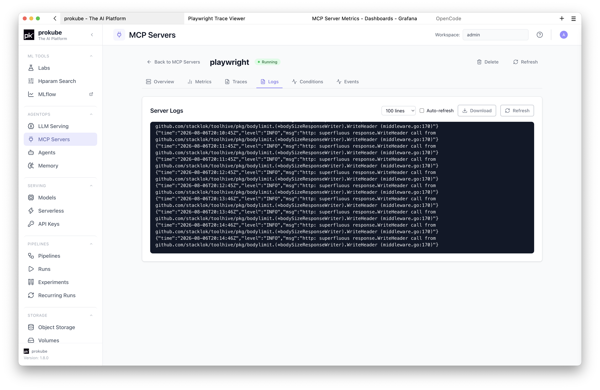

# MCP Servers

::: info Upstream documentation
For MCP and ToolHive concepts that are not specific to prokube, use the upstream documentation:

- [Model Context Protocol documentation](https://modelcontextprotocol.io/)
- [ToolHive documentation](https://docs.stacklok.com/toolhive/)
- [ToolHive Kubernetes CRD reference](https://docs.stacklok.com/toolhive/reference/crds/)
:::

MCP servers expose tools, data sources, and internal APIs to AI assistants through the Model Context Protocol. In prokube, MCP servers run as Kubernetes workloads managed by ToolHive instead of local processes on a developer machine.

Use MCP servers when an agent or MCP-capable client needs governed access to a tool, for example sandbox execution, browser automation, databases, internal APIs, or other services that should not be called with broad user credentials.

## How prokube Runs MCP Servers

Open **MCP** from the prokube UI sidebar under **AgentOps**. Select the workspace before deploying or inspecting servers.

An MCP server is deployed into the selected workspace namespace as a [ToolHive `MCPServer`](https://docs.stacklok.com/toolhive/reference/crds/) resource. prokube provides the UI, workspace authorization, registry integration, logs, events, metrics, and optional Agent Gateway access. ToolHive handles the server runtime and local MCP proxy for that resource.

The MCP page contains two main sections:

- **Deployed Servers**: MCP servers currently running in the selected workspace.
- **Server Catalog**: registry entries that can be deployed with preconfigured images, tools, metadata, and required configuration fields.

## Deploy from the Catalog

Use the catalog for known server images and common integrations. Catalog cards show the server name, description, provided tools, source, tier, repository link, and compatibility badges such as **Requires Root**.

The catalog can be filtered by:

- search text;
- tier: **Official** or **Community**;
- source: **prokube.ai Only** or **Third Party Only**;
- sort order: stars or name.

Click a catalog card to deploy it. The deploy dialog shows:

- **Namespace**: target workspace namespace.
- **Server Name**: Kubernetes resource name for the MCP server.
- **Configuration**: required and optional environment variables from the registry entry.
- **Registry Credentials**: image pull secrets available in the workspace.
- **Resource Limits**: optional CPU and memory requests and limits.
- **Technical Details**: image, transport, and provided tools.

Environment variables can be entered directly or read from a Kubernetes Secret in the workspace. Use Secrets for tokens, passwords, API keys, and other sensitive values. See [Kubernetes Secrets](../platform/kubernetes.html#kubernetes-secrets).

### Catalog Source and Trust

prokube uses the upstream [ToolHive Catalog](https://github.com/stacklok/toolhive-catalog), a community-curated registry of MCP servers and skills. The catalog gives you a better starting point than searching for arbitrary container images: entries are described in a common format, reviewed through the ToolHive project, and include metadata such as the publisher, repository, required configuration, tools, and maintenance tier.

Treat the catalog as a curated trust signal, not as a blanket approval for every environment:

- **Official** entries are maintained by the MCP team, the upstream project, or platform owners.
- **Community** entries are contributed and maintained by the community.
- **prokube.ai Only** narrows the list to entries published or curated by prokube.ai where available.

Before giving an MCP server credentials or access to internal systems, still review what it connects to, who maintains it, which tools it exposes, and whether it needs broad permissions. Prefer Official or internally maintained servers for production workflows.

## Deploy a Custom Server

Use **Deploy Custom Server** when the server is not in the catalog or when you maintain your own image.

Required fields:

- **Server Name**: Kubernetes-compatible resource name.
- **Container Image**: image that runs the MCP server.
- **Transport Protocol**: `stdio`, `sse`, or `streamable-http`.
- **Proxy Port**: port exposed by the ToolHive proxy.

Optional fields:

- environment variables, either direct values or Secret references;
- image pull credentials for private registries;
- CPU and memory requests and limits;
- container arguments;
- root or writable-filesystem options for images that require them;
- persistent storage for servers that need data to survive pod restarts;
- live view for browser-based servers such as noVNC-backed Playwright images.

Prefer custom images that run as non-root and work with a read-only root filesystem. Images that require root or write access are harder to run in restricted workspaces and have a larger security footprint.

## Use YAML for Advanced Configuration

As with other Kubernetes-backed resources in prokube, you can use YAML when the form does not expose a setting you need.

The deploy dialog can generate a ToolHive `MCPServer` manifest from the form fields. Use it to inspect the resource before deployment, adjust advanced fields, or submit a reviewed manifest directly through the UI.

The namespace is set by prokube to the selected workspace namespace. Custom YAML must still be a ToolHive `MCPServer` resource using a supported `toolhive.stacklok.dev` API version.

## Connect Clients

The **Deployed Servers** table shows each server's status, image, transport, proxy port, and URL when available. Deploying an MCP server also registers it with the workspace's federated MCP endpoint in Agent Gateway.

For external clients, create an [API key](../platform/api_keys.html) scoped to the MCP server. Use the authentication format expected by the client.

For kagent agents, open **Agents** and select the discovered MCP tools when creating or editing the agent. Tools from workspace MCP servers appear through the managed `gateway-mcp` endpoint; create a separate Tool only when you need to connect an additional external MCP endpoint.

OpenCode and other MCP-capable clients can use the endpoint URL shown in prokube. In OpenCode Labs, add it through the OpenCode MCP manager and configure the required headers or OAuth settings there. See [OpenCode: Add MCP Servers](../labs/opencode.html#add-mcp-servers).

## Sandbox MCP

The catalog includes `sandbox-mcp`, a prokube-provided MCP server for Agent Sandbox operations.

It exposes tools for common sandbox tasks, including creating sandboxes, claiming existing sandboxes, running commands, executing code, reading and writing files, and managing sandbox pools.

When deploying `sandbox-mcp`, prokube pre-fills deployment context for the selected workspace:

- `PROKUBE_API_URL`: backend API URL reachable from the MCP server pod;
- `PROKUBE_WORKSPACE`: selected workspace namespace;
- `PROKUBE_USER_ID`: current user identity used for backend authorization.

You can also set `SANDBOX_NAME` to auto-connect to a specific sandbox on the first tool call.

## Browser Automation Servers

Some catalog entries, such as the prokube Playwright noVNC image, include live browser viewing and trace support.

For these servers, the details page can show:

- **Live View** for an interactive browser session;
- **Traces** for recorded Playwright sessions;
- **Logs** and **Events** for debugging startup and runtime issues;
- **Metrics** for runtime monitoring.

Live view is only available for servers that declare live-view support in the catalog or custom configuration.

## Security and Operations

- Deploy servers only in workspaces where the intended users should have access to the exposed tools.
- Store sensitive configuration in [Kubernetes Secrets](../platform/kubernetes.html#kubernetes-secrets) instead of direct environment variable values.
- Prefer **Official** or internally maintained catalog entries for production use.
- Review third-party images before granting access to internal data or network destinations.
- Avoid root and writable-root-filesystem options unless the image requires them.
- Restricted workspace security policies can reject servers that request root privileges.
- Set resource requests and limits for long-running or shared servers.
- Delete MCP servers that are no longer used.

## Troubleshooting

| Symptom | Check |
|---|---|
| Server stays `Pending` | Open the details page and check **Events** and **Logs**. Also verify image pull credentials and workspace quota. |
| Image cannot be pulled | Confirm the image name and select the required registry credential for private registries. See [Registry Credentials](../platform/kubernetes.html#registry-credentials). |
| Deployment is rejected by security policy | The image may require root or a writable filesystem in a restricted workspace. Use a compliant image or ask an administrator to review the workspace policy. |
| Required configuration is missing | Check the catalog entry's required environment variables and provide direct values or Secret references. |
| Client cannot connect | Confirm the server is `Running`, copy the current URL, and verify the API key is scoped to the MCP server. |
| Tool calls fail after connecting | Check server logs, required upstream credentials, workspace network policy, and whether the tool depends on an external service. |

## Related Pages

- [API Keys](../platform/api_keys.html)
- [Kubernetes Resources](../platform/kubernetes.html)
- [Agent Sandboxes](./sandboxes.html)
- [Agents](./agents.html)
