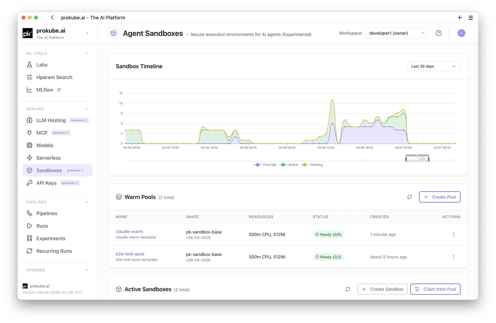
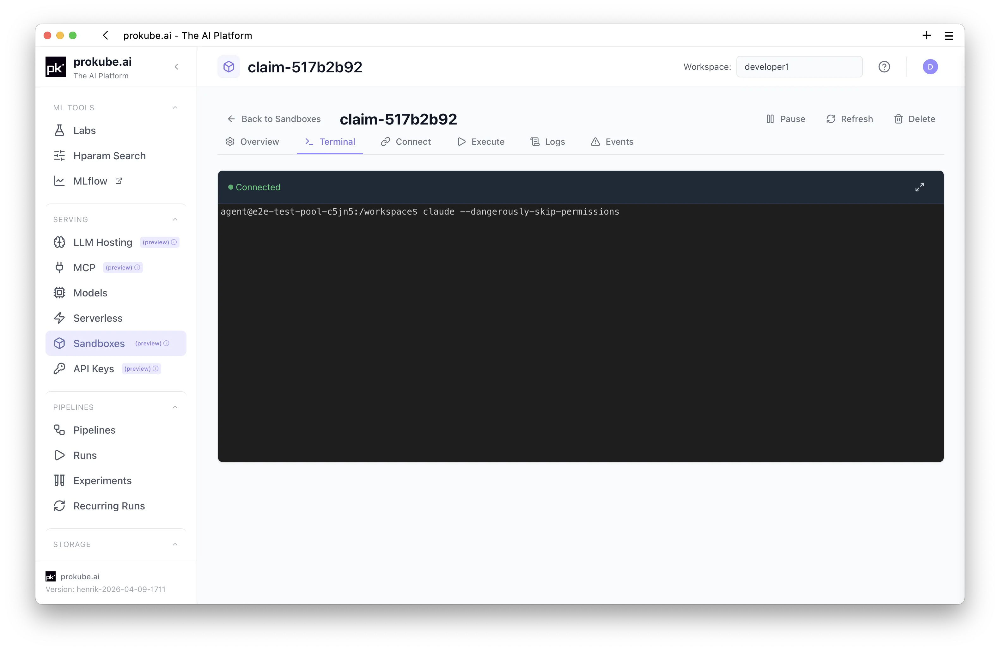
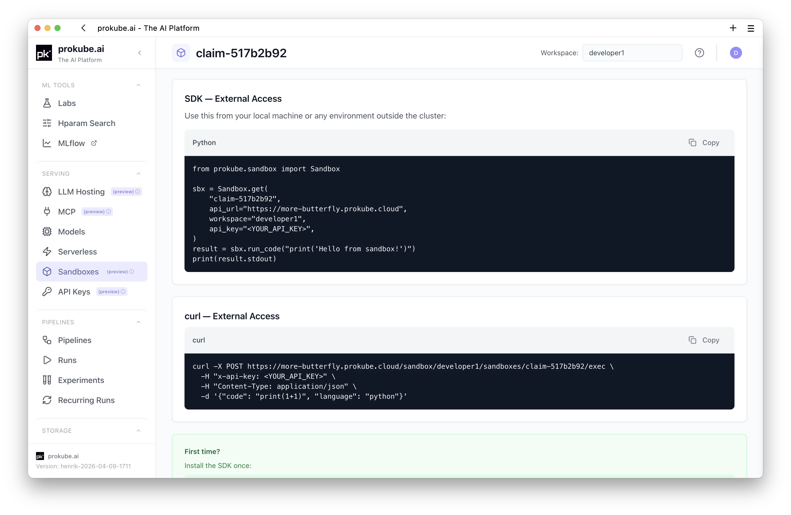
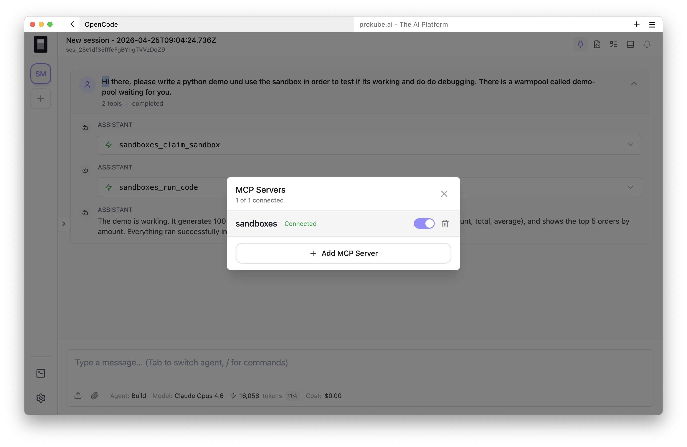
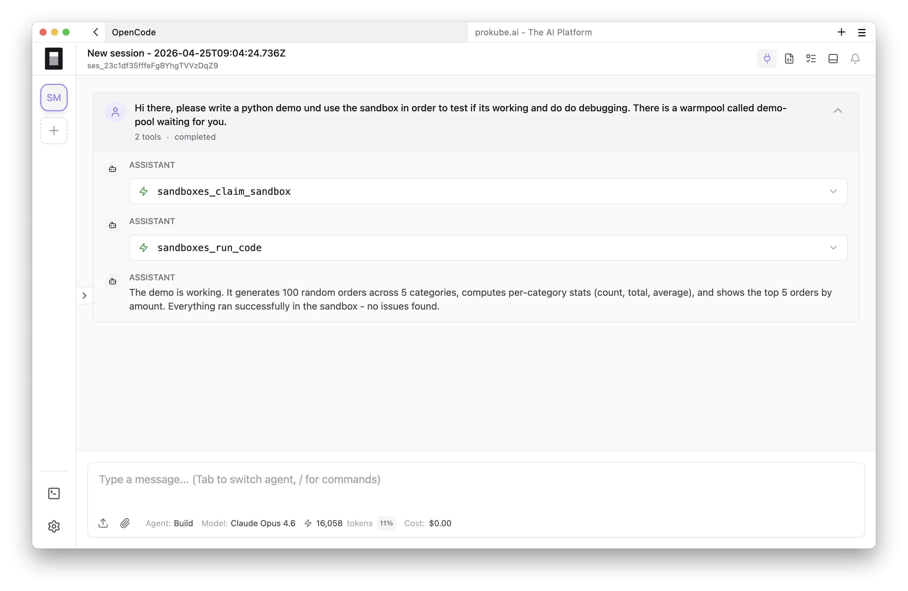

# Agent Sandboxes

Agent Sandboxes are isolated Linux environments for AI agents and automation workflows. They give agents a place to run code, inspect files, install packages, keep state across calls, and pause when idle while the workload stays inside the prokube platform environment.

Sandboxes are part of the AgentOps track, but they use the same shared platform foundation as the rest of prokube: workspaces, RBAC, secrets, observability, storage, and Agent Gateway for external API access.

::: info Upstream references
- [Kubernetes SIG Apps Agent Sandbox](https://agent-sandbox.sigs.k8s.io/docs/)
- [OpenSandbox `execd`](https://github.com/opensandbox-group/OpenSandbox/tree/main/components/execd)
- [Kata Containers documentation](https://kata-containers.github.io/kata-containers/)
:::

## How the Components Fit Together

prokube combines upstream sandbox components with platform-specific lifecycle, access, and persistence behavior:

| Component | Role in prokube |
|---|---|
| Kubernetes SIG Apps [Agent Sandbox](https://github.com/kubernetes-sigs/agent-sandbox) | Provides the Kubernetes `Sandbox`, `SandboxTemplate`, `SandboxClaim`, and `SandboxWarmPool` APIs and their controllers. These resources manage stable sandbox identity, Pods, claims, and pre-warmed capacity. |
| OpenSandbox [`execd`](https://github.com/opensandbox-group/OpenSandbox/tree/main/components/execd) | Runs inside the standard sandbox image and provides the execution service used for commands and file operations. prokube does not use the complete OpenSandbox control plane. |
| [Kata Containers](https://katacontainers.io/) | Can provide VM-backed workload isolation through a Kubernetes `RuntimeClass`. The configured runtime is a deployment choice. |
| prokube sandbox services | Add workspace-aware UI and APIs, SDK and MCP access, Agent Gateway routing, managed egress, persistence integration, runtime images, and platform lifecycle behavior. |

Pause and resume in prokube build on the sandbox lifecycle primitives but add prokube-specific persistence and restore behavior. In particular, prokube defines which filesystem paths survive a pause and how the environment is prepared again on resume.

## When to Use Sandboxes

Use a sandbox when an agent needs an actual execution environment instead of a predefined tool call:

- run Python or shell code generated by an agent
- analyze unfamiliar files or datasets
- install packages for a task-specific workflow
- debug and self-correct by running tests or scripts
- keep interpreter and workspace state across multiple calls
- isolate untrusted code from the user's laptop and from the Kubernetes control plane

## UI Overview

The Sandbox page in pkui is workspace-scoped. Select the workspace in the page header, then manage WarmPools and active sandboxes for that workspace.

The page contains three main areas:

- **Timeline**: shows sandbox capacity and usage over time.
- **Warm Pools**: pre-created sandboxes that can be claimed quickly.
- **Active Sandboxes**: direct or pool-backed sandboxes that currently exist in the workspace.



## Warm Pools

WarmPools keep sandbox pods pre-created so agents can claim one without waiting for a cold container start. Use WarmPools for agent workflows where startup latency matters or where many tasks use the same image and resource profile.

From the **Warm Pools** section, users can:

- create a pool
- see how many pools exist in the workspace
- refresh pool state
- inspect pool readiness and available pods
- claim a sandbox from a ready pool

Only ready pools with available pods can be used by **Claim from Pool**.

## Create a Direct Sandbox

Use **Create Sandbox** when you want a standalone sandbox from a selected container image. This is a cold start path and usually takes longer than claiming from a WarmPool.

The UI currently supports:

- sandbox name
- predefined image or custom image URL
- CPU limit
- memory limit
- optional auto-idle timeout in minutes
- internet egress toggle for HTTP/HTTPS access, for example `pip`, `npm`, or external APIs
- environment variables
- mounted workspace secrets, with all secret keys exposed as environment variables

The sandbox name must use lowercase letters, numbers, and hyphens.

## Claim a Sandbox from a Pool

Use **Claim from Pool** when you want fast provisioning from an existing WarmPool.

The claim dialog lets users:

- select a ready pool
- see how many pods are available
- inspect the pool image and resources
- set an optional per-claim auto-idle timeout

If no auto-idle timeout is set on the claim, the sandbox inherits the pool default. If the pool has no default, the platform default applies.

## Manage Active Sandboxes

The **Active Sandboxes** table shows sandboxes in the selected workspace.

Users can:

- search by name, service, pool, or pod
- filter by status: Running, Pending, Paused, Failed, or Completed
- filter by source: direct or pool-backed
- open sandbox details by clicking the sandbox name
- pause direct running sandboxes
- resume paused direct sandboxes
- delete sandboxes

The table shows the sandbox name, service, status, and creation time. Pool-backed sandboxes show the originating pool below the name.

Pause/resume is currently exposed for direct sandboxes. Pool-backed sandboxes are usually treated as claimed disposable capacity and are deleted when no longer needed.

Open a sandbox to use its terminal, run code, inspect connection examples, or review logs and events.



## Pause and Resume Behavior

Pausing a sandbox frees compute resources by stopping the underlying pod. Persistent paths are preserved and restored on resume.

Preserved paths include:

- `/workspace`
- `/root`
- `/home/agent`
- `/skills`

Running processes stop when the sandbox is paused. System packages installed with `apt install` are not preserved automatically. If a workflow needs system packages after resume, use a restore script such as `~/.sandbox-restore.sh` so the environment can reinstall them on startup.

## External API Access

External clients should access sandboxes through Agent Gateway, for example:

```text
https://<cluster-domain>/sandbox/<workspace>
```

Do not use direct backend service URLs from external clients.

API keys are managed on the platform **API Keys** page. See [API Keys](../platform/api_keys.md) for key handling and scope guidance.

Current SDK note: the Python and TypeScript SDKs send keys as `x-api-key`. Bearer-style keys are not the SDK default right now.

The sandbox detail page's **Connect** tab provides ready-to-adapt Python SDK and `curl` examples for the selected sandbox.



## API Surface

The Sandbox API is available through the platform backend and, for external clients, through the Agent Gateway sandbox route. SDK users normally do not call these endpoints directly, but understanding the API shape helps when integrating custom agents or debugging SDK behavior.

The external route shape is:

```text
https://<cluster-domain>/sandbox/<workspace>/...
```

Internally, the backend routes are workspace-scoped under:

```text
/api/namespaces/{namespace}/...
```

### WarmPool API

| Method | Path | Purpose |
| --- | --- | --- |
| `GET` | `/sandbox-pools` | List WarmPools in a workspace. |
| `GET` | `/sandbox-pools/{name}` | Get one WarmPool. |
| `POST` | `/sandbox-pools` | Create a WarmPool from structured fields. |
| `POST` | `/sandbox-pools/yaml` | Create SandboxTemplate and/or WarmPool resources from YAML. |
| `DELETE` | `/sandbox-pools/{name}` | Delete a WarmPool. |
| `POST` | `/sandbox-pools/{name}/warmup` | Warm unclaimed pods without claiming them. |
| `GET` | `/sandbox-pools/{name}/events` | Read Kubernetes events for a pool. |
| `POST` | `/sandbox-pools/{pool_name}/test` | Claim from a pool, execute code, and optionally clean up in one call. |

### Sandbox Lifecycle API

| Method | Path | Purpose |
| --- | --- | --- |
| `GET` | `/sandboxes` | List active sandboxes in a workspace. |
| `GET` | `/sandboxes/{name}` | Get sandbox details. |
| `POST` | `/sandboxes` | Create a direct sandbox from an image. Returns before cold start has completed. |
| `POST` | `/sandboxes/claim` | Claim a sandbox from a WarmPool. |
| `DELETE` | `/sandboxes/{name}` | Delete or release a sandbox. |
| `POST` | `/sandboxes/{name}/pause` | Pause a running sandbox. |
| `POST` | `/sandboxes/{name}/resume` | Resume a paused sandbox. |
| `POST` | `/sandboxes/{name}/activity` | Record an explicit activity heartbeat for auto-idle tracking. |
| `GET` | `/sandboxes/history?window=5m` | Read timeline data for active, idle pool, and pending sandboxes. |

### Execution and Files API

| Method | Path | Purpose |
| --- | --- | --- |
| `POST` | `/sandboxes/{name}/exec` | Execute Python/Jupyter or shell-style code in a sandbox. |
| `POST` | `/sandboxes/test` | Create a temporary direct sandbox, execute code, and clean it up. |
| `POST` | `/sandboxes/{name}/files` | Upload one file. |
| `POST` | `/sandboxes/{name}/files/batch` | Upload multiple files in order. |
| `GET` | `/sandboxes/{name}/files?path=/workspace` | List files in a sandbox directory. |
| `GET` | `/sandboxes/{name}/files/download?path=...` | Download a file. |
| `POST` | `/sandboxes/{name}/kernel/restart` | Restart the Jupyter kernel and clear session state. |
| `GET` | `/sandboxes/{name}/logs` | Read sandbox container logs. |
| `GET` | `/sandboxes/{name}/events` | Read Kubernetes events for a sandbox. |

### Configuration API

| Method | Path | Purpose |
| --- | --- | --- |
| `GET` | `/sandbox-config` | Read configured images, resource options, pool defaults, and runtime settings. |
| `GET` | `/sandbox-images` | Read the platform-provided image list. |

### Example Direct API Call

Most clients should use the SDKs. For low-level debugging, a direct request looks like this:

```bash
curl \
  -H "x-api-key: ${PROKUBE_API_KEY}" \
  "https://<cluster-domain>/sandbox/<workspace>/sandboxes"
```

## Python SDK

Use the Python SDK when writing Python agents, notebooks, or automation that should control sandboxes directly.

### Claim from a WarmPool

```python
from prokube.sandbox import Sandbox

with Sandbox.from_pool("python-pool") as sbx:
    result = sbx.run_code("print('hello from sandbox')")
    print(result.stdout)
```

### Stateful Code Execution

`run_code()` uses a Jupyter kernel. Variables and imports persist across calls until the kernel is reset or the sandbox is paused/resumed.

```python
from prokube.sandbox import Sandbox

sbx = Sandbox.from_pool("python-pool")
sbx.run_code("import numpy as np")
sbx.run_code("data = np.random.randn(10_000)")
result = sbx.run_code("print(data.mean())")
print(result.stdout)
sbx.kill()
```

### Shell Commands and Files

```python
from prokube.sandbox import Sandbox

with Sandbox.from_pool("python-pool") as sbx:
    sbx.commands.run("pip install pandas")
    sbx.files.write("/workspace/input.txt", "hello")
    content = sbx.files.read("/workspace/input.txt")
    print(content)
```

### Create a Direct Sandbox

```python
from prokube.sandbox import Sandbox

sbx = Sandbox.create(
    image="registry.example.com/sandbox/python:latest",
    cpu="2",
    memory="4Gi",
    allow_internet_access=False,
)
sbx.wait_until_ready()

result = sbx.commands.run("python --version")
print(result.stdout)

sbx.kill()
```

## TypeScript SDK

Use the TypeScript SDK for Node.js agents and automation.

### Claim from a WarmPool

```typescript
import { Sandbox } from "prokube";

const sbx = await Sandbox.fromPool("python-pool");
try {
  const result = await sbx.runCode("print('hello from sandbox')");
  console.log(result.stdout);
} finally {
  await sbx.kill();
}
```

### Create a Direct Sandbox

```typescript
import { Sandbox } from "prokube";

const sbx = await Sandbox.create("registry.example.com/sandbox/python:latest", {
  resources: { cpu: "2", memory: "4Gi" },
  allowInternetAccess: false,
});

try {
  await sbx.waitUntilReady();
  const result = await sbx.commands.run("python --version");
  console.log(result.stdout);
} finally {
  await sbx.kill();
}
```

### Connect to an Existing Sandbox

```typescript
import { Sandbox } from "prokube";

const sbx = await Sandbox.get("my-sandbox");
const phase = await sbx.getPhase();
console.log(phase);
```

## MCP Access

Sandbox workflows can also be exposed to MCP-capable clients through a sandbox MCP server. This is useful when an agent should create, claim, drive, and clean up sandboxes without a direct SDK integration.

The MCP client still needs the same platform information:

- prokube API URL
- workspace name
- API key with sandbox access

See [API Keys](../platform/api_keys.md) for key handling and scope guidance.

In OpenCode, connect the sandbox MCP server from the MCP Servers dialog:



The agent can then claim a sandbox and execute code through MCP tools without leaving the chat:


